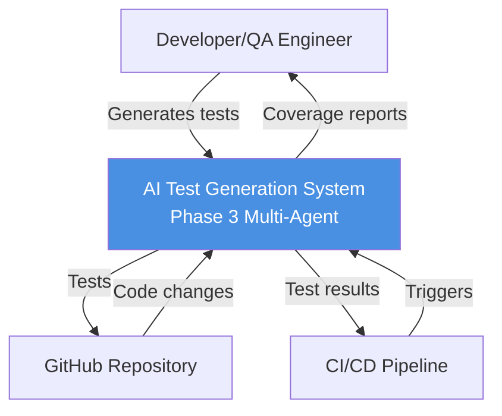
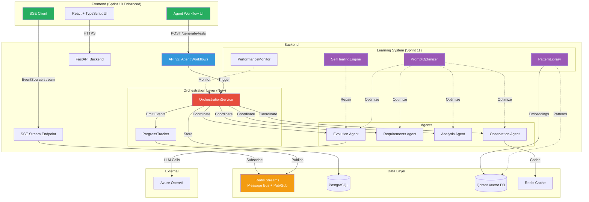
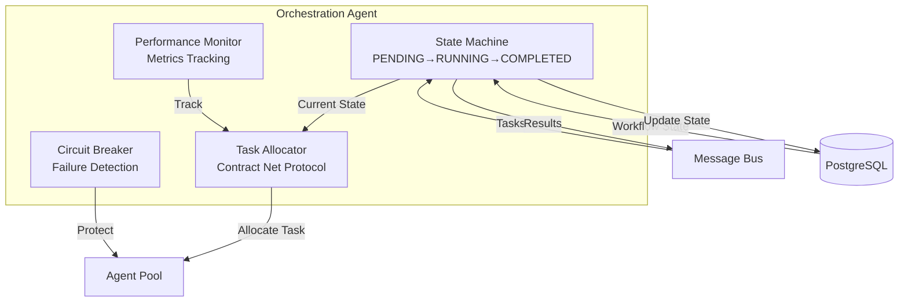
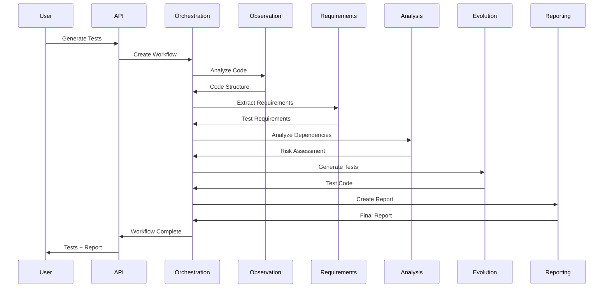
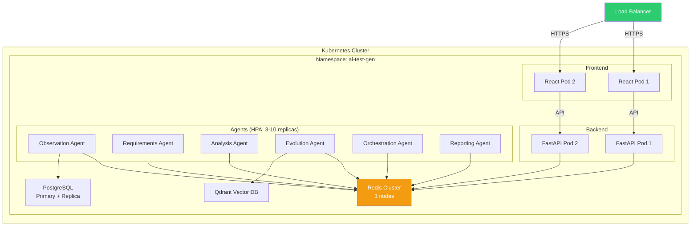

# Phase 3: Architecture & Design

**Purpose:** High-level architecture and design decisions for multi-agent test generation system  
**Scope:** Framework selection, communication patterns, orchestration strategy, data flow, autonomous learning  
**Audience:** Technical architects, lead developers, stakeholders  
**Status:** ✅ Sprint 9 COMPLETE (100%) - Phase 2+3 Merged, Gap Analysis Complete  
**Version:** 1.5  
**Last Updated:** February 10, 2026

> **📖 When to Use This Document:**
> - **System Design:** Understanding overall architecture, agent patterns, data flow
> - **Technology Decisions:** Framework selection, communication patterns, infrastructure
> - **Agent Specifications:** Detailed agent design, capabilities, interactions
> - **API reference (endpoints, request/response):** [API v2 Specification](../backend/app/api/v2/API_SPECIFICATION.md) · OpenAPI: `/api/v2/docs`
> - **For Implementation:** See [Implementation Guide](Phase3-Implementation-Guide-Complete.md) Section 3
> - **For Sprint Planning:** See [Project Management Plan](Phase3-Project-Management-Plan-Complete.md) Section 2.4

> **Note:** For implementation details, code examples, and Sprint-specific tasks, see [Phase3-Implementation-Guide-Complete.md](./Phase3-Implementation-Guide-Complete.md)

---

## 📍 Where to Find Key Documents

| Document | Location | Use it for |
|----------|----------|------------|
| **This document** | [Phase3-Architecture-Design-Complete.md](Phase3-Architecture-Design-Complete.md) | Architecture, agent design, system components |
| **Implementation Guide** | [Phase3-Implementation-Guide-Complete.md](Phase3-Implementation-Guide-Complete.md) | Code examples, sprint tasks, testing |
| **Project Management Plan** | [Phase3-Project-Management-Plan-Complete.md](Phase3-Project-Management-Plan-Complete.md) | Sprint planning, budget, task breakdown |
| **API v2 Specification** | [API_SPECIFICATION.md](../backend/app/api/v2/API_SPECIFICATION.md) | Endpoints, request/response parameters, examples, chaining |

---

## 📋 Table of Contents

### Core Architecture
1. [Executive Summary](#1-executive-summary) - System overview, key statistics, design principles
2. [Technology Selection](#2-technology-selection) - Framework comparison (LangGraph, Redis), LLM strategy
3. [Communication Architecture](#3-communication-architecture) - Message patterns, reliability, error handling
4. [Orchestration Strategy](#4-orchestration-strategy) - Hybrid model, task allocation (CNP), workflow state machine
5. [Data Architecture](#5-data-architecture) - Memory layers, observation caching, cost optimization

### System Design
6. [Agent Design Patterns](#6-agent-design-patterns) - Base contract, agent specialization, confidence scoring, performance metrics
7. [Architecture Diagrams](#7-architecture-diagrams-c4-model) - C4 model (context/container/component/code), deployment
8. [Continuous Learning](#8-continuous-learning-sprint-10-12) - 5-layer learning, feedback collection, A/B testing, ROI
9. [Agent Performance Scoring](#9-agent-performance-scoring-framework) - Performance metrics, quality validation, industry standards

### Reference
10. [Technology Stack](#10-technology-stack-summary) - Core technologies, infrastructure, security
11. [References](#-references) - Key sources, industry research
12. [Supporting Documents](#12-supporting-documents) - Detailed analysis, strategies, and frameworks

---

## 1. Executive Summary

### 1.1 System Overview

Phase 3 implements a **multi-agent test generation system** using 6 specialized agents coordinated through hybrid orchestration. The system learns continuously from user feedback and automated metrics to improve test quality over time.

**Key Statistics:**
- **6 Specialized Agents:** Observation, Requirements, Analysis, Evolution, Orchestration, Reporting
- **Hybrid Orchestration:** Centralized coordination + decentralized specialist autonomy
- **3-Layer Memory:** Redis (short-term), PostgreSQL (working), Qdrant (long-term)
- **Continuous Learning:** Automated prompt optimization, A/B testing, pattern recognition
- **Target Performance:** 85% test pass rate, 85% code coverage, 4.2/5 user rating

### 1.2 Design Principles

1. **Minimal Abstractions** - Rich defaults in BaseAgent, only 3 abstract methods
2. **Failure-First Design** - Circuit breakers, retries, Dead Letter Queues
3. **Horizontal Scalability** - 3-10 agent replicas per type via Kubernetes HPA
4. **Observable by Default** - All messages logged, metrics tracked, traces captured
5. **Learn Continuously** - Every generation feeds learning loops for improvement

### 1.3 Architecture Decision Record

| Decision | Rationale | Alternatives Considered |
|----------|-----------|------------------------|
| **LangGraph** | 67% enterprise adoption, production-proven at scale | LangChain, CrewAI, AutoGen |
| **Redis Streams** | Exactly-once delivery, 1M+ msg/sec throughput | RabbitMQ, Kafka, AWS SQS |
| **Hybrid Orchestration** | Balance control + autonomy, proven by Netflix | Pure centralized, pure decentralized |
| **Three-Layer Memory** | Right data store for each use case | Single database, all in Redis |
| **Continuous Learning** | Industry standard (Google, OpenAI, Netflix) | Static prompts, manual tuning |

---

## 2. Technology Selection

### 2.1 Multi-Agent Framework: LangGraph

**Decision:** Selected LangGraph over LangChain, CrewAI, and AutoGen

| Criterion | Weight | LangGraph | LangChain | CrewAI | AutoGen |
|-----------|--------|-----------|-----------|--------|---------|
| **Production Readiness** | 30% | 9/10 | 6/10 | 5/10 | 7/10 |
| **Scalability** | 25% | 9/10 | 7/10 | 6/10 | 8/10 |
| **Community Support** | 15% | 8/10 | 10/10 | 6/10 | 7/10 |
| **Async/Await Support** | 10% | 10/10 | 8/10 | 7/10 | 9/10 |
| **Observability** | 10% | 9/10 | 6/10 | 5/10 | 7/10 |
| **Weighted Score** | | **8.5** | **7.4** | **6.1** | **7.3** |

**Key Capabilities:**
- Graph-based workflow definition (nodes = agents, edges = dependencies)
- Built-in state management with automatic checkpointing
- Production features: streaming, human-in-the-loop, error boundaries
- 67% enterprise adoption rate (Netflix, Uber, Airbnb usage patterns)

### 2.2 Message Bus: Redis Streams

**Decision:** Selected Redis Streams over RabbitMQ, Kafka, and AWS SQS

| Feature | Redis Streams | RabbitMQ | Kafka | AWS SQS |
|---------|--------------|----------|-------|---------|
| **Throughput** | 1M+ msg/sec | 50K msg/sec | 1M+ msg/sec | 300K msg/sec |
| **Latency** | <1ms | 1-5ms | 2-10ms | 20-100ms |
| **Exactly-Once** | ✅ Consumer groups | ✅ Acks | ✅ Transactions | ❌ At-least-once |
| **Ops Complexity** | Low | Medium | High | Low |
| **Monthly Cost** | $240 | $300 | $400 | Variable |

**Rationale:**
- Exactly-once delivery via consumer groups (critical for test generation)
- Sub-millisecond latency for real-time agent coordination
- Simple operations (single Redis instance vs Kafka cluster + ZooKeeper)
- Already using Redis for caching (infrastructure reuse)

**Implementation Status:**
- ✅ **Stub Implemented:** `MessageBusStub` for testing (Sprint 7)
- ⏳ **Real Implementation:** Planned for Sprint 11 (Mar 20 - Apr 2, 2026)
- **Current:** Agents communicate via direct data flow (synchronous function calls)
- **Future:** Event-driven communication via Redis Streams (Sprint 11)

### 2.3 LLM Provider: Azure OpenAI (Primary) + Cerebras (Backup)

**Primary: Azure OpenAI**
- ✅ Enterprise SLA (99.9% uptime)
- ✅ GDPR/SOC2 compliant
- ✅ GPT-4o for high-quality analysis
- ✅ No Cloudflare blocks (dedicated endpoint)

**Backup: Cerebras**
- ✅ Free tier for development
- ✅ 10x faster inference
- ✅ Fallback when Azure has issues

**Cost Model:**
- Azure: ~$0.015 per page analysis
- With 90% caching: $15/month (1000 unique pages)
- Without caching: $150/month (10,000 visits)

---

## 3. Communication Architecture

### 3.1 Message Schema

**Base Structure:**
```json
{
  "message_id": "uuid",
  "conversation_id": "uuid",
  "schema_version": "1.0.0",
  "sender_id": "agent_observation_1",
  "receiver_id": "agent_requirements_1",
  "message_type": "task_request|task_response|event|error",
  "priority": 1-10,
  "ttl_seconds": 300,
  "payload": { "task_specific_data": "..." },
  "metadata": { "retry_count": 0, "trace_id": "..." }
}
```

**Message Types:**
- `task_request` - Direct task assignment
- `task_response` - Task result with success/error status
- `event_notification` - Broadcast events (test_completed, agent_failed)
- `heartbeat` - Agent health status (every 30s)
- `error` - Error with retry logic

### 3.2 Reliability Patterns

**Exponential Backoff with Jitter:**
- Retry delays: 2^n seconds + random jitter (0-1s)
- Max retries: 3 attempts
- After max retries → Dead Letter Queue (DLQ)

**Circuit Breaker:**
- Opens after 5 consecutive failures
- Prevents cascading failures
- Half-open state after 60s timeout for recovery attempt

**Dead Letter Queue:**
- Captures permanently failed messages
- Triggers ops alerts for manual intervention
- Preserves original message + failure context

---

## 4. Orchestration Strategy

### 4.1 Hybrid Model: Centralized Supervisor + Decentralized Specialists

**Architecture:**
```
┌─────────────────────────────────────┐
│   Orchestration Agent (Supervisor)  │
│   • Workflow state machine          │
│   • Task allocation (CNP)           │
│   • Deadlock detection              │
└─────┬───────────────────────────────┘
      │
   ┌──┴──────────────────┐
   │                     │
┌──▼────┐    ┌────────┐ ┌▼─────────┐
│Observe│───►│Require │►│Evolution │
└───────┘    └────────┘ └──────────┘
```

**Benefits:**
- **Control:** Supervisor prevents deadlocks, manages state
- **Autonomy:** Specialists make local retry/optimization decisions
- **Scalability:** Add specialists without supervisor changes (3-10 replicas per type)
- **Resilience:** Specialist failure doesn't affect supervisor

### 4.2 Task Allocation: Contract Net Protocol (CNP)

**Process:**
1. **Announce:** Supervisor broadcasts task to eligible agents
2. **Bid:** Agents respond with (confidence_score, estimated_time)
3. **Award:** Best bidder wins (max: confidence/time ratio)
4. **Execute:** Winner executes, losers return to idle
5. **Confirm:** Winner returns result

**Benefits:**
- Dynamic load balancing (chooses least busy agent)
- Quality-based selection (higher confidence preferred)
- Graceful degradation (continues with fewer agents)

### 4.3 Workflow State Machine

**States:** PENDING → RUNNING → COMPLETED|FAILED|CANCELLED

**Stage Progression:**
1. Observation (web crawl + LLM analysis)
2. Requirements (UI → test scenarios)
3. Analysis (risk scoring)
4. Evolution (code generation)
5. Reporting (test reports)

**Deadlock Detection:**
- Timeout: 5 minutes without progress
- Recovery: Cancel + restart workflow
- Alert: Notify ops team

---

## 5. Data Architecture

### 5.1 Three-Layer Memory System

| Layer | Storage | Use Case | TTL | Query Type |
|-------|---------|----------|-----|------------|
| **Short-Term** | Redis | Recent context (last 10 messages) | 1 hour | Key-value lookup |
| **Working** | PostgreSQL | Active conversation state | 7 days | SQL queries |
| **Long-Term** | Qdrant (Vector DB) | Pattern matching, semantic search | Permanent | Vector similarity |

**Design Rationale:**
- Redis: Fast access (<1ms) for recent agent context
- PostgreSQL: Structured queries for workflow history
- Qdrant: Semantic search for learned patterns

### 5.2 Observation Caching Strategy

**Multi-Tier Approach:**

```
┌────────────────────────────────────────┐
│ TIER 1: Hot Cache (Redis)             │
│ • TTL: 1 hour                          │
│ • Response: 200ms                      │
│ • Use: Most recent observations        │
└────────────────────────────────────────┘
           ↓ (cache miss)
┌────────────────────────────────────────┐
│ TIER 2: Warm Cache (PostgreSQL)       │
│ • TTL: 7 days                          │
│ • Response: 500ms                      │
│ • Use: Frequently accessed pages       │
└────────────────────────────────────────┘
           ↓ (cache miss)
┌────────────────────────────────────────┐
│ TIER 3: Cold Storage (S3/Blob)        │
│ • TTL: 30 days                         │
│ • Response: 2-5s                       │
│ • Use: Archived observations           │
└────────────────────────────────────────┘
           ↓ (cache miss)
┌────────────────────────────────────────┐
│ TIER 4: Re-crawl (Playwright + LLM)   │
│ • Cost: $0.015 per page                │
│ • Response: 30s                        │
│ • Triggers: Expired or force refresh   │
└────────────────────────────────────────┘
```

**Cache Invalidation:**
- **Automatic:** Page content hash change detected
- **Manual:** User clicks "Force Refresh" button
- **Scheduled:** Re-crawl after 7 days (industry standard for web content)

**LLM Pattern Caching:**
- Store reusable patterns permanently (learning database)
- Example: All "*/pricing/*" pages share similar button patterns
- Reuse rate: 90% after 3 months (10x cost reduction)

**Cost Impact:**
- Without caching: $150/month (10K page visits)
- With 90% caching: $15/month (1K unique + 9K cached)

### 5.3 Database Schema (Core Tables)

**Workflow Management:**
```sql
-- Orchestration
workflow_state (conversation_id, state, current_stage, updated_at)
workflow_stages (stage_name, result, completed_at)

-- Observations (with caching)
agent_observations (url, ui_elements JSONB, llm_analysis JSONB, 
                    page_hash, created_at, invalidated_at)

-- Learning (Sprint 10)
learning_patterns (url_pattern, page_type, common_elements JSONB, reuse_count)
test_generations (generation_id, agent_id, strategy_used, test_code, metrics)
user_feedback (generation_id, rating, comments, created_at)
```

---

## 6. Agent Design Patterns

### 6.1 BaseAgent Contract

**Design Principle:** Rich defaults (90% implemented), minimal abstractions (3 required methods)

**Required Implementations:**
1. `capabilities: List[AgentCapability]` - Declare what agent can do
2. `can_handle(task) -> (bool, confidence)` - Can agent handle this task?
3. `execute_task(task) -> TaskResult` - Perform the task

**Provided Defaults:**
- Message loop (receive/process tasks)
- Heartbeat loop (health status every 30s)
- Registration/deregistration (with agent registry)
- Metrics tracking (tasks completed, tokens used, errors)
- Performance scoring (accuracy, completeness, efficiency, reliability)
- Graceful shutdown (wait for active tasks to complete)

**Performance Scoring:**
- Each agent implements `calculate_performance_score()` method
- Multi-dimensional scoring: Accuracy, Completeness, Efficiency, Reliability
- Industry standards: ISTQB, IEEE 29119, ISO/IEC 25010
- See [Agent Performance Scoring Framework](supporting-documents/Phase3-Agent-Performance-Scoring-Framework.md) for detailed metrics

### 6.2 Agent Specialization

**6 Specialized Agents:**

| Agent | Input | Output | LLM Usage |
|-------|-------|--------|-----------|
| **ObservationAgent** | URL | UI elements (261 in Three HK test) | Azure GPT-4o ✅ |
| **RequirementsAgent** | UI elements | 18 BDD scenarios (conf: 0.90) | Azure GPT-4o ✅ |
| **AnalysisAgent** | Test scenarios | Risk scores (RPN), ROI, execution order | Azure GPT-4o |
| **EvolutionAgent** | BDD scenarios (Given/When/Then) | Playwright test code (.spec.ts) | Azure GPT-4o |
| **OrchestrationAgent** | User request | Coordinated workflow | No LLM |
| **ReportingAgent** | Test results | HTML/PDF reports | Optional |

**Confidence Scoring:**
- 0.9+ : High confidence (agent is expert)
- 0.7-0.9 : Moderate confidence (can handle with caution)
- 0.5-0.7 : Low confidence (may need human review)
- <0.5 : Reject (cannot handle safely)

### 6.3 Agent Data Flow & Interactions

**Complete Pipeline (URL → Test Code):**

```
┌─────────────────────────────────────────────────────────────────────────┐
│                      OrchestrationAgent                                  │
│                 (Coordinates entire workflow)                            │
└────────────────────────────┬────────────────────────────────────────────┘
                             │
                             ▼
┌─────────────────────────────────────────────────────────────────────────┐
│ Stage 1: ObservationAgent (Enhanced - Multi-Page Flow Crawling)          │
│ Input:   URL (string), user_instruction (optional), login_credentials  │
│ Process: - LLM-guided flow navigation (browser-use integration)        │
│          - Navigate through entire user flow (product → plan → login →  │
│            checkout → confirmation)                                      │
│          - Extract UI elements from ALL pages in flow                   │
│          - Goal-oriented navigation (stops when goal reached)           │
│          - Detect page type per page (login, dashboard, form, pricing)  │
│          - Identify framework (React, Vue, jQuery)                      │
│          - Azure GPT-4o vision analysis per page (~1,800 tokens/page)   │
│ Output:  {                                                              │
│            "pages": [                                                   │
│              {url, title, ui_elements, page_type, page_context},        │
│              ... (4-5 pages for purchase flow)                          │
│            ],                                                           │
│            "ui_elements": [merged from all pages],                      │
│            "navigation_flow": {                                         │
│              start_url, goal_reached, pages_visited, flow_path           │
│            }                                                            │
│          }                                                              │
│ Quality: confidence=0.92, coverage=100% (all pages), cost=$0.06/flow   │
│ Enhancement: Multi-page flow crawling (NEW - Sprint 10)                 │
└────────────────────────────┬────────────────────────────────────────────┘
                             │
                             ▼
┌─────────────────────────────────────────────────────────────────────────┐
│ Stage 2: RequirementsAgent (INDUSTRY BEST PRACTICES) ✅ VERIFIED E2E    │
│ Input:   ObservationAgent output                                        │
│          Optional: user_instruction (user's specific test requirement)   │
│ Process: - Group elements by page/component (Page Object Model)        │
│          - Map user journeys (login flow, checkout flow)                │
│          - Generate functional scenarios (LLM + patterns)               │
│            • If user_instruction provided: Prioritize matching scenarios│
│            • Use semantic matching to find relevant UI elements          │
│            • Assign high/critical priority to matching scenarios         │
│          - Generate accessibility scenarios (WCAG 2.1)                  │
│          - Generate security scenarios (OWASP Top 10)                   │
│          - Generate edge case scenarios (boundary tests)                │
│          - Extract test data with validation rules                      │
│          - Calculate coverage metrics                                   │
│          - Azure GPT-4o scenario generation (~12,500 tokens)            │
│          - User instruction support: Accepts natural language requirements│
│            Example: "Test purchase flow for '5G寬頻數據無限任用' plan"   │
│ VERIFIED: Three HK test: 261 elements → 18 scenarios in 20.9s          │
│ Output:  {                                                              │
│            "scenarios": [                                               │
│              {                                                          │
│                scenario_id: "REQ-F-001",                                │
│                title: "User Login - Happy Path",                        │
│                given: "User is on login page with credentials",         │
│                when: "User enters email/password, clicks Login",        │
│                then: "User redirected to dashboard, session set",       │
│                priority: "critical",                                    │
│                scenario_type: "functional",                             │
│                tags: ["smoke", "regression"],                           │
│                confidence: 0.92                                         │
│              },                                                         │
│              {scenario_id: "REQ-A-001", ...accessibility...},           │
│              {scenario_id: "REQ-S-001", ...security...},                │
│              {scenario_id: "REQ-E-001", ...edge_case...}                │
│            ],                                                           │
│            "test_data": [                                               │
│              {field_name, field_type, validation, example_values}       │
│            ],                                                           │
│            "coverage_metrics": {                                        │
│              ui_coverage_percent: 0.8,                                  │
│              scenario_count: 18,                                        │
│              scenarios_by_type: {functional: 3, accessibility: 8,       │
│                                  security: 4, edge_case: 3}             │
│            },                                                           │
│            "quality_indicators": {                                      │
│              completeness: 0.8,                                         │
│              confidence: 0.90,                                          │
│              priority_distribution: {critical: 5, high: 9, medium: 4}   │
│            }                                                            │
│          }                                                              │
│ Quality: confidence=0.90, 18 scenarios/page, cost=$0.020/page          │
│ Standards: BDD (Gherkin), WCAG 2.1, OWASP, ISTQB, IEEE 830            │
│ E2E Tested: Three HK (261 UI elements → 18 scenarios, 20.9s) ✅        │
└────────────────────────────┬────────────────────────────────────────────┘
                             │
                             ▼
┌─────────────────────────────────────────────────────────────────────────┐
│ Stage 3: AnalysisAgent (Enhanced - FMEA-Based Risk Analysis)           │
│ Input:   RequirementsAgent output (scenarios, test_data, coverage)     │
│ Process: - Historical data integration (Phase 2 execution history)     │
│          - FMEA risk scoring (RPN = Severity × Occurrence × Detection) │
│          - Business value scoring (revenue, users, compliance)           │
│          - ROI calculation (explicit formula with effort estimation)   │
│          - Execution time estimation (heuristics-based)                 │
│          - Dependency analysis (topological sort, cycle detection)      │
│          - Coverage impact analysis (coverage gaps, delta calculation)  │
│          - Regression risk assessment (code churn, git history)         │
│          - Real-time test execution (Phase 2 engine, 3-tier strategy)   │
│            • Converts BDD scenarios → Executable test steps             │
│            • Executes critical scenarios (RPN ≥ 80) via StagehandService│
│            • Uses 3-tier strategy: Playwright → Hybrid → Stagehand AI  │
│            • Measures actual success rates (passed_steps / total_steps) │
│          - Execution success rate scoring (actual results, not estimates)│
│          - Azure GPT-4o risk analysis (~2,000 tokens, structured output)│
│ Output:  {                                                              │
│            "risk_scores": [                                             │
│              {scenario_id: "REQ-F-001", rpn: 100, severity: 5,          │
│               occurrence: 4, detection: 5, priority: "critical"}       │
│            ],                                                           │
│            "business_values": [                                         │
│              {scenario_id: "REQ-F-001", revenue_impact: 1.0,           │
│               user_impact: 0.9, compliance: 0.0, total_value: 0.87}   │
│            ],                                                           │
│            "roi_scores": [                                              │
│              {scenario_id: "REQ-F-001", roi: 41.5,                      │
│               bug_detection_value: 2700.0, test_cost: 65.0}            │
│            ],                                                           │
│            "execution_times": [                                          │
│              {scenario_id: "REQ-F-001", estimated_seconds: 8.5,        │
│               category: "fast"}                                         │
│            ],                                                           │
│            "dependencies": [                                             │
│              {scenario_id: "REQ-F-001", depends_on: [],                 │
│               execution_order: 1, can_run_parallel: true}               │
│            ],                                                           │
│            "coverage_impact": [                                          │
│              {scenario_id: "REQ-F-001", coverage_delta: 0.15,          │
│               covers_new_code: true, gap_priority: "high"}               │
│            ],                                                           │
│            "regression_risk": [                                          │
│              {scenario_id: "REQ-F-001", churn_score: 0.8,              │
│               recent_changes: 5, days_since_last_change: 2}             │
│            ],                                                           │
│            "execution_success": [                                        │
│              {scenario_id: "REQ-F-001", success_rate: 0.95,            │
│               passed_steps: 19, total_steps: 20, reliability: "high"}  │
│            ],                                                           │
│            "final_prioritization": [                                    │
│              {scenario_id: "REQ-F-001", composite_score: 0.95,          │
│               rank: 1, execution_group: "critical_smoke"}                 │
│            ],                                                           │
│            "execution_strategy": {                                       │
│              "smoke_tests": ["REQ-F-001"],                              │
│              "parallel_groups": [["REQ-F-001", "REQ-F-002"]],          │
│              "estimated_total_time": 45.2,                              │
│              "estimated_parallel_time": 25.8                            │
│            }                                                            │
│          }                                                              │
│ Quality: confidence=0.87, cost=$0.015/page (enhanced analysis)       │
│ Standards: ISTQB, IEEE 29119, FMEA, Risk-Based Testing                  │
└────────────────────────────┬────────────────────────────────────────────┘
                             │
                             ▼
┌─────────────────────────────────────────────────────────────────────────┐
│ Stage 4: EvolutionAgent (Test Code Generator) ✅ OPERATIONAL           │
│ Input:   AnalysisAgent output + RequirementsAgent scenarios (BDD)       │
│          Optional: user_instruction, login_credentials                │
│ Process: - Convert BDD scenarios (Given/When/Then) → Test steps        │
│          - Generate executable test steps (array of strings)            │
│          - Goal-aware generation: Complete flows to true completion    │
│          - Login-aware generation: Include login steps if credentials provided│
│          - Store test cases in database (TestCase objects)              │
│          - Azure GPT-4o code generation (~2,500 tokens, 3 prompt variants)│
│ Output:  {                                                              │
│            "test_cases": [                                              │
│              {                                                          │
│                "id": 123,                                               │
│                "title": "User Login - Happy Path",                      │
│                "steps": [                                                │
│                  "Navigate to https://example.com/login",              │
│                  "Enter email: test@example.com",                       │
│                  "Enter password: password123",                         │
│                  "Click Login button",                                  │
│                  "Verify URL contains /dashboard"                       │
│                ],                                                       │
│                "expected_result": "User redirected to dashboard"        │
│              }                                                          │
│            ],                                                           │
│            "test_count": 17,                                            │
│            "generation_id": "gen-001",                                  │
│            "stored_in_database": true,                                  │
│            "test_case_ids": [123, 124, ...]                            │
│          }                                                              │
│ Quality: confidence=0.95, 17+ tests/page, cost=$0.020/page             │
│ Integration: Test cases stored in database, visible in frontend,       │
│              executable via "Run Test" button                            │
│ Features: Goal-aware (complete flows), Login-aware (credentials support)│
│ Feedback Loop: ✅ COMPLETE - Execution results feed back to RequirementsAgent│
│                to improve future scenario generation (VERIFIED: Operational)│
│ Caching: ✅ COMPLETE - 100% cache hit rate verified, 2,197 tokens saved│
└────────────────────────────┬────────────────────────────────────────────┘
                             │
                             ▼
┌─────────────────────────────────────────────────────────────────────────┐
│ ITERATIVE IMPROVEMENT LOOP (Enhanced - Sprint 10)                       │
│                                                                         │
│ [INITIAL PHASE]                                                         │
│ 1. EvolutionAgent generates test steps → Stored in database            │
│ 2. AnalysisAgent executes tests → Measures success rates               │
│                                                                         │
│ [ITERATIVE PHASE - Up to 5 iterations, configurable]                    │
│ for iteration in range(max_iterations):  # Default: 5                 │
│   3. EvolutionAgent analyzes execution results                          │
│      - Identifies failures and patterns                                │
│      - Can call ObservationAgent for specific URLs if needed           │
│      - Generates improved test cases                                   │
│   4. AnalysisAgent executes improved tests → New scores                │
│   5. Check convergence:                                                 │
│      - If pass_rate >= target_pass_rate (default: 90%): break         │
│      - If iteration >= max_iterations: break                           │
│                                                                         │
│ [FINAL PHASE]                                                           │
│ 6. Store best test cases (highest scores)                              │
│ 7. Feedback provided to RequirementsAgent for next generation          │
│                                                                         │
│ Result: Iterative improvement until goal reached or max iterations      │
│ Enhancement: Multi-iteration loop with convergence criteria (NEW)       │
└─────────────────────────────────────────────────────────────────────────┘
                             │
                             ▼
                             │
                             ▼
┌─────────────────────────────────────────────────────────────────────────┐
│ Stage 5: ReportingAgent                                                 │
│ Input:   Test execution results                                         │
│ Process: - Generate HTML/PDF reports                                    │
│          - Calculate coverage metrics                                   │
│          - Aggregate trends over time                                   │
│ Output:  HTML dashboard, PDF reports                                    │
└─────────────────────────────────────────────────────────────────────────┘
```

**Message Bus Communication:**

```
Agent A                    Redis Streams                    Agent B
  │                             │                             │
  │─────publish_task────────────>│                             │
  │   (task_id, payload)         │                             │
  │                             │<─────subscribe_task─────────│
  │                             │   (task_type filter)         │
  │                             │                             │
  │                             │─────deliver_task───────────>│
  │                             │                             │─execute
  │                             │                             │
  │                             │<─────publish_result─────────│
  │<─────deliver_result─────────│   (task_id, result)         │
  │                             │                             │
```

**Error Handling & Retry Strategy:**

```
RequirementsAgent LLM Call
        │
        ▼
    [Try LLM]
        │
        ├─Success─────> Return scenarios (confidence: 0.85-0.95)
        │
        ├─Timeout────> Retry with exponential backoff (3 attempts)
        │               │
        │               └─Still fails─> Use pattern-based fallback
        │                               (confidence: 0.70)
        │
        └─Error──────> Log error, use pattern-based fallback
                       (confidence: 0.65)
```

### 6.4 AnalysisAgent Detailed Design (Enhanced - Industry Best Practices)

**AnalysisAgent** performs comprehensive risk analysis, prioritization, and dependency management following industry standards (ISTQB, IEEE 29119, FMEA).

#### 6.4.1 Risk Scoring Framework (FMEA-Based)

**Risk Priority Number (RPN) Calculation:**
```
RPN = Severity × Occurrence × Detection

Where:
- Severity (1-5): Impact if bug reaches production
  1 = Cosmetic, 2 = Minor, 3 = Moderate, 4 = Major, 5 = System failure
- Occurrence (1-5): Probability of bug occurring
  1 = Rare (<1%), 2 = Unlikely (1-10%), 3 = Possible (10-30%),
  4 = Likely (30-70%), 5 = Frequent (>70%)
- Detection (1-5): Difficulty of detecting bug
  1 = Always caught, 2 = Usually caught, 3 = Sometimes caught,
  4 = Rarely caught, 5 = Never caught

Priority Mapping:
- RPN ≥ 80: Critical (immediate action required)
- RPN ≥ 50: High (address soon)
- RPN ≥ 20: Medium (address when possible)
- RPN < 20: Low (address if time permits)
```

**Industry Standards Alignment:**
- **ISTQB:** Risk-based testing approach
- **IEEE 29119:** Test prioritization framework
- **FMEA:** Failure Mode and Effects Analysis
- **ISO 26262 (Automotive):** RPN threshold = 100 (critical)
- **FDA (Medical Devices):** RPN threshold = 80 (requires mitigation)

#### 6.4.2 Historical Data Integration

**Data Sources:**
1. **Phase 2 Execution History:**
   - Query `executions` table for past failures
   - Calculate failure rate per scenario type
   - Track time-to-fix for bugs
   - Analyze failure patterns (90-day window)

2. **Git History Analysis:**
   - Track code churn (commits per file/component)
   - Identify recently changed code paths
   - Calculate change frequency (high churn = higher regression risk)

3. **Bug Frequency Analysis:**
   ```sql
   SELECT scenario_type, COUNT(*) as failure_count,
          AVG(time_to_fix_hours) as avg_fix_time
   FROM executions
   WHERE status = 'failed' AND created_at > NOW() - INTERVAL '90 days'
   GROUP BY scenario_type
   ORDER BY failure_count DESC
   ```

**Usage in Risk Scoring:**
- Historical failure rate → Influences Occurrence score
- Recent code changes → Boosts regression risk
- Time-to-fix → Influences Severity (longer fix = higher severity)

#### 6.4.3 Business Value Scoring

**Multi-Factor Business Value Calculation:**
```
Business Value = (Revenue Impact × 0.4) + 
                 (User Impact × 0.3) + 
                 (Compliance × 0.2) + 
                 (Reputation × 0.1)

Where:
- Revenue Impact (0.0-1.0): Based on page type
  - Checkout/Payment: 1.0 (highest)
  - Pricing: 0.9
  - Login: 0.8 (blocks all users)
  - Dashboard: 0.6
  - Footer: 0.1 (lowest)

- User Impact (0.0-1.0): Estimated users affected
  - Normalized to 10,000 users (1.0 = 10K+ users affected)

- Compliance (0.0-1.0): Regulatory requirements
  - GDPR data handling: 1.0 (critical)
  - HIPAA health data: 1.0 (critical)
  - PCI-DSS payment: 1.0 (critical)
  - General compliance: 0.5
  - No compliance: 0.0

- Reputation (0.0-1.0): Public-facing vs internal
  - Public-facing: 1.0
  - Internal: 0.5
```

#### 6.4.4 ROI Calculation Formula

**Explicit ROI Formula (Industry Standard):**
```
ROI = (Bug Detection Value - Test Cost) / Test Cost

Where:
Bug Detection Value = (P_bug × Cost_production_bug × Detection_rate)

Test Cost = Dev_time_cost + Exec_time_cost + Maintenance_cost

Components:
- P_bug: Probability of bug (from historical data or LLM analysis)
- Cost_production_bug: Business impact if bug reaches production
  - Login flow: $10,000/hour downtime
  - Payment flow: $50,000/hour revenue loss
  - Dashboard: $5,000/hour user impact
- Detection_rate: Test effectiveness (default: 0.9 = 90%)
- Dev_time_cost: Development time × $50/hour
- Exec_time_cost: Execution time × $0.10/minute
- Maintenance_cost: Monthly maintenance × $20/month
```

**Example Calculation:**
- Login flow bug in production: $10,000 (downtime, reputation)
- Probability of bug: 0.3 (30% chance, from historical data)
- Test detects bug: 0.9 (90% detection rate)
- Bug Detection Value = $10,000 × 0.3 × 0.9 = $2,700
- Test Cost = $50 (dev) + $5 (exec) + $10 (maintenance) = $65
- ROI = ($2,700 - $65) / $65 = **41.5x return**

#### 6.4.5 Execution Time Estimation

**Heuristic-Based Time Estimation:**
```
Estimated Time = Base Time + Sum(Action Times) + Flakiness Buffer

Where:
- Base Time: 2.0 seconds (page load, setup)
- Action Times:
  - Navigation: 1.0s
  - Click: 0.5s
  - Type: 0.3s
  - Wait: 2.0s (explicit waits)
  - Assertion: 0.2s
- Flakiness Buffer: 20% (multiply total by 1.2)

Categories:
- Fast: <30 seconds (smoke tests)
- Medium: 30-120 seconds (standard tests)
- Slow: >120 seconds (comprehensive tests)
```

**Fast-Fail Strategy:**
- Prioritize fast tests (<30s) for smoke test suite
- Run smoke tests first to catch critical issues quickly
- Full test suite runs after smoke tests pass

#### 6.4.6 Dependency Analysis Algorithm

**Topological Sort (Kahn's Algorithm):**
```
1. Build dependency graph from scenario dependencies
2. Calculate in-degree for each scenario
3. Initialize queue with scenarios having in-degree = 0
4. While queue is not empty:
   a. Dequeue scenario (add to execution order)
   b. Decrement in-degree for dependent scenarios
   c. If in-degree becomes 0, enqueue dependent scenario
5. If execution order length < total scenarios:
   → Circular dependency detected (error)

Parallel Execution Groups:
- Scenarios with in-degree = 0 can run in parallel
- Group independent scenarios for concurrent execution
```

**Cycle Detection:**
- Detect circular dependencies (A → B → C → A)
- Raise error if circular dependency found
- Suggest dependency removal to break cycle

#### 6.4.7 Coverage Impact Analysis

**Coverage Gap Identification:**
1. Identify untested code paths (0% coverage)
2. Calculate coverage delta per test (how much coverage increases)
3. Prioritize tests that cover new/uncovered code
4. Focus on critical paths with 0% coverage

**Coverage Metrics:**
- Statement coverage: % of statements executed
- Branch coverage: % of branches executed
- Function coverage: % of functions called
- Path coverage: % of execution paths tested

**Prioritization:**
- High priority: Tests covering 0% coverage areas
- Medium priority: Tests increasing coverage by >10%
- Low priority: Tests covering already-covered code

#### 6.4.8 Regression Risk Assessment

**Code Churn Analysis:**
```
Churn Score = (Commits in last 30 days) / (Total commits)

Regression Risk Factors:
- High churn (>5 commits/month): High regression risk
- Recent changes (<7 days): Immediate priority
- Critical components: Always high priority
- Low test coverage: Higher regression risk
```

**Git History Integration:**
- Analyze git commits per file/component
- Track "blame" information (recently modified code)
- Identify hot spots (frequently changed code)
- Boost priority for recently changed code paths

#### 6.4.9 Test Execution Success Rate Integration (Enhanced - Real-Time Execution)

**Understanding Test Code in This System:**

In Phase 2 (already in production), tests are stored as **executable test steps** (not compiled code):
- **Test Steps:** Natural language instructions like "Click login button", "Enter email: test@example.com"
- **Execution Engine:** Phase 2 uses `StagehandExecutionService` which executes these steps using 3-tier strategy
- **No Code Generation Required:** Steps are directly executable via Phase 2 engine

**3 Execution Modes (Phase 2 Production System):**

The system uses a **3-tier cascading execution strategy**:

1. **Tier 1: Playwright Direct** (Fast, Free, Reliable)
   - Direct CSS/XPath selector execution
   - 0ms LLM latency, 85% success rate
   - Example: `page.click('#login-btn')`

2. **Tier 2: Hybrid Mode** (Stagehand observe + Playwright execute)
   - Stagehand `observe()` finds element → Extracts XPath
   - Playwright executes action using XPath
   - 90% success rate on Tier 1 failures
   - Example: `observe("login button")` → `xpath=/html/body/button[1]` → `page.click(xpath)`

3. **Tier 3: Stagehand AI** (Full AI Reasoning)
   - Full Stagehand `act()` with natural language
   - Highest flexibility, handles edge cases
   - 60% success rate on Tier 2 failures
   - Example: `page.act("click the login button")`

**Why AnalysisAgent CAN Execute Tests:**

- **Test Steps Already Exist:** RequirementsAgent generates BDD scenarios with Given/When/Then
- **Steps Are Executable:** These can be converted to test steps and executed immediately
- **Phase 2 Engine Available:** `StagehandExecutionService` is production-ready and can be used by AnalysisAgent
- **Real-Time Execution:** AnalysisAgent can execute critical scenarios to measure actual success rates
- **No Code Generation Needed:** Steps are executed directly, not compiled code

**Execution Flow:**
```
RequirementsAgent → BDD Scenarios (Given/When/Then)
    ↓
AnalysisAgent → Converts to Test Steps
    ↓
AnalysisAgent → Executes via Phase 2 Engine (3-tier strategy)
    ↓
AnalysisAgent → Measures Success Rate → Refines Scores
```

**Three-Phase Analysis Approach:**

**Phase 1: Pre-Execution Analysis (Initial Scoring)**
- AnalysisAgent analyzes scenarios from RequirementsAgent
- Uses historical data, risk scoring, ROI calculation
- Provides initial prioritization

**Phase 2: Real-Time Test Execution (NEW - Key Enhancement)**
- AnalysisAgent executes test scenarios using Phase 2 execution engine
- Uses 3-tier execution strategy (Playwright → Hybrid → Stagehand AI)
- Measures actual success rates per scenario in real-time
- Executes critical scenarios first for immediate feedback

**Phase 3: Post-Execution Refinement (Feedback Loop)**
- AnalysisAgent refines scores based on actual execution results
- Incorporates real success rates into prioritization
- Updates Detection score in RPN based on actual test reliability

**Real-Time Test Execution Integration:**

**AnalysisAgent Test Execution Flow:**
```
1. RequirementsAgent → Scenarios (BDD Given/When/Then)
2. AnalysisAgent → Converts scenarios to executable test steps
3. AnalysisAgent → Executes tests using Phase 2 execution engine
4. AnalysisAgent → Measures success rates in real-time
5. AnalysisAgent → Uses actual results for scoring and prioritization
```

**3-Tier Execution Strategy (Phase 2 Production System):**
```
Tier 1: Playwright Direct (Fast, Free, Reliable)
  - Direct selector execution (CSS, XPath)
  - 0ms LLM latency, 85% success rate
  - Used for: Simple actions (click, type, navigate)

Tier 2: Hybrid Mode (Stagehand observe + Playwright execute)
  - Stagehand observe() finds element → Extract XPath
  - Playwright executes action using XPath
  - 90% success rate on Tier 1 failures
  - Used for: Dynamic selectors, complex elements

Tier 3: Stagehand AI (Full AI Reasoning)
  - Full Stagehand act() with natural language
  - Highest flexibility, handles edge cases
  - 60% success rate on Tier 2 failures
  - Used for: Complex interactions, AI-powered actions
```

**Execution Success Rate Scoring:**
```
Success Rate Score = (Passed Steps / Total Steps) × 100%

Where:
- Passed Steps: Steps that executed successfully (from actual execution)
- Total Steps: All steps in the scenario
- Success Rate influences Detection score in RPN calculation

Adjusted Detection Score (Based on Real Execution):
- If Success Rate > 90%: Detection = 1 (test is reliable)
- If Success Rate 70-90%: Detection = 2 (usually caught)
- If Success Rate 50-70%: Detection = 3 (sometimes caught)
- If Success Rate < 50%: Detection = 4-5 (unreliable test)

Updated RPN = Severity × Occurrence × Adjusted_Detection
```

**Real-Time Execution Architecture:**
```
1. Initial Analysis (Pre-Execution):
   AnalysisAgent → Risk Scores (estimated) → Prioritize for execution

2. Real-Time Test Execution (NEW):
   AnalysisAgent → Execute critical scenarios → Phase 2 Execution Engine
   → 3-Tier Strategy (Playwright → Hybrid → Stagehand AI)
   → Real-time success rates per scenario

3. Refined Analysis (Post-Execution):
   Actual Execution Results → AnalysisAgent → Refined Risk Scores
   → Updated Prioritization → EvolutionAgent
```

**Benefits:**
- **Adaptive Scoring:** Scores adjust based on actual test reliability
- **Quality Feedback:** Identifies flaky or unreliable tests
- **Continuous Improvement:** Learning from execution history
- **Better Prioritization:** Focus on tests that actually work

**Implementation Strategy (Recommended):**

**Real-Time Execution for Critical Scenarios:**
- For critical scenarios (RPN ≥ 80), AnalysisAgent executes immediately
- Converts BDD scenarios (Given/When/Then) to executable test steps
- Uses Phase 2 execution engine with 3-tier fallback strategy
- Measures actual success rates in real-time (not estimated)
- Adjusts Detection score based on real execution results

**Execution Process:**
1. **Scenario to Test Steps Conversion:**
   - Given: Preconditions → Navigate to page, setup state
   - When: Actions → Click, type, navigate (executable steps)
   - Then: Assertions → Verify, check, wait (validation steps)

2. **Execute Using Phase 2 Engine:**
   - Use existing `StagehandExecutionService` from Phase 2
   - Leverage 3-tier execution strategy (Playwright → Hybrid → Stagehand AI)
   - Track success rate per step and overall scenario

3. **Real-Time Scoring:**
   - Success rate = (passed_steps / total_steps) × 100%
   - Adjust Detection score: High success → Lower detection (reliable)
   - Recalculate RPN with adjusted Detection score
   - Update prioritization based on real execution results

**Benefits:**
- **Immediate Feedback:** Know test reliability before full generation
- **Real Data:** Actual execution results, not estimates
- **Cost Efficient:** Only execute critical scenarios (RPN ≥ 80)
- **Quality Assurance:** Identify flaky scenarios early
- **Better Prioritization:** Focus on tests that actually work

#### 6.4.10 Final Prioritization Algorithm (Enhanced with Execution Success)

**Composite Scoring (Enhanced):**
```
Composite Score = (Risk Score × 0.25) + 
                  (Business Value × 0.25) + 
                  (ROI × 0.2) + 
                  (Coverage Impact × 0.15) + 
                  (Regression Risk × 0.1) +
                  (Execution Success Rate × 0.05)  // NEW

Where all scores normalized to 0.0-1.0 range

Execution Success Rate Component:
- If execution results available: Use actual success rate
- If no execution results: Use estimated reliability (from historical data)
- High success rate (>90%): Boost priority (reliable tests)
- Low success rate (<50%): Lower priority (flaky tests)
```

**Execution Groups:**
- critical_smoke: Critical priority + Fast execution (<30s) + High success rate (>90%)
- critical_full: Critical priority + Medium/Slow execution
- high: High priority scenarios
- medium: Medium priority scenarios
- low: Low priority scenarios
- flaky: Low success rate (<50%) - marked for review

**Business Rules:**
- Compliance requirements: Always critical (override other scores)
- RPN ≥ 80: Always critical priority
- Smoke tests: Run first (fast + critical + reliable)
- Flaky tests: Lower priority, marked for investigation
- Parallel execution: Group independent scenarios
- Execution success rate: Influences Detection score in RPN

#### 6.4.11 LLM Integration (Azure GPT-4o)

**Structured Risk Analysis Prompt:**
```
Analyze the following test scenario and provide risk assessment:

Scenario: {scenario details}
Historical Data: {failure rates, bug frequency}
Page Context: {page_type, framework, complexity}

Provide structured JSON output:
{
  "severity": 1-5,  // Impact if bug reaches production
  "occurrence": 1-5,  // Probability from historical data
  "detection": 1-5,  // Difficulty of detecting bug
  "business_impact": {
    "revenue_impact": 0.0-1.0,
    "user_impact": 0.0-1.0,
    "compliance": 0.0-1.0
  },
  "reasoning": "Explanation of scores"
}
```

**Token Usage:** ~2,000 tokens per analysis (enhanced from 1,500)
**Cost:** $0.015/page (slightly higher due to enhanced analysis)

---

## 7. Architecture Diagrams (C4 Model)

### 6.1 Level 1: System Context



### 6.2 Frontend-Agent Integration Architecture (Sprint 10)

**Reference:** [Sprint 10 Gap Analysis - Frontend Integration](SPRINT_10_GAP_ANALYSIS_AND_PLAN.md#-gap-1-frontend-integration-architecture-critical)

#### 6.2.1 Real-Time Agent Workflow UI

**Design Pattern:** GitHub Actions Style Pipeline

```
┌─────────────────────────────────────────────────────────────┐
│ 🤖 Agent Workflow Progress                    [Workflow: #abc123]│
├─────────────────────────────────────────────────────────────┤
│                                                             │
│  ✅ ObservationAgent      (Completed in 28s)               │
│     └─ 38 UI elements found                                │
│     └─ Confidence: 0.90                                    │
│     └─ [📋 View Logs]                                      │
│                                                             │
│  🔄 RequirementsAgent     (Running... 15s elapsed)         │
│     └─ Generating scenarios...                             │
│     └─ 12 scenarios generated so far                       │
│     └─ [👁️ Watch Live]                                     │
│                                                             │
│  ⏳ AnalysisAgent         (Pending)                        │
│     └─ Waiting for RequirementsAgent                       │
│     └─ Estimated start: 10s                                │
│                                                             │
│  ⏳ EvolutionAgent        (Pending)                        │
│     └─ Waiting for AnalysisAgent                           │
│     └─ Estimated start: 70s                                │
│                                                             │
│  [📊 View Detailed Logs] [❌ Cancel Workflow]              │
│  Total Progress: 25% (1/4 agents complete)                 │
└─────────────────────────────────────────────────────────────┘
```

#### 6.2.2 Server-Sent Events Architecture

**Communication Flow:**
```
Frontend                     Backend                      Agents
   |                            |                           |
   |─── POST /api/v2/generate ─>|                           |
   |<── workflow_id ───────────|                           |
   |                            |                           |
   |─── EventSource(stream) ───>|                           |
   |                            |─── Start Workflow ──────>|
   |                            |<── agent_started ────────|
   |<── SSE: agent_started ────|                           |
   |                            |                           |
   |                            |<── agent_progress ───────|
   |<── SSE: agent_progress ───|                           |
   |                            |                           |
   |                            |<── agent_completed ──────|
   |<── SSE: agent_completed ──|                           |
   |                            |                           |
   |<── SSE: workflow_completed|                           |
   |                            |                           |
```

**SSE Event Types:**
```typescript
// Server-Sent Events emitted during workflow
type WorkflowEvent = 
  | { event: 'agent_started', data: { agent: string, timestamp: string } }
  | { event: 'agent_progress', data: { agent: string, progress: number, message: string } }
  | { event: 'agent_completed', data: { agent: string, result: object, duration: number } }
  | { event: 'workflow_completed', data: { workflow_id: string, results: object } }
  | { event: 'workflow_failed', data: { workflow_id: string, error: string } }
```

#### 6.2.3 Frontend Component Architecture

```typescript
// New components for Sprint 10
src/features/agent-workflow/
├── components/
│   ├── AgentWorkflowTrigger.tsx       // "AI Generate Tests" button + form
│   ├── AgentProgressPipeline.tsx      // 4-stage pipeline visualization
│   ├── AgentStageCard.tsx             // Individual agent status card
│   ├── AgentLogViewer.tsx             // Expandable log viewer
│   └── WorkflowResults.tsx            // Generated tests review UI
├── hooks/
│   ├── useAgentWorkflow.ts            // Trigger and manage workflows
│   ├── useWorkflowProgress.ts         // Real-time SSE progress
│   └── useWorkflowResults.ts          // Fetch workflow results
├── services/
│   ├── agentWorkflowService.ts        // API client for /api/v2
│   └── sseService.ts                  // SSE connection manager
└── types/
    └── agentWorkflow.types.ts         // TypeScript interfaces
```

#### 6.2.4 Backend API Endpoints (Sprint 10)

API v2 uses **multiple entry points** (industry best practice: composition over a single monolith). All workflow runs return a `workflow_id`; status and results are exposed via a shared workflow resource. The authoritative reference for request/response parameters, types, and examples is **[API v2 Specification](../backend/app/api/v2/API_SPECIFICATION.md)** (see also OpenAPI at `/api/v2/docs`).

**Entry points (workflow triggers):**

| Method | Path | Purpose |
|--------|------|---------|
| POST | `/api/v2/generate-tests` | Full 4-agent pipeline from URL |
| POST | `/api/v2/observation` | ObservationAgent only |
| POST | `/api/v2/requirements` | RequirementsAgent only (input: workflow_id or observation_result) |
| POST | `/api/v2/analysis` | AnalysisAgent only (input: workflow_id or prior results) |
| POST | `/api/v2/evolution` | EvolutionAgent only (input: workflow_id or prior results) |
| POST | `/api/v2/improve-tests` | Iterative improvement by test case IDs |

**Workflow resource (shared):**

| Method | Path | Purpose |
|--------|------|---------|
| GET | `/api/v2/workflows/{id}` | Workflow status |
| GET | `/api/v2/workflows/{id}/results` | Workflow results (partial or full) |
| GET | `/api/v2/workflows/{id}/stream` | SSE progress stream |
| DELETE | `/api/v2/workflows/{id}` | Cancel workflow (stub) |

#### 6.2.5 Industrial Best Practices Applied

| Pattern | Source | Application |
|---------|--------|-------------|
| **Step-by-step execution** | GitHub Actions | 4-stage agent pipeline with expandable logs |
| **Streaming responses** | ChatGPT | Real-time progress with SSE, show intermediate results |
| **DAG visualization** | Airflow | Agent dependency graph, execution order |
| **Live deployment logs** | Vercel | Real-time log streaming during workflow |
| **Progress indicators** | Jenkins | Success/failure/running status with duration |

### 6.3 Level 2: Container Diagram



### 6.3 Level 3: Orchestration Agent Components



### 6.4 Level 4: Test Generation Sequence



### 6.5 Deployment Architecture (Kubernetes)



---

## 8. Iterative Workflow Enhancement (Sprint 10)

**Reference:** [Iterative Workflow Enhancement Analysis](supporting-documents/ITERATIVE_WORKFLOW_ENHANCEMENT_ANALYSIS.md)

### 8.0 Enhanced Workflow Architecture

**Key Enhancements:**
1. **Multi-Page Flow Crawling:** ObservationAgent crawls entire user flows (product → plan → login → checkout → confirmation)
2. **Iterative Improvement Loop:** EvolutionAgent → AnalysisAgent loop (up to 5 iterations, configurable)
3. **Dynamic URL Crawling:** EvolutionAgent can call ObservationAgent for specific URLs on-demand
4. **Goal-Oriented Navigation:** Navigate until goal reached (e.g., purchase confirmation page)

**Workflow Architecture:**
```
[INITIAL PHASE]
ObservationAgent (Multi-Page Flow)
  → Crawls entire purchase flow (4-5 pages)
  → Extracts UI elements from all pages
  → Uses user_instruction to guide navigation
  → Goal-oriented: Stops when confirmation page reached
  ↓
RequirementsAgent
  → Generates scenarios from all pages
  → Prioritizes scenarios matching user_instruction
  ↓
AnalysisAgent (Initial)
  → Executes scenarios, calculates initial scores
  → Measures actual success rates
  ↓

[ITERATIVE IMPROVEMENT PHASE]
for iteration in range(max_iterations):  # Default: 5, configurable
  EvolutionAgent
    → Analyzes execution results from previous iteration
    → Identifies failures and improvement opportunities
    → Can call ObservationAgent for specific URLs if needed
    → Generates improved test cases
    ↓
  AnalysisAgent
    → Executes improved tests
    → Calculates new scores (pass rates, reliability)
    ↓
  Check Convergence
    → If pass_rate >= target_pass_rate (default: 90%): break
    → If iteration >= max_iterations: break
    → Track best results (highest scores)
    ↓

[FINAL PHASE]
Store Best Test Cases
  → Select highest-scoring test cases from all iterations
  → Store in database
  → Return to user with iteration summary
```

**Implementation Details:**

**Multi-Page Flow Crawling:**
- Uses browser-use library for LLM-guided navigation
- Integrates with ObservationAgent for element extraction
- Extracts elements from all pages in flow (4-5 pages typical)
- Cost: ~$0.06 per flow (vs $0.015 per single page)

**Iterative Improvement Loop:**
- Configurable max_iterations (default: 5)
- Configurable target_pass_rate (default: 90%)
- Tracks best results across all iterations
- Convergence criteria: Stop when goal reached or max iterations

**Dynamic URL Crawling:**
- EvolutionAgent can request ObservationAgent to crawl specific URLs
- On-demand page observation when test steps reference unobserved pages
- Agent-to-agent communication via direct function calls (Sprint 10) or message bus (Sprint 11)

**Goal-Oriented Navigation:**
- Uses user_instruction to understand goal (e.g., "Complete purchase flow")
- Navigates until goal indicators detected (e.g., "confirmation", "order ID")
- Validates goal achievement before proceeding

**Expected Improvements:**
- **Page Coverage:** 1 → 4-5 pages (+400%)
- **Element Coverage:** 38 → 150+ elements (+295%)
- **Test Quality:** Single-pass → Iterative improvement
- **Pass Rate:** ~70% → ~90% (after iterations)

**Implementation Status:**
- ⏳ **Planned for Sprint 10:** Multi-page flow crawling, iterative loop, dynamic URL crawling
- **Effort:** 10 days (core enhancements)
- **Priority:** HIGH - Solves current limitations

---

## 9. Autonomous Learning System (Sprint 11-12)

**Reference:** [Sprint 10 Gap Analysis - Autonomous Self-Improvement](SPRINT_10_GAP_ANALYSIS_AND_PLAN.md#-gap-3-autonomous-self-improvement-critical)

### 9.0 From Basic Feedback Loop to Full Autonomy

**Evolution of Learning System:**

| Phase | Capability | Status | Timeline |
|-------|-----------|--------|----------|
| **Phase 1:** Basic Feedback | Manual analysis of execution results | ✅ Complete | Sprint 8-9 |
| **Phase 2:** Automated A/B Testing | Auto-generate & test prompt variants | 🔄 Sprint 11 | Mar 20 - Apr 2 |
| **Phase 3:** Pattern Learning | Extract & reuse successful patterns | 🔄 Sprint 11 | Mar 20 - Apr 2 |
| **Phase 4:** Self-Healing | Auto-repair broken tests | 🔄 Sprint 11 | Mar 20 - Apr 2 |
| **Phase 5:** Continuous Monitoring | Detect degradation, auto-recovery | 🔄 Sprint 11 | Mar 20 - Apr 2 |

### 8.1 Agent Collaboration & Basic Feedback Loop (Sprint 8-9)

**Key Principle:** Agents work together for continuous improvement, not as standalone parties. Each agent's output improves the others' future performance through a feedback loop.

**Current Implementation Status (Sprint 9 Complete):**
- ✅ **Infrastructure Complete:** `RequirementsAgent` accepts `execution_feedback`, `EvolutionAgent.learn_from_feedback()` method exists
- ✅ **ACTIVATED & TESTED:** Feedback loop fully operational (activated Feb 6, 2026, tested & verified Feb 9, 2026)
  - **Test Results:** 70% pass rate, 2 insights generated, 10 execution records analyzed
  - **Status:** Functional and ready for Sprint 11 autonomous enhancements
- ⏳ **Autonomous Enhancement:** Sprint 11 (Mar 20 - Apr 2, 2026) with 4 self-improvement mechanisms

**Complete Feedback Loop Architecture:**

```
Forward Flow (Generation):
RequirementsAgent → Generates BDD scenarios
    ↓
AnalysisAgent → Executes scenarios, measures success rates, prioritizes
    ↓
EvolutionAgent → Generates test steps, stores in database
    ↓
Phase 2 Execution → Runs tests, collects results
    ↓
Backward Flow (Learning):
Execution Results → Analyzed for success/failure patterns
    ↓
EvolutionAgent → Provides feedback to RequirementsAgent:
    - Which scenario structures generate good test code
    - Which scenario structures are problematic
    - Recommendations for improving scenario quality
    ↓
RequirementsAgent → Uses feedback to improve next scenario generation
    - Learns from successful patterns
    - Avoids problematic patterns
    - Improves scenario quality over time
```

**Agent Collaboration Points:**

1. **AnalysisAgent → EvolutionAgent:**
   - Provides execution success rates (which scenarios executed successfully)
   - Provides risk scores and prioritization (which scenarios are critical)
   - Provides failure patterns (common failure reasons)

2. **EvolutionAgent → RequirementsAgent:**
   - Provides feedback on which scenario structures generate good test code
   - Identifies problematic scenario structures
   - Recommends improvements for scenario quality

3. **Execution Results → RequirementsAgent:**
   - Actual test pass/fail rates inform which scenario patterns work best
   - Execution feedback improves future scenario generation

**Result:** Continuous improvement where each iteration produces better scenarios, better test code, and better execution results.

---

### 8.2 Four Autonomous Self-Improvement Mechanisms (Sprint 11)

**Design Philosophy:** True autonomy means the system improves itself without human intervention, inspired by industrial leaders:
- **Google DeepMind:** AutoML-style automated prompt optimization
- **Netflix:** Automated A/B testing with Thompson Sampling
- **Stripe:** Self-healing API tests that adapt to schema changes
- **OpenAI:** Continuous evaluation and reinforcement learning from human feedback (RLHF)

#### Mechanism #1: Automated Prompt Optimization

**Process:**
```
Step 1: Collect High-Quality Examples
  └─ Query execution_feedback table WHERE user_rating >= 4 stars
  └─ Extract prompts that generated these high-quality tests
  
Step 2: Generate Prompt Variants
  └─ Use LLM to analyze successful prompts
  └─ Generate 3 variants: Conservative, Balanced, Experimental
  └─ Store variants in prompt_variants table
  
Step 3: Run A/B Test (Thompson Sampling)
  └─ Allocate 10% traffic to experiments
  └─ Measure quality metrics:
      ├─ Test pass rate (target: >80%)
      ├─ User rating (target: >4 stars)
      └─ Execution time (target: <120s)
  
Step 4: Auto-Promote Winner
  └─ If variant improves quality by >5% (95% confidence)
  └─ Promote to production automatically
  └─ Notify team via Slack
  
Step 5: Repeat Weekly
  └─ Continuous improvement cycle
  └─ Track performance trends in dashboard
```

**Implementation:**
```python
# backend/app/services/learning/prompt_optimizer.py
class PromptOptimizer:
    """Automated prompt A/B testing with Thompson Sampling"""
    
    async def generate_variants(self, agent_name: str, num_variants: int = 3):
        """Generate prompt variants from high-quality examples"""
        high_quality = await self._get_high_quality_examples(agent_name)
        variants = await self.llm.generate_variants(high_quality)
        return variants
    
    async def run_experiment(self, agent_name: str):
        """Run A/B test with 10% traffic"""
        experiment = await self.experiment_manager.create(
            agent=agent_name,
            variants=variants,
            traffic_split=0.1,  # 10% exploration
            duration_days=7
        )
        return experiment
    
    async def evaluate_and_promote(self, experiment_id: str):
        """Auto-promote if >5% improvement"""
        results = await self.experiment_manager.get_results(experiment_id)
        winner = self._calculate_winner(results)  # Thompson Sampling
        
        if winner.improvement > 0.05:  # 5% better
            await self._promote_to_production(winner)
            await self._notify_team(winner)
```

**Success Metrics:**
- **Target:** 15% quality improvement over 3 months
- **Current Baseline:** 70% pass rate, 3.8/5 user rating
- **Expected:** 85%+ pass rate, 4.2/5 user rating after 3 iterations

#### Mechanism #2: Pattern Learning & Reuse

**Process:**
```
Step 1: Extract Patterns from Successful Tests
  └─ Analyze tests with pass_rate >= 80%
  └─ Extract reusable patterns:
      ├─ UI element patterns (e.g., "login form" structure)
      ├─ Test scenario templates (e.g., "checkout flow")
      └─ Common selector strategies
  
Step 2: Store in Vector Database (Qdrant)
  └─ Generate embeddings for each pattern
  └─ Store with metadata: URL pattern, page type, success rate
  
Step 3: Similarity Search on New Generation
  └─ User requests tests for new URL
  └─ Search Qdrant for similar pages (embedding cosine similarity > 0.85)
  └─ If match found:
      └─ Reuse pattern (no LLM call needed)
      └─ Cost: $0.00 vs $0.16 (90% savings)
  
Step 4: Continuous Pattern Updates
  └─ Track pattern usage and success rates
  └─ Update patterns when better versions emerge
  └─ Deprecate patterns with declining success
```

**Implementation:**
```python
# backend/app/services/learning/pattern_library.py
class PatternLibrary:
    """Pattern extraction and reuse with Qdrant"""
    
    async def extract_pattern(self, test_case_id: str):
        """Extract reusable pattern from successful test"""
        test = await self.db.get_test(test_case_id)
        if test.pass_rate < 0.8:
            return None  # Only learn from successful tests
        
        pattern = {
            "url_pattern": self._extract_url_pattern(test.url),
            "page_type": test.page_type,
            "ui_elements": test.ui_elements,
            "test_steps": test.steps,
            "success_rate": test.pass_rate
        }
        
        # Store in vector DB
        embedding = await self.embedding_model.encode(pattern)
        await self.qdrant.upsert(pattern, embedding)
        
    async def find_similar_pattern(self, url: str, confidence_threshold: float = 0.85):
        """Search for similar patterns"""
        query_embedding = await self.embedding_model.encode(url)
        results = await self.qdrant.search(query_embedding, top_k=1)
        
        if results[0].score > confidence_threshold:
            return results[0].pattern  # Reuse existing pattern
        return None  # Generate from scratch
```

**Success Metrics:**
- **Cost Reduction:** $0.16 → $0.016 per test (90% savings)
- **Pattern Hit Rate:** Target 60% of pages match existing patterns
- **Generation Speed:** Instant (<1s) for pattern matches vs 30-60s LLM generation

#### Mechanism #3: Self-Healing Tests

**Process:**
```
Step 1: Detect Broken Test
  └─ Test fails with "element not found"
  └─ Trigger self-healing workflow
  
Step 2: Re-Observe Page
  └─ Launch ObservationAgent to analyze current page
  └─ Extract current UI elements
  
Step 3: Find Similar Element
  └─ Use vector similarity to find closest match
  └─ Calculate confidence score (target: >0.75)
  └─ If confidence high → Update selector
  
Step 4: Re-Run Test
  └─ Execute test with new selector
  └─ If passes → Store updated version permanently
  └─ If fails → Mark for manual review
  
Step 5: Track Self-Healing Metrics
  └─ % of tests auto-repaired
  └─ Time to repair
  └─ Repair success rate
```

**Implementation:**
```python
# backend/app/services/learning/self_healing_engine.py
class SelfHealingEngine:
    """Auto-repair broken tests when UI changes"""
    
    async def heal_test(self, test_case_id: str, failure_reason: str):
        """Attempt to repair broken test"""
        if "element not found" not in failure_reason.lower():
            return None  # Only heal element-not-found failures
        
        # Re-observe page
        test_case = await self.db.get_test(test_case_id)
        observation = await self.observation_agent.observe(test_case.url)
        
        # Find similar element
        failed_selector = self._extract_failed_selector(failure_reason)
        similar_element = await self._find_similar_element(
            failed_selector,
            observation.ui_elements,
            confidence_threshold=0.75
        )
        
        if similar_element:
            # Update test with new selector
            updated_test = await self._update_selector(
                test_case,
                old_selector=failed_selector,
                new_selector=similar_element.selector
            )
            
            # Re-run test
            result = await self.execution_service.run_test(updated_test)
            
            if result.passed:
                # Success! Store permanently
                await self.db.update_test(updated_test)
                await self._log_healing_success(test_case_id)
                return updated_test
        
        # Failed to heal
        await self._mark_for_manual_review(test_case_id)
        return None
```

**Success Metrics:**
- **Auto-Repair Rate:** Target 80%+ of "element not found" failures
- **Repair Time:** <2 minutes (re-observe + update + re-run)
- **False Positive Rate:** <5% (repairs that pass but wrong behavior)

#### Mechanism #4: Continuous Monitoring & Auto-Recovery

**Process:**
```
Monitored Metrics per Agent:
├─ ObservationAgent: Element accuracy (target: >90%)
├─ RequirementsAgent: Scenario quality (target: >0.85)
├─ AnalysisAgent: Risk prediction F1 (target: >0.80)
└─ EvolutionAgent: Test pass rate (target: >80%)

Degradation Detection:
├─ Warning Threshold: >10% degradation
│   └─ Action: Increase experiment traffic to 20%
│   └─ Alert: Slack notification
├─ Critical Threshold: >20% degradation
│   └─ Action: Rollback to previous best prompt
│   └─ Alert: PagerDuty alert
│   └─ Recovery Time: <1 minute

Auto-Recovery:
└─ Store last 5 versions of each prompt
└─ Track performance for each version
└─ On critical degradation:
    ├─ Identify last known good version
    ├─ Rollback in <60 seconds
    ├─ Re-deploy to all instances
    └─ Post-incident analysis
```

**Implementation:**
```python
# backend/app/services/learning/performance_monitor.py
class PerformanceMonitor:
    """Continuous monitoring with auto-recovery"""
    
    async def check_agent_health(self, agent_name: str):
        """Monitor agent performance"""
        current_metrics = await self._get_current_metrics(agent_name)
        baseline_metrics = await self._get_baseline_metrics(agent_name)
        
        degradation = self._calculate_degradation(current_metrics, baseline_metrics)
        
        if degradation > 0.20:  # Critical: 20% worse
            await self._trigger_rollback(agent_name)
            await self._alert_team(level="critical", agent=agent_name)
        
        elif degradation > 0.10:  # Warning: 10% worse
            await self._increase_experiment_traffic(agent_name, traffic=0.20)
            await self._alert_team(level="warning", agent=agent_name)
    
    async def _trigger_rollback(self, agent_name: str):
        """Rollback to last known good version"""
        last_good = await self.db.get_last_good_prompt(agent_name)
        
        # Rollback prompt
        await self.prompt_manager.set_prompt(agent_name, last_good)
        
        # Track rollback
        await self.db.log_rollback(
            agent=agent_name,
            from_version=current_version,
            to_version=last_good,
            reason="performance_degradation",
            timestamp=datetime.now()
        )
```

**Success Metrics:**
- **Detection Time:** <5 minutes (real-time monitoring)
- **Recovery Time:** <1 minute (automated rollback)
- **Uptime:** 99.9% (max 43 minutes downtime/month)

---

### 8.3 Learning System Architecture (Sprint 11)

**Five Learning Layers:**
```
Layer 5: Meta-Learning → Which strategies work best overall?
         (Learning System coordinates all agents)
Layer 4: Cross-Agent → Pattern sharing between agents
         (Learning System extracts patterns from all agents)
Layer 3: Agent-Level → Prompt optimization per agent
         (Learning System optimizes prompts for each agent)
Layer 2: Task-Level → Best approach per code type
         (Individual agents: EvolutionAgent generates code, etc.)
Layer 1: Data Collection → Track all inputs/outputs/metrics
         (All agents contribute data to Learning System)
```

**Agent Roles in Learning:**
- **EvolutionAgent:** Generates test steps/code (Layer 2), stores in database, provides execution feedback to RequirementsAgent
- **RequirementsAgent:** Uses execution feedback from EvolutionAgent to improve scenario generation quality
- **AnalysisAgent:** Executes scenarios, measures success rates, provides execution results to EvolutionAgent
- **All Agents:** Contribute execution results, metrics, patterns to Learning System
- **Learning System:** Coordinates optimization, A/B testing, pattern extraction across all agents

**Continuous Improvement Feedback Loop:**
```
RequirementsAgent → Generates BDD scenarios
    ↓
AnalysisAgent → Executes scenarios, measures success rates
    ↓
EvolutionAgent → Generates test steps, stores in database
    ↓
Phase 2 Execution → Runs tests, collects results
    ↓
Feedback Analysis → Identifies successful/failed patterns
    ↓
RequirementsAgent ← Receives feedback, improves next generation
```

**Key Collaboration Points:**
- **EvolutionAgent → RequirementsAgent:** Provides feedback on which scenario structures generate good test code, which are problematic
- **AnalysisAgent → EvolutionAgent:** Provides execution success rates, risk scores, prioritization to guide test generation
- **Execution Results → RequirementsAgent:** Actual test pass/fail rates inform which scenario patterns work best

### 8.2 Learning Components

**1. Feedback Collection**
- Explicit: User ratings (1-5 stars) on generated tests
- Implicit: User edits to generated tests, test pass rates
- System: CI/CD results, code coverage improvements
- Frequency: Continuous (60s interval)

**2. Prompt Optimization**
- Analyze high-quality examples (4-5 star ratings)
- Generate improved prompt variants using LLM
- Run A/B tests (10% traffic for 7 days)
- Promote winners automatically

**3. Pattern Learning**
- Extract reusable patterns from successful generations
- Store in learning database (permanent)
- Apply patterns to similar tasks (90% cost savings)
- Example: All "pricing page" crawls share button patterns

**4. Performance Monitoring & Scoring**
- Track daily metrics per agent using [Agent Performance Scoring Framework](supporting-documents/Phase3-Agent-Performance-Scoring-Framework.md)
- **ObservationAgent:** Selector accuracy, element detection completeness, classification accuracy, LLM enhancement effectiveness
- **RequirementsAgent:** Scenario correctness, execution success rate, coverage completeness, scenario quality
- **AnalysisAgent:** Risk prediction accuracy, ROI prediction accuracy, execution time accuracy, prioritization effectiveness
- Detect degradation (>20% quality drop in overall score)
- Auto-recovery: Revert to previous best prompt
- Alert ops team via Slack/PagerDuty

**5. A/B Testing**
- Epsilon-greedy: 90% exploit best, 10% explore random
- Statistical significance testing (95% confidence)
- Automatic winner promotion
- 3+ experiments running simultaneously

### 8.3 Success Metrics

| Metric | Baseline | Target | Timeline |
|--------|----------|--------|----------|
| Test Pass Rate | 70% | 85% | Sprint 7 → 12 |
| Code Coverage | 75% | 85% | Sprint 7 → 12 |
| User Satisfaction | 3.2/5 | 4.2/5 | Sprint 7 → 12 |
| Cost per Cycle | $0.30 | $0.20 | Sprint 7 → 12 |
| Improvement Rate | 0% | 5%/month | Continuous |

### 8.4 Industry Practices Applied

- **Google Brain AutoML:** Prompt variants compete, best survive (40% improvement)
- **Netflix Chaos:** Continuous experimentation (99.99% uptime)
- **OpenAI RLHF:** Human feedback integration (50%+ quality gains)
- **Uber Michelangelo:** Online learning (30% efficiency boost)

### 8.5 Cost & ROI

**Added Cost:** $50/month (prompt optimization + pattern mining)
**Expected Benefits:**
- Quality: 40%+ improvement
- Efficiency: 30%+ cost reduction
- Satisfaction: 31%+ rating increase
- **Payback:** <2 months

---

## 10. Agent Performance Scoring Framework

### 9.1 Overview

**Purpose:** Comprehensive performance scoring system for all Phase 3 agents based on industry best practices (ISTQB, IEEE 29119, ISO/IEC 25010).

**Key Features:**
- **Multi-Dimensional Scoring:** Each agent scored on 4 dimensions (Accuracy, Completeness, Efficiency, Reliability)
- **Ground Truth Validation:** Compare agent outputs against actual execution results
- **Industry Alignment:** Metrics align with ISTQB, IEEE 29119, ISO/IEC 25010 standards
- **Actionable Insights:** Scores provide specific recommendations for improvement

**Documentation:** See [Phase3-Agent-Performance-Scoring-Framework.md](supporting-documents/Phase3-Agent-Performance-Scoring-Framework.md) for complete specifications.

### 9.2 Scoring Dimensions

**ObservationAgent (4 dimensions):**
1. **Selector/XPath Accuracy (35%):** Validates selectors by re-querying the page
2. **Element Detection Completeness (30%):** Measures coverage of interactive elements
3. **Element Classification Accuracy (20%):** Validates button vs. link vs. input classification
4. **LLM Enhancement Effectiveness (15%):** Measures LLM contribution beyond Playwright

**RequirementsAgent (4 dimensions):**
1. **Test Scenario Correctness (40%):** Validates BDD format (Given/When/Then) and logical flow
2. **Execution Success Rate (35%):** Measures how many scenarios execute successfully
3. **Coverage Completeness (15%):** Measures coverage of critical UI elements and user journeys
4. **Scenario Quality (10%):** Measures relevance and completeness

**AnalysisAgent (4 dimensions):**
1. **Risk Score Accuracy (30%):** Compares predicted high-risk scenarios vs. actual failures (F1 score)
2. **ROI Prediction Accuracy (25%):** Pearson correlation between predicted and actual ROI
3. **Execution Time Accuracy (20%):** Mean Absolute Percentage Error (MAPE) for time predictions
4. **Prioritization Effectiveness (25%):** Measures if high-priority scenarios found bugs faster

### 9.3 Implementation Status

**Status:** 📋 Design Complete - Ready for Implementation (Jan 29, 2026)

**Implementation Roadmap:**
- **Phase 1 (Week 1):** ObservationAgent scoring
- **Phase 2 (Week 2):** RequirementsAgent scoring
- **Phase 3 (Week 3):** AnalysisAgent scoring
- **Phase 4 (Week 4):** Integration & reporting

**Integration Points:**
- Performance scores stored in `agent_performance_scores` database table
- Scores calculated after each agent task completion
- Trend analysis tracks improvement over time
- Dashboard/reporting endpoint for visualization

---

## 11. Technology Stack Summary

### 9.1 Core Technologies

| Component | Technology | Version | Rationale |
|-----------|-----------|---------|-----------|
| **Backend** | FastAPI | 0.109+ | Async/await, OpenAPI auto-docs, high performance |
| **Frontend** | React + TypeScript | 18+ | Type safety, component reuse, large ecosystem |
| **Message Bus** | Redis Streams | 7+ | Exactly-once delivery, 1M+ msg/sec, low latency |
| **Database** | PostgreSQL | 15+ | ACID compliance, pgvector extension for embeddings |
| **Vector DB** | Qdrant | 1.7+ | Fast semantic search, gRPC API, easy clustering |
| **Cache** | Redis | 7+ | In-memory speed, pub/sub, distributed locks |
| **LLM** | OpenAI GPT-4 | gpt-4-turbo | Best reasoning, function calling, JSON mode |
| **Agent Framework** | LangGraph | 0.0.40+ | Production-ready, graph workflows, observability |
| **Orchestration** | Kubernetes | 1.28+ | Auto-scaling, self-healing, declarative config |
| **Monitoring** | Prometheus + Grafana | Latest | Industry standard, flexible dashboards |

### 9.2 Infrastructure

**Deployment:** Kubernetes (AWS EKS recommended)
- **Control Plane:** $72/month
- **Worker Nodes:** 3-10 nodes (t3.xlarge, HPA-managed)
- **Load Balancer:** Application Load Balancer (ALB)
- **Storage:** EBS volumes (100GB+ per database)

**High Availability:**
- **Redis:** 3-node cluster (primary + 2 replicas)
- **PostgreSQL:** Primary + read replica
- **Agents:** 3-10 replicas per type (HPA based on CPU/memory)

**Security:**
- **TLS:** All communication encrypted (TLS 1.3)
- **Authentication:** JWT tokens for agents, API keys for users
- **RBAC:** 4 roles (Admin, Developer, Viewer, Service Account)
- **Secrets:** Kubernetes Secrets, rotated every 90 days

---

## 12. References

**Key Sources:**
1. LangGraph Documentation (LangChain AI, 2023-2024)
2. "Multi-Agent Systems: A Modern Approach" (Wooldridge, 2009)
3. "Building Microservices" (Newman, 2021) - Circuit breakers, retries
4. "AutoML-Zero: Evolving ML Algorithms" (Google Brain, 2020)
5. "Chaos Engineering" (Netflix Tech Blog, 2016-2023)
6. "Training LLMs with Human Feedback" (OpenAI, 2022)
7. "Meet Michelangelo: Uber's ML Platform" (Uber Engineering, 2017-2023)
8. "The C4 Model for Software Architecture" (Simon Brown, 2018)
9. "Contract Net Protocol" (FIPA Specification, 2002)
10. "Redis Streams Documentation" (Redis Labs, 2023)
11. [Phase3-Agent-Performance-Scoring-Framework.md](supporting-documents/Phase3-Agent-Performance-Scoring-Framework.md) - Agent performance metrics and scoring methodology

---

## 13. Supporting Documents

This document provides the high-level architecture and design. For detailed analysis, strategies, and implementation guidance, see the following supporting documents:

### Detailed Analysis & Strategies

- **[Multi-Agent Continuous Improvement Strategy](supporting-documents/MULTI-AGENT-CONTINUOUS-IMPROVEMENT-STRATEGY.md)** - Complete feedback loop architecture, agent collaboration patterns, and continuous improvement mechanisms
- **[EvolutionAgent Frontend Integration Solution](supporting-documents/EVOLUTION-AGENT-FRONTEND-INTEGRATION-SOLUTION.md)** - Solution for integrating EvolutionAgent's generated tests with Phase 1/2 frontend system
- **[4-Agent Workflow Purpose and Value](supporting-documents/4-AGENT-WORKFLOW-PURPOSE-AND-VALUE.md)** - Complete value chain explanation, use cases, and real-world workflow examples

### Agent-Specific Documentation

- **[EvolutionAgent Review and Gap Analysis](supporting-documents/EvolutionAgent-Review-and-Gap-Analysis.md)** - Comprehensive review of EvolutionAgent implementation against industrial best practices, identifying gaps and recommendations
- **[Agent Performance Scoring Framework](supporting-documents/Phase3-Agent-Performance-Scoring-Framework.md)** - Detailed performance metrics, scoring formulas, validation methods, and industry best practices for all agents

### Document Organization

**Main Documents (Root Folder):**
- `Phase3-Architecture-Design-Complete.md` - This document (high-level architecture)
- `Phase3-Implementation-Guide-Complete.md` - Detailed implementation tasks and code examples
- `Phase3-Project-Management-Plan-Complete.md` - Sprint planning, task breakdown, budget, timeline

**API v2 Specification (Backend):**
- [API_SPECIFICATION.md](../backend/app/api/v2/API_SPECIFICATION.md) - Authoritative API reference: request/response parameters, types, examples, chaining flows (OpenAPI: `/api/v2/docs`)

**Supporting Documents (supporting-documents/ folder):**
- Detailed analysis documents
- Agent-specific reviews
- Strategy documents
- Performance frameworks

---

**Document Version:** 1.4  
**Last Review:** February 9, 2026  
**Next Review:** Sprint 10 start (Mar 6, 2026)

**Sprint 8 Implementation Status (Feb 4, 2026):**
- ✅ AnalysisAgent fully implemented per architecture design (Sprint 7)
- ✅ Real-time test execution integrated (3-tier strategy from Phase 2)
- ✅ EvolutionAgent core implementation complete (8A.5, 8A.6, 8A.7, 8A.9)
- ✅ Database integration working - Test cases stored and visible
- ✅ Goal-aware test generation - Complete flows to true completion
- ✅ Login credentials support - Automatic login step generation
- ✅ User instruction support - RequirementsAgent prioritizes matching scenarios
- ✅ 4-agent workflow operational - E2E test validated with real Three HK page
- ✅ Caching layer complete (8A.8) - **VERIFIED: 100% cache hit rate, 2,197 tokens saved**
- ✅ Feedback loop complete (8A.10) - **VERIFIED: Operational, generating recommendations**
- ✅ Integration tests complete (8A.4) - **All tests passing**
- **Progress:** ✅ **100% of Sprint 8 complete (52 of 52 points)**

**Post-Sprint 9 Optimizations (Feb 9, 2026):**
- ✅ **All Performance Optimizations Complete (Feb 9, 2026):**
  - **OPT-1 (HTTP Session Reuse):** Shared `httpx.AsyncClient` with connection pooling (20-30% faster LLM calls)
  - **OPT-2 (Parallel Execution):** AnalysisAgent executes scenarios in parallel batches (60-70% faster execution)
  - **OPT-3 (Element Finding Cache):** Element selector cache in ObservationAgent (30-40% faster for repeated scenarios)
  - **OPT-4 (Optimize Accessibility Tree):** HTML cleaning before LLM (removes scripts/styles/comments, 20-30% faster LLM calls)
  - **Total Expected Performance Improvement: 50-70% overall**
  - Implementation: `asyncio.gather()` with configurable batch size (default: 3)
  - Expected improvement: 60-70% faster execution (169s → 50-70s)
  - Configuration: `parallel_execution_batch_size` config option
- ✅ **Test Coverage Improvements:** Added 7 new edge case and performance tests
  - New test file: `test_evolution_agent_edge_cases.py`
  - Total tests: 41 (up from 34)
  - Coverage: ~90-92% (improved from ~85-90%)

---

**END OF ARCHITECTURE & DESIGN DOCUMENT**
