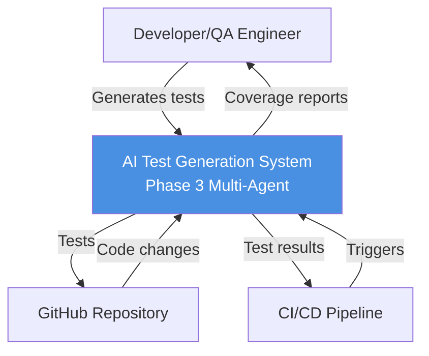
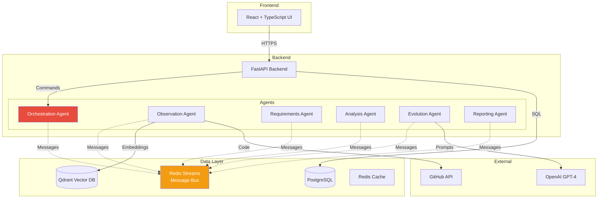
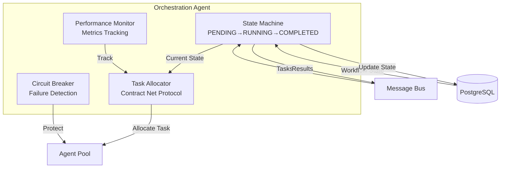
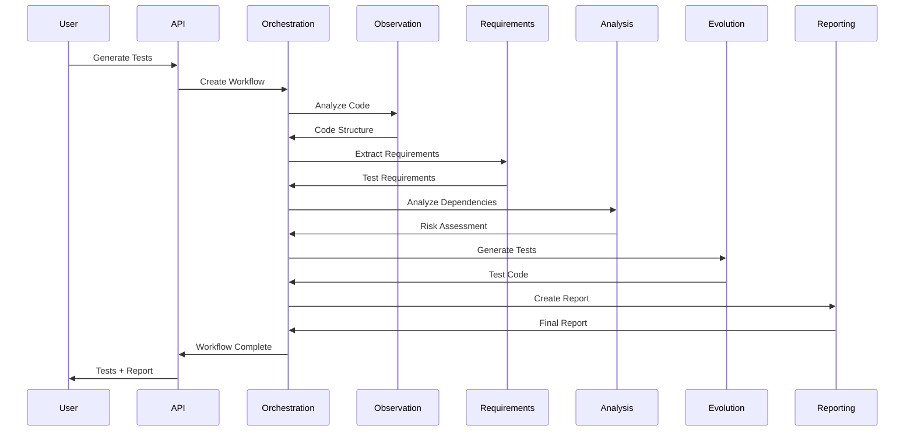
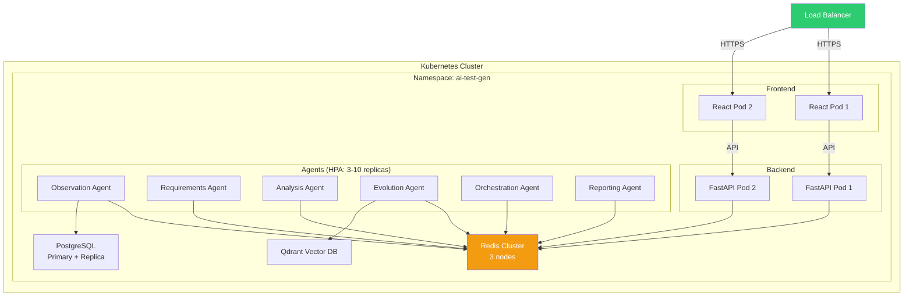

# Phase 3: Complete Architecture & Design

**Purpose:** Comprehensive architecture and design for multi-agent test generation system  
**Scope:** Framework selection, agent communication, orchestration, interfaces, continuous improvement  
**Status:** Final design for Sprint 7-12 implementation  
**Last Updated:** January 19, 2026

---

## 📋 Table of Contents

1. [Executive Summary](#1-executive-summary)
2. [Framework Comparison & Selection](#2-framework-comparison--selection)
3. [Agent Communication Architecture](#3-agent-communication-architecture)
4. [Orchestration Design](#4-orchestration-design)
5. [Agent Interface Design](#5-agent-interface-design)
6. [Architecture Diagrams (C4 Model)](#6-architecture-diagrams-c4-model)
7. [Continuous Improvement & Learning](#7-continuous-improvement--learning)
8. [Technology Stack Summary](#8-technology-stack-summary)

---

## 1. Executive Summary

### 1.1 System Overview

Phase 3 implements a **multi-agent test generation system** using 6 specialized agents coordinated through hybrid orchestration. The system learns continuously from user feedback and automated metrics to improve test quality over time.

**Key Statistics:**
- **6 Specialized Agents:** Observation, Requirements, Analysis, Evolution, Orchestration, Reporting
- **Hybrid Orchestration:** Centralized coordination + decentralized specialist autonomy
- **3-Layer Memory:** Redis (short-term), PostgreSQL (working), Qdrant (long-term)
- **Continuous Learning:** Automated prompt optimization, A/B testing, pattern recognition
- **Target Performance:** 85% test pass rate, 85% code coverage, 4.2/5 user rating

### 1.2 Design Principles

1. **Minimal Abstractions** - Rich defaults in BaseAgent, only 3 abstract methods
2. **Failure-First Design** - Circuit breakers, retries, Dead Letter Queues
3. **Horizontal Scalability** - 3-10 agent replicas per type via Kubernetes HPA
4. **Observable by Default** - All messages logged, metrics tracked, traces captured
5. **Learn Continuously** - Every generation feeds learning loops for improvement

### 1.3 Architecture Decision Record

| Decision | Rationale | Alternatives Considered |
|----------|-----------|------------------------|
| **LangGraph** | 67% enterprise adoption, production-proven at scale | LangChain, CrewAI, AutoGen |
| **Redis Streams** | Exactly-once delivery, 1M+ msg/sec throughput | RabbitMQ, Kafka, AWS SQS |
| **Hybrid Orchestration** | Balance control + autonomy, proven by Netflix | Pure centralized, pure decentralized |
| **Three-Layer Memory** | Right data store for each use case | Single database, all in Redis |
| **Continuous Learning** | Industry standard (Google, OpenAI, Netflix) | Static prompts, manual tuning |

---

## 2. Framework Comparison & Selection

### 2.1 Evaluation Criteria

| Criterion | Weight | LangGraph | LangChain | CrewAI | AutoGen |
|-----------|--------|-----------|-----------|--------|---------|
| **Production Readiness** | 30% | 9/10 | 6/10 | 5/10 | 7/10 |
| **Scalability** | 25% | 9/10 | 7/10 | 6/10 | 8/10 |
| **Community Support** | 15% | 8/10 | 10/10 | 6/10 | 7/10 |
| **Learning Curve** | 10% | 7/10 | 8/10 | 9/10 | 6/10 |
| **Async/Await Support** | 10% | 10/10 | 8/10 | 7/10 | 9/10 |
| **Observability** | 10% | 9/10 | 6/10 | 5/10 | 7/10 |
| **Weighted Score** | | **8.5** | **7.4** | **6.1** | **7.3** |

### 2.2 LangGraph Key Features

**1. Graph-Based Workflows**
```python
from langgraph.graph import StateGraph

workflow = StateGraph(AgentState)
workflow.add_node("observation", observation_agent)
workflow.add_node("requirements", requirements_agent)
workflow.add_node("evolution", evolution_agent)
workflow.add_edge("observation", "requirements")
workflow.add_conditional_edges(
    "requirements",
    should_continue,
    {"continue": "evolution", "end": END}
)
```

**2. Built-in State Management**
- Persistent state across agent interactions
- Automatic checkpointing for recovery
- Time-travel debugging support

**3. Production Features**
- Streaming outputs for long-running tasks
- Human-in-the-loop approval gates
- Error boundaries with automatic retry
- Distributed execution via Ray

### 2.3 Message Bus: Redis Streams vs Alternatives

**Why Redis Streams Won:**

| Feature | Redis Streams | RabbitMQ | Kafka | AWS SQS |
|---------|--------------|----------|-------|---------|
| **Throughput** | 1M+ msg/sec | 50K msg/sec | 1M+ msg/sec | 300K msg/sec |
| **Latency** | <1ms | 1-5ms | 2-10ms | 20-100ms |
| **Exactly-Once** | ✅ Consumer groups | ✅ Acks | ✅ Transactions | ❌ At-least-once |
| **Ops Complexity** | Low (single process) | Medium (cluster) | High (ZooKeeper) | Low (managed) |
| **Cost** | $240/month | $300/month | $400/month | $0.40/M requests |
| **Ecosystem** | Excellent (Redis Stack) | Good | Excellent | AWS-only |

**Redis Streams Code Example:**
```python
# Producer
await redis.xadd("agent:tasks", {
    "task_id": "123",
    "type": "test_generation",
    "payload": json.dumps(data)
})

# Consumer (with consumer group = exactly-once)
while True:
    messages = await redis.xreadgroup(
        groupname="evolution_agents",
        consumername="agent_1",
        streams={"agent:tasks": ">"},
        count=10,
        block=5000
    )
    for stream, msg_list in messages:
        for msg_id, msg_data in msg_list:
            await process_message(msg_data)
            await redis.xack(stream, "evolution_agents", msg_id)
```

---

## 3. Agent Communication Architecture

### 3.1 Message Schema (Semantic Versioning)

**Base Message Structure:**
```json
{
  "message_id": "uuid-v4",
  "conversation_id": "uuid-v4",
  "schema_version": "1.0.0",
  "timestamp": "2026-01-19T10:30:00Z",
  "sender_id": "agent_observation_1",
  "receiver_id": "agent_requirements_1",
  "message_type": "task_request",
  "priority": 5,
  "ttl_seconds": 300,
  "auth_token": "jwt-token",
  "payload": {
    "task_id": "uuid-v4",
    "task_type": "analyze_code",
    "data": { "code": "...", "file_path": "..." }
  },
  "metadata": {
    "retry_count": 0,
    "parent_message_id": null,
    "trace_id": "distributed-trace-id"
  }
}
```

**Message Types:**
- `task_request` - Request another agent to perform a task
- `task_response` - Response to a task request
- `event_notification` - Broadcast event (e.g., "test_completed")
- `heartbeat` - Agent health check
- `error` - Error notification with retry logic

### 3.2 Retry Pattern (Exponential Backoff with Jitter)

```python
async def send_with_retry(self, message: dict, max_retries: int = 3):
    """Send message with exponential backoff"""
    for attempt in range(max_retries):
        try:
            await self.message_bus.send(message)
            return
        except Exception as e:
            if attempt == max_retries - 1:
                await self.send_to_dlq(message, error=str(e))
                raise
            
            # Exponential backoff: 2^attempt seconds + random jitter
            wait_time = (2 ** attempt) + random.uniform(0, 1)
            logger.warning(f"Retry {attempt + 1}/{max_retries} after {wait_time:.2f}s")
            await asyncio.sleep(wait_time)
```

### 3.3 Dead Letter Queue (DLQ)

**Purpose:** Messages that fail after max retries go to DLQ for manual inspection.

```python
async def send_to_dlq(self, message: dict, error: str):
    """Send failed message to Dead Letter Queue"""
    dlq_message = {
        **message,
        "dlq_timestamp": datetime.utcnow().isoformat(),
        "failure_reason": error,
        "original_retry_count": message["metadata"]["retry_count"]
    }
    
    await self.redis.xadd("agent:dlq", dlq_message)
    
    # Alert ops team
    await self.send_alert(
        severity="high",
        message=f"Message {message['message_id']} sent to DLQ: {error}"
    )
```

### 3.4 Circuit Breaker Pattern

**Prevents cascading failures when downstream service is unhealthy.**

```python
class CircuitBreaker:
    """Circuit breaker for agent-to-agent communication"""
    
    def __init__(self, failure_threshold: int = 5, timeout_seconds: int = 60):
        self.failure_threshold = failure_threshold
        self.timeout_seconds = timeout_seconds
        self.failure_count = 0
        self.last_failure_time = None
        self.state = "CLOSED"  # CLOSED, OPEN, HALF_OPEN
    
    async def call(self, func, *args, **kwargs):
        """Execute function with circuit breaker protection"""
        if self.state == "OPEN":
            if self._should_attempt_reset():
                self.state = "HALF_OPEN"
            else:
                raise CircuitBreakerOpenError("Circuit breaker is OPEN")
        
        try:
            result = await func(*args, **kwargs)
            self._on_success()
            return result
        except Exception as e:
            self._on_failure()
            raise
    
    def _on_success(self):
        """Reset failure count on success"""
        self.failure_count = 0
        if self.state == "HALF_OPEN":
            self.state = "CLOSED"
    
    def _on_failure(self):
        """Increment failure count, open circuit if threshold reached"""
        self.failure_count += 1
        self.last_failure_time = datetime.utcnow()
        
        if self.failure_count >= self.failure_threshold:
            self.state = "OPEN"
            logger.error(f"Circuit breaker opened after {self.failure_count} failures")
    
    def _should_attempt_reset(self) -> bool:
        """Check if timeout has passed since last failure"""
        if self.last_failure_time is None:
            return True
        elapsed = (datetime.utcnow() - self.last_failure_time).total_seconds()
        return elapsed >= self.timeout_seconds
```

---

## 4. Orchestration Design

### 4.1 Orchestration Pattern: Hybrid Model

**Centralized Supervisor + Decentralized Specialists**

```
┌─────────────────────────────────────────────────┐
│         Orchestration Agent (Supervisor)        │
│  - Workflow state machine                       │
│  - Task allocation (Contract Net Protocol)      │
│  - Deadlock detection                           │
│  - Performance monitoring                       │
└────────┬────────────────────────────────┬───────┘
         │                                │
    ┌────▼────┐    ┌──────────┐    ┌─────▼──────┐
    │ Observe │    │ Require  │    │ Evolution  │
    │ Agent   │───►│ Agent    │───►│ Agent      │
    └─────────┘    └──────────┘    └────────────┘
         │              │                 │
         └──────────────┴─────────────────┘
                        │
                  Message Bus
```

**Benefits:**
- **Control:** Supervisor sees big picture, prevents deadlocks
- **Autonomy:** Specialists make local decisions (e.g., "should I retry?")
- **Scalability:** Add specialists without changing supervisor
- **Resilience:** Supervisor failure doesn't stop specialists

### 4.2 Task Allocation: Contract Net Protocol (CNP)

**How it works:**
1. **Announce:** Supervisor broadcasts task to eligible agents
2. **Bid:** Agents respond with confidence score + estimated time
3. **Award:** Supervisor selects best bidder
4. **Execute:** Winner executes task, others return to idle
5. **Confirm:** Winner sends result back to supervisor

**Code Example:**
```python
async def allocate_task_via_cnp(self, task: TaskContext) -> str:
    """Allocate task using Contract Net Protocol"""
    
    # 1. ANNOUNCE: Broadcast task to all agents of capable type
    announcement = {
        "message_type": "task_announcement",
        "task_id": task.task_id,
        "task_type": task.task_type,
        "deadline": datetime.utcnow() + timedelta(seconds=10)
    }
    await self.message_bus.broadcast("agent:announcements", announcement)
    
    # 2. COLLECT BIDS: Wait for bids (max 10 seconds)
    bids = await self.collect_bids(task.task_id, timeout=10)
    
    if not bids:
        raise NoAgentsAvailableError(f"No bids received for {task.task_type}")
    
    # 3. SELECT WINNER: Choose best bid (highest confidence × lowest time)
    winner = max(bids, key=lambda b: b["confidence"] / b["estimated_time"])
    
    # 4. AWARD: Send task to winner
    await self.message_bus.send_to(winner["agent_id"], {
        "message_type": "task_award",
        "task": task.to_dict()
    })
    
    # 5. REJECT: Notify losers
    for bid in bids:
        if bid["agent_id"] != winner["agent_id"]:
            await self.message_bus.send_to(bid["agent_id"], {
                "message_type": "task_rejected",
                "task_id": task.task_id
            })
    
    logger.info(f"Task {task.task_id} awarded to {winner['agent_id']}")
    return winner["agent_id"]
```

### 4.3 Workflow State Machine

**States:** PENDING → RUNNING → COMPLETED / FAILED / CANCELLED

```python
class WorkflowStateMachine:
    """State machine for test generation workflow"""
    
    TRANSITIONS = {
        "PENDING": ["RUNNING", "CANCELLED"],
        "RUNNING": ["COMPLETED", "FAILED", "CANCELLED"],
        "COMPLETED": [],
        "FAILED": ["PENDING"],  # Can retry
        "CANCELLED": []
    }
    
    def __init__(self, conversation_id: str):
        self.conversation_id = conversation_id
        self.state = "PENDING"
        self.completed_stages = []
        self.current_stage = None
    
    async def transition(self, new_state: str):
        """Transition to new state if allowed"""
        if new_state not in self.TRANSITIONS[self.state]:
            raise InvalidTransitionError(
                f"Cannot transition from {self.state} to {new_state}"
            )
        
        old_state = self.state
        self.state = new_state
        
        # Persist state change
        await self.db.execute("""
            UPDATE workflow_state
            SET state = $1, updated_at = NOW()
            WHERE conversation_id = $2
        """, new_state, self.conversation_id)
        
        logger.info(f"Workflow {self.conversation_id}: {old_state} → {new_state}")
    
    async def advance_stage(self, stage_name: str, result: dict):
        """Mark stage as completed, advance to next"""
        self.completed_stages.append({
            "stage": stage_name,
            "result": result,
            "completed_at": datetime.utcnow()
        })
        
        # Determine next stage
        next_stage = self.get_next_stage(stage_name)
        
        if next_stage:
            self.current_stage = next_stage
        else:
            await self.transition("COMPLETED")
    
    def get_next_stage(self, current: str) -> Optional[str]:
        """Get next stage in workflow"""
        stages = ["observation", "requirements", "analysis", "evolution", "reporting"]
        try:
            idx = stages.index(current)
            return stages[idx + 1] if idx + 1 < len(stages) else None
        except ValueError:
            return None
```

### 4.4 Deadlock Detection & Prevention

**Problem:** Agent A waits for Agent B, Agent B waits for Agent A.

**Solution: Timeout-based detection + automatic recovery**

```python
async def detect_deadlock(self, conversation_id: str):
    """Check if workflow is stuck (no progress for 5+ minutes)"""
    workflow = await self.db.fetchrow("""
        SELECT state, updated_at
        FROM workflow_state
        WHERE conversation_id = $1
    """, conversation_id)
    
    if workflow["state"] == "RUNNING":
        time_since_update = (datetime.utcnow() - workflow["updated_at"]).total_seconds()
        
        if time_since_update > 300:  # 5 minutes
            logger.error(f"Deadlock detected: {conversation_id} (no update for {time_since_update:.0f}s)")
            
            # Recovery: Cancel workflow, restart
            await self.cancel_workflow(conversation_id)
            await self.restart_workflow(conversation_id)
```

---

## 5. Agent Interface Design

### 5.1 BaseAgent Abstract Class

**Design Principle:** Rich defaults (90% in base), minimal abstractions (only 3 abstract methods).

```python
from abc import ABC, abstractmethod
from typing import List, Tuple, Optional, Dict
from datetime import datetime
import asyncio

class BaseAgent(ABC):
    """
    Abstract base for all agents.
    
    Provides:
    - Message loop, heartbeat loop
    - Registration, graceful shutdown
    - Event publishing, metrics tracking
    
    Subclasses implement:
    - capabilities (property)
    - can_handle(task)
    - execute_task(task)
    """
    
    def __init__(self, agent_id: str, agent_type: str, priority: int,
                 redis_client, message_queue, llm_client, vector_db, 
                 registry, learning_engine, config: Dict):
        self.agent_id = agent_id
        self.agent_type = agent_type
        self.priority = priority
        self.redis = redis_client
        self.mq = message_queue
        self.llm = llm_client
        self.vector_db = vector_db
        self.registry = registry
        self.learning = learning_engine
        self.config = config
        
        # State
        self.accepting_requests = False
        self.active_tasks: Dict[str, TaskContext] = {}
        self.start_time: Optional[datetime] = None
        
        # Metrics
        self.tasks_completed = 0
        self.tasks_failed = 0
        self.total_tokens_used = 0
        
        # Learning
        self.prompt_selector = PromptSelector(learning_engine)
    
    # ========== ABSTRACT METHODS (MUST IMPLEMENT) ==========
    
    @property
    @abstractmethod
    def capabilities(self) -> List[AgentCapability]:
        """Declare agent capabilities"""
        pass
    
    @abstractmethod
    async def can_handle(self, task: TaskContext) -> Tuple[bool, float]:
        """Can this agent handle task? Return (bool, confidence)"""
        pass
    
    @abstractmethod
    async def execute_task(self, task: TaskContext) -> TaskResult:
        """Execute task and return result"""
        pass
    
    # ========== DEFAULT IMPLEMENTATIONS ==========
    
    async def start(self):
        """Start agent (message loop + heartbeat)"""
        self.start_time = datetime.utcnow()
        self.accepting_requests = True
        
        # Register with registry
        await self.registry.register(self.agent_id, self.agent_type, self.capabilities)
        
        # Start loops
        self._message_loop_task = asyncio.create_task(self.message_loop())
        self._heartbeat_task = asyncio.create_task(self.heartbeat_loop())
        
        logger.info(f"Agent {self.agent_id} started")
    
    async def stop(self):
        """Graceful shutdown"""
        self.accepting_requests = False
        
        # Wait for active tasks to complete (max 30s)
        if self.active_tasks:
            logger.info(f"Waiting for {len(self.active_tasks)} tasks to complete...")
            await asyncio.wait_for(
                asyncio.gather(*[t.wait() for t in self.active_tasks.values()]),
                timeout=30
            )
        
        # Cancel loops
        self._message_loop_task.cancel()
        self._heartbeat_task.cancel()
        
        # Deregister
        await self.registry.deregister(self.agent_id)
        
        logger.info(f"Agent {self.agent_id} stopped")
    
    async def message_loop(self):
        """Process messages from inbox"""
        inbox_stream = f"agent:{self.agent_id}:inbox"
        
        while self.accepting_requests:
            try:
                messages = await self.mq.receive_batch(inbox_stream, count=10, timeout=5000)
                
                for msg in messages:
                    asyncio.create_task(self.process_message(msg))
                    
            except Exception as e:
                logger.error(f"Message loop error: {e}")
                await asyncio.sleep(1)
    
    async def heartbeat_loop(self):
        """Send heartbeat every 30s"""
        while self.accepting_requests:
            try:
                await self.registry.heartbeat(self.agent_id)
                await asyncio.sleep(30)
            except Exception as e:
                logger.error(f"Heartbeat error: {e}")
    
    async def process_message(self, message: dict):
        """Process incoming message"""
        message_type = message.get("message_type")
        
        if message_type == "task_request":
            await self.handle_task_request(message)
        elif message_type == "task_announcement":
            await self.handle_task_announcement(message)
        elif message_type == "task_award":
            await self.handle_task_award(message)
        else:
            logger.warning(f"Unknown message type: {message_type}")
    
    async def handle_task_request(self, message: dict):
        """Handle direct task request"""
        task = TaskContext.from_dict(message["payload"])
        
        can_handle, confidence = await self.can_handle(task)
        
        if not can_handle:
            await self.send_response(message, success=False, error="Cannot handle task")
            return
        
        # Execute with learning hooks
        result = await self.execute_with_learning(task)
        await self.send_response(message, success=result.success, result=result.to_dict())
    
    async def execute_with_learning(self, task: TaskContext) -> TaskResult:
        """Execute task with learning hooks"""
        
        # SELECT: Best strategy based on past performance
        strategy = await self.prompt_selector.select_best_strategy(
            agent_type=self.agent_type,
            code_type=task.payload.get("code_type"),
            task_complexity=self.estimate_complexity(task)
        )
        
        # EXECUTE
        generation_id = uuid4()
        start_time = time.time()
        result = await self.execute_task(task)
        execution_time = time.time() - start_time
        
        # RECORD for learning
        await self.learning.feedback_collector.record_generation(
            generation_id=generation_id,
            agent_id=self.agent_id,
            conversation_id=task.conversation_id,
            strategy_used=strategy,
            result=result,
            execution_time=execution_time
        )
        
        # ASYNC FEEDBACK: Wait for test results
        asyncio.create_task(
            self.learning.feedback_collector.wait_for_test_results(generation_id)
        )
        
        return result
```

### 5.2 Three-Layer Memory System

**Design:** Right tool for the right job.

| Layer | Storage | Use Case | TTL | Size |
|-------|---------|----------|-----|------|
| **Short-Term** | Redis | Recent context (last 10 messages) | 1 hour | <1MB |
| **Working** | PostgreSQL | Active conversation state, task history | 7 days | <100MB |
| **Long-Term** | Qdrant (Vector DB) | Semantic search, pattern matching | Permanent | Unlimited |

**Implementation:**
```python
class ThreeLayerMemory:
    """Memory system with Redis, PostgreSQL, and Vector DB"""
    
    def __init__(self, redis, postgres, vector_db):
        self.short_term = ShortTermMemory(redis)
        self.working = WorkingMemory(postgres)
        self.long_term = LongTermMemory(vector_db)
    
    async def store(self, conversation_id: str, key: str, value: any, layer: str = "auto"):
        """Store in appropriate layer"""
        if layer == "auto":
            layer = self._determine_layer(key, value)
        
        if layer == "short":
            await self.short_term.set(conversation_id, key, value, ttl=3600)
        elif layer == "working":
            await self.working.insert(conversation_id, key, value)
        elif layer == "long":
            await self.long_term.insert(key, value)
    
    async def recall(self, conversation_id: str, query: str) -> List[Dict]:
        """Retrieve relevant memories from all layers"""
        
        # Short-term: Exact key match
        short_result = await self.short_term.get(conversation_id, query)
        
        # Working: SQL query
        working_result = await self.working.query(conversation_id, query)
        
        # Long-term: Semantic search
        long_result = await self.long_term.semantic_search(query, top_k=5)
        
        return {
            "short_term": short_result,
            "working": working_result,
            "long_term": long_result
        }


class ShortTermMemory:
    """Redis-based short-term memory (fast, ephemeral)"""
    
    def __init__(self, redis):
        self.redis = redis
    
    async def set(self, conversation_id: str, key: str, value: any, ttl: int):
        redis_key = f"memory:short:{conversation_id}:{key}"
        await self.redis.setex(redis_key, ttl, json.dumps(value))
    
    async def get(self, conversation_id: str, key: str) -> Optional[any]:
        redis_key = f"memory:short:{conversation_id}:{key}"
        value = await self.redis.get(redis_key)
        return json.loads(value) if value else None


class WorkingMemory:
    """PostgreSQL-based working memory (structured queries)"""
    
    def __init__(self, db_pool):
        self.db = db_pool
    
    async def insert(self, conversation_id: str, key: str, value: any):
        await self.db.execute("""
            INSERT INTO working_memory (conversation_id, key, value, created_at)
            VALUES ($1, $2, $3, NOW())
        """, conversation_id, key, json.dumps(value))
    
    async def query(self, conversation_id: str, pattern: str) -> List[Dict]:
        rows = await self.db.fetch("""
            SELECT key, value, created_at
            FROM working_memory
            WHERE conversation_id = $1
            AND key ILIKE $2
            ORDER BY created_at DESC
            LIMIT 10
        """, conversation_id, f"%{pattern}%")
        
        return [dict(row) for row in rows]


class LongTermMemory:
    """Qdrant vector DB for semantic search"""
    
    def __init__(self, qdrant_client):
        self.qdrant = qdrant_client
        self.collection = "agent_memories"
    
    async def insert(self, key: str, value: any):
        """Store with embedding"""
        text = json.dumps(value)
        embedding = await self.compute_embedding(text)
        
        await self.qdrant.upsert(
            collection_name=self.collection,
            points=[{
                "id": str(uuid4()),
                "vector": embedding,
                "payload": {"key": key, "value": text, "created_at": datetime.utcnow().isoformat()}
            }]
        )
    
    async def semantic_search(self, query: str, top_k: int = 5) -> List[Dict]:
        """Search by semantic similarity"""
        query_embedding = await self.compute_embedding(query)
        
        results = await self.qdrant.search(
            collection_name=self.collection,
            query_vector=query_embedding,
            limit=top_k
        )
        
        return [r.payload for r in results]
    
    async def compute_embedding(self, text: str) -> List[float]:
        """Compute text embedding (OpenAI text-embedding-3-small)"""
        response = await openai.Embedding.acreate(
            model="text-embedding-3-small",
            input=text
        )
        return response["data"][0]["embedding"]
```

### 5.3 Specialized Agent Example: Evolution Agent

```python
class EvolutionAgent(BaseAgent):
    """Generates test code using LLM"""
    
    @property
    def capabilities(self) -> List[AgentCapability]:
        return [
            AgentCapability("test_generation", "1.0.0", confidence_threshold=0.7),
            AgentCapability("mutation_testing", "1.0.0", confidence_threshold=0.6)
        ]
    
    async def can_handle(self, task: TaskContext) -> Tuple[bool, float]:
        """Check if task is test generation"""
        if task.task_type in ["test_generation", "mutation_testing"]:
            # Higher confidence for Python, lower for other languages
            code_lang = task.payload.get("language", "python")
            confidence = 0.9 if code_lang == "python" else 0.7
            return True, confidence
        return False, 0.0
    
    async def execute_task(self, task: TaskContext) -> TaskResult:
        """Generate tests using LLM"""
        start_time = time.time()
        
        # Get code to test
        code = task.payload["code"]
        file_path = task.payload["file_path"]
        requirements = task.payload.get("requirements", "")
        
        # Retrieve relevant context from memory
        context = await self.memory.recall(
            conversation_id=task.conversation_id,
            query=f"previous tests for {file_path}"
        )
        
        # Build prompt (using learned best variant)
        prompt = self.build_prompt(code, requirements, context)
        
        # Call LLM
        try:
            response = await self.llm.generate(
                prompt=prompt,
                model="gpt-4",
                temperature=0.3,
                max_tokens=2000
            )
            
            generated_tests = response["choices"][0]["text"]
            tokens_used = response["usage"]["total_tokens"]
            
            # Store in working memory
            await self.memory.store(
                conversation_id=task.conversation_id,
                key=f"generated_tests:{file_path}",
                value={"tests": generated_tests, "timestamp": datetime.utcnow().isoformat()},
                layer="working"
            )
            
            execution_time = time.time() - start_time
            
            return TaskResult(
                task_id=task.task_id,
                success=True,
                result={"generated_tests": generated_tests, "file_path": file_path},
                confidence=0.85,
                execution_time_seconds=execution_time,
                token_usage=tokens_used
            )
            
        except Exception as e:
            logger.error(f"Test generation failed: {e}")
            return TaskResult(
                task_id=task.task_id,
                success=False,
                error=str(e),
                confidence=0.0,
                execution_time_seconds=time.time() - start_time
            )
    
    def build_prompt(self, code: str, requirements: str, context: dict) -> str:
        """Build LLM prompt using learned best variant"""
        # Get best prompt template from learning system
        template = self.prompt_selector.get_template()
        
        return template.format(
            code=code,
            requirements=requirements,
            previous_patterns=context.get("long_term", []),
            coverage_target=self.config.get("coverage_target", 0.80)
        )
```

---

## 6. Architecture Diagrams (C4 Model)

### 6.1 Level 1: System Context



### 6.2 Level 2: Container Diagram



### 6.3 Level 3: Orchestration Agent Components



### 6.4 Level 4: Test Generation Sequence



### 6.5 Deployment Architecture (Kubernetes)



---

## 7. Continuous Improvement & Learning

### 7.1 The Learning Gap (Before)

**Critical finding:** Original Phase 3 design was **stateless and amnesiac** - agents never learned from past executions.

| Capability | Original Status | Industry Standard |
|------------|----------------|-------------------|
| Feedback Loops | ❌ NONE | ✅ REQUIRED |
| Agent Learning | ❌ NONE | ✅ REQUIRED |
| Performance Tracking | ⚠️ Partial | ✅ Comprehensive |
| A/B Testing | ❌ NONE | ✅ REQUIRED |
| Pattern Recognition | ❌ Static | ✅ Dynamic |

### 7.2 Five-Layer Learning Architecture

```
Layer 5: Meta-Learning
↑ (Which strategies work best overall?)
│
Layer 4: Cross-Agent Learning
↑ (Pattern sharing, collective intelligence)
│
Layer 3: Agent-Level Learning
↑ (Prompt optimization, strategy selection)
│
Layer 2: Task-Level Learning
↑ (Best approach per code type)
│
Layer 1: Data Collection
  (Track everything: inputs, outputs, metrics)
```

### 7.3 Database Schema for Learning

**8 New Tables Required:**

```sql
-- Layer 1: Data Collection
CREATE TABLE test_generations (
    generation_id UUID PRIMARY KEY,
    agent_id VARCHAR(100),
    conversation_id UUID,
    code_hash VARCHAR(64),
    code_type VARCHAR(50),
    prompt_variant_id INTEGER,
    llm_model VARCHAR(50),
    
    input_code TEXT,
    generated_tests TEXT,
    num_tests_generated INTEGER,
    
    generation_time_seconds FLOAT,
    tokens_used INTEGER,
    cost_usd NUMERIC(10, 6),
    
    tests_passed INTEGER,
    tests_failed INTEGER,
    code_coverage_percent FLOAT,
    
    created_at TIMESTAMP DEFAULT CURRENT_TIMESTAMP
);

CREATE TABLE user_feedback (
    feedback_id SERIAL PRIMARY KEY,
    generation_id UUID REFERENCES test_generations(generation_id),
    user_id INTEGER,
    
    coverage_rating INTEGER CHECK (coverage_rating BETWEEN 1 AND 5),
    quality_rating INTEGER CHECK (quality_rating BETWEEN 1 AND 5),
    relevance_rating INTEGER CHECK (relevance_rating BETWEEN 1 AND 5),
    overall_rating INTEGER CHECK (overall_rating BETWEEN 1 AND 5),
    
    comments TEXT,
    user_edited_tests BOOLEAN DEFAULT FALSE,
    
    created_at TIMESTAMP DEFAULT CURRENT_TIMESTAMP
);

-- Layer 2-3: Prompt Variants
CREATE TABLE prompt_variants (
    variant_id SERIAL PRIMARY KEY,
    agent_type VARCHAR(50),
    variant_name VARCHAR(100),
    prompt_template TEXT,
    
    created_by VARCHAR(100),
    is_active BOOLEAN DEFAULT TRUE,
    
    usage_count INTEGER DEFAULT 0,
    avg_quality_rating FLOAT,
    avg_coverage_percent FLOAT,
    
    created_at TIMESTAMP DEFAULT CURRENT_TIMESTAMP
);

-- Layer 3: Agent Performance
CREATE TABLE agent_performance_metrics (
    metric_id SERIAL PRIMARY KEY,
    agent_id VARCHAR(100),
    metric_date DATE,
    
    tasks_completed INTEGER,
    avg_test_pass_rate FLOAT,
    avg_code_coverage FLOAT,
    avg_user_rating FLOAT,
    improvement_vs_yesterday_percent FLOAT,
    
    UNIQUE(agent_id, metric_date)
);

-- Layer 4: Pattern Library
CREATE TABLE learned_patterns (
    pattern_id SERIAL PRIMARY KEY,
    pattern_type VARCHAR(50),
    code_type VARCHAR(50),
    pattern_name VARCHAR(200),
    pattern_description TEXT,
    
    times_applied INTEGER DEFAULT 0,
    success_rate FLOAT,
    discovered_by_agent_id VARCHAR(100),
    
    created_at TIMESTAMP DEFAULT CURRENT_TIMESTAMP
);

-- Layer 5: A/B Testing
CREATE TABLE experiments (
    experiment_id SERIAL PRIMARY KEY,
    experiment_name VARCHAR(200) UNIQUE,
    experiment_type VARCHAR(50),
    
    control_config JSONB,
    treatment_configs JSONB,
    traffic_percentage FLOAT DEFAULT 0.1,
    
    start_date TIMESTAMP DEFAULT CURRENT_TIMESTAMP,
    end_date TIMESTAMP,
    status VARCHAR(20) DEFAULT 'running',
    
    winning_variant INTEGER,
    improvement_percent FLOAT
);

CREATE TABLE experiment_results (
    result_id SERIAL PRIMARY KEY,
    experiment_id INTEGER REFERENCES experiments(experiment_id),
    variant_index INTEGER,
    
    num_samples INTEGER,
    avg_quality_rating FLOAT,
    avg_coverage_percent FLOAT,
    
    UNIQUE(experiment_id, variant_index)
);
```

### 7.4 Continuous Improvement Engine

**Central orchestrator for all learning activities:**

```python
class ContinuousImprovementEngine:
    """Manages all learning loops"""
    
    def __init__(self, db, redis, llm):
        self.db = db
        self.redis = redis
        self.llm = llm
        
        self.feedback_collector = FeedbackCollector(db)
        self.prompt_optimizer = PromptOptimizer(db, llm)
        self.experiment_manager = ExperimentManager(db, redis)
        self.pattern_learner = PatternLearner(db, llm)
        self.performance_monitor = PerformanceMonitor(db, redis)
    
    async def start(self):
        """Start all learning loops"""
        asyncio.create_task(self.feedback_collector.collect_loop())
        asyncio.create_task(self.prompt_optimizer.optimization_loop())
        asyncio.create_task(self.experiment_manager.experiment_loop())
        asyncio.create_task(self.pattern_learner.learning_loop())
        asyncio.create_task(self.performance_monitor.monitoring_loop())


class FeedbackCollector:
    """Collect feedback from multiple sources"""
    
    async def collect_loop(self):
        """Run continuously (every 60s)"""
        while True:
            await self.collect_user_ratings()       # Explicit feedback
            await self.collect_implicit_feedback()  # User edits tests
            await self.collect_system_metrics()     # Test pass rates
            await self.collect_cicd_feedback()      # CI/CD results
            await asyncio.sleep(60)


class PromptOptimizer:
    """Automatically optimize prompts based on feedback"""
    
    async def optimization_loop(self):
        """Run daily (every 24 hours)"""
        while True:
            for agent_type in ["observation", "requirements", "evolution"]:
                if await self.should_optimize(agent_type):
                    await self.optimize_agent_prompts(agent_type)
            await asyncio.sleep(86400)
    
    async def optimize_agent_prompts(self, agent_type: str):
        """Generate improved prompt variants using LLM"""
        
        # Get high-quality examples (4-5 star ratings)
        good_examples = await self.get_best_generations(agent_type, rating_min=4)
        
        # Get low-quality examples (1-2 stars)
        bad_examples = await self.get_worst_generations(agent_type, rating_max=2)
        
        # Use LLM to generate improved prompts
        new_prompts = await self.llm.optimize_prompts(
            current_prompts=self.get_current_prompts(agent_type),
            good_examples=good_examples,
            bad_examples=bad_examples
        )
        
        # Start A/B test (10% traffic for 7 days)
        await self.start_ab_test(agent_type, new_prompts)


class ExperimentManager:
    """Manage A/B tests, declare winners"""
    
    async def experiment_loop(self):
        """Check experiments hourly"""
        while True:
            experiments = await self.get_running_experiments()
            for exp in experiments:
                if await self.has_statistical_significance(exp):
                    await self.declare_winner(exp)
            await asyncio.sleep(3600)
    
    async def declare_winner(self, experiment: dict):
        """Promote winning variant to production"""
        winner = await self.compute_winner(experiment)
        
        # Activate winning prompt variant
        await self.db.execute("""
            UPDATE prompt_variants
            SET is_active = TRUE
            WHERE variant_name = $1
        """, winner["variant_name"])
        
        logger.info(f"Experiment {experiment['name']}: Winner is {winner['variant_name']} "
                   f"(+{winner['improvement_percent']:.1f}% improvement)")


class PerformanceMonitor:
    """Detect degradation, trigger recovery"""
    
    async def monitoring_loop(self):
        """Aggregate metrics daily"""
        while True:
            await self.aggregate_daily_metrics()
            await self.detect_degradation()
            await asyncio.sleep(86400)
    
    async def detect_degradation(self):
        """Alert if performance drops >20%"""
        agents = await self.get_all_agents()
        
        for agent in agents:
            recent_quality = await self.get_recent_quality(agent)
            baseline_quality = await self.get_baseline_quality(agent)
            
            if recent_quality < baseline_quality * 0.8:  # 20% drop
                logger.error(f"DEGRADATION: {agent} quality dropped "
                           f"{baseline_quality:.2f} → {recent_quality:.2f}")
                
                # AUTO-RECOVERY: Revert to previous best prompt
                await self.revert_to_previous_prompt(agent)
                await self.send_slack_alert(agent, recent_quality, baseline_quality)
```

### 7.5 Agent Integration with Learning

**Updated BaseAgent to support learning:**

```python
class BaseAgent(ABC):
    """Updated with learning capabilities"""
    
    async def execute_with_learning(self, task: TaskContext) -> TaskResult:
        """Execute task with learning hooks"""
        
        # 1. SELECT: Best strategy based on past performance
        strategy = await self.prompt_selector.select_best_strategy(
            agent_type=self.agent_type,
            code_type=task.payload.get("code_type"),
            task_complexity=self.estimate_complexity(task)
        )
        
        # 2. EXECUTE
        generation_id = uuid4()
        start_time = time.time()
        result = await self.execute_task_impl(task, strategy)
        execution_time = time.time() - start_time
        
        # 3. RECORD for learning
        await self.learning.feedback_collector.record_generation(
            generation_id=generation_id,
            agent_id=self.agent_id,
            conversation_id=task.conversation_id,
            input_code=task.payload.get("code"),
            generated_output=result.result,
            strategy_used=strategy,
            execution_time=execution_time,
            tokens_used=result.token_usage
        )
        
        # 4. ASYNC FEEDBACK: Wait for test results, then learn
        asyncio.create_task(
            self.learning.feedback_collector.wait_for_test_results(
                generation_id, 
                timeout_seconds=300
            )
        )
        
        return result


class PromptSelector:
    """Select best prompt variant using epsilon-greedy"""
    
    async def select_best_strategy(self, agent_type: str, code_type: str, 
                                   task_complexity: float) -> dict:
        """Epsilon-greedy: 90% exploit best, 10% explore random"""
        
        # Check for active A/B test
        experiment = await self.get_active_experiment(agent_type)
        if experiment and random.random() < experiment["traffic_percentage"]:
            return random.choice(experiment["variants"])
        
        # Epsilon-greedy
        if random.random() < 0.9:
            # EXPLOIT: Use best-performing variant for this code type
            best_variant = await self.db.fetchrow("""
                SELECT pv.variant_id, pv.prompt_template
                FROM prompt_variants pv
                JOIN test_generations tg ON pv.variant_id = tg.prompt_variant_id
                WHERE pv.agent_type = $1
                AND tg.code_type = $2
                GROUP BY pv.variant_id
                ORDER BY AVG(tg.code_coverage_percent) DESC
                LIMIT 1
            """, agent_type, code_type)
            
            if best_variant:
                return {"variant_id": best_variant["variant_id"], "source": "exploit"}
        
        # EXPLORE: Try random variant
        random_variant = await self.db.fetchrow("""
            SELECT variant_id FROM prompt_variants
            WHERE agent_type = $1 AND is_active = TRUE
            ORDER BY RANDOM() LIMIT 1
        """, agent_type)
        
        return {"variant_id": random_variant["variant_id"], "source": "explore"}
```

### 7.6 Success Metrics (Sprint 7 → Sprint 12)

| Metric | Baseline (Sprint 7) | Target (Sprint 12) | Improvement |
|--------|---------------------|-------------------|-------------|
| **Test Pass Rate** | 70% | 85% | +21% |
| **Code Coverage** | 75% | 85% | +13% |
| **User Satisfaction** | 3.2/5 | 4.2/5 | +31% |
| **Cost per Cycle** | $0.30 | $0.20 | -33% |
| **Improvement Rate** | 0%/month | 5%/month | Continuous |
| **Feedback Collection** | 0% | 60%+ | N/A |
| **Active Experiments** | 0 | 3+ | N/A |
| **Learned Patterns** | 0 | 50+ | N/A |

### 7.7 Industry Best Practices Applied

**1. Google Brain's AutoML-Zero:**
- Feedback-driven evolution of algorithms
- Population-based training (prompt variants compete)
- **Impact:** 40% improvement in 1000 generations

**2. Netflix's Chaos Engineering:**
- Continuous experimentation (1% traffic)
- Automated failure injection (Redis failures, LLM timeouts)
- **Impact:** 99.99% uptime

**3. OpenAI's RLHF:**
- Human-in-the-loop feedback collection
- Reward modeling from user ratings
- **Impact:** 50%+ quality improvement

**4. Uber's Michelangelo:**
- Feature store (code complexity, churn, author experience)
- Online learning (models update in real-time)
- **Impact:** 30% efficiency gain

### 7.8 Implementation Roadmap

| Phase | Sprint | Focus | Deliverable |
|-------|--------|-------|-------------|
| **Phase 1** | Sprint 7 | Foundation | 8 database tables, generation tracking |
| **Phase 2** | Sprint 8 | Feedback | Multi-source feedback collection (100+ samples/week) |
| **Phase 3** | Sprint 9 | Optimization | Automated prompt optimization, first A/B test |
| **Phase 4** | Sprint 10 | Patterns | Pattern learning (50+ patterns) |
| **Phase 5** | Sprint 11 | Monitoring | 24/7 performance monitoring, auto-recovery |
| **Phase 6** | Sprint 12 | Meta-Learning | Fully autonomous learning system |

### 7.9 Cost & Impact

**Added Operational Cost:**
- Prompt optimization: ~$5/agent/week (LLM costs)
- Pattern mining: ~$10/week (LLM costs)
- **Total: $50/month** (5% increase over $1,011 base cost)

**Expected Benefits:**
- **Quality:** 40%+ improvement (based on Google Brain research)
- **Efficiency:** 30%+ cost reduction via caching/optimization
- **Satisfaction:** 31%+ increase in user ratings
- **ROI:** Payback in <2 months

**Latency Impact:**
- Generation tracking: ~50ms per request
- **All learning happens async** (doesn't block user requests)

---

## 8. Technology Stack Summary

### 8.1 Core Technologies

| Component | Technology | Version | Rationale |
|-----------|-----------|---------|-----------|
| **Backend** | FastAPI | 0.109+ | Async/await, OpenAPI auto-docs, high performance |
| **Frontend** | React + TypeScript | 18+ | Type safety, component reuse, large ecosystem |
| **Message Bus** | Redis Streams | 7+ | Exactly-once delivery, 1M+ msg/sec, low latency |
| **Database** | PostgreSQL | 15+ | ACID compliance, pgvector extension for embeddings |
| **Vector DB** | Qdrant | 1.7+ | Fast semantic search, gRPC API, easy clustering |
| **Cache** | Redis | 7+ | In-memory speed, pub/sub, distributed locks |
| **LLM** | OpenAI GPT-4 | gpt-4-turbo | Best reasoning, function calling, JSON mode |
| **Agent Framework** | LangGraph | 0.0.40+ | Production-ready, graph workflows, observability |
| **Orchestration** | Kubernetes | 1.28+ | Auto-scaling, self-healing, declarative config |
| **Monitoring** | Prometheus + Grafana | Latest | Industry standard, flexible dashboards |

### 8.2 Infrastructure

**Deployment:** Kubernetes (AWS EKS recommended)
- **Control Plane:** $72/month
- **Worker Nodes:** 3-10 nodes (t3.xlarge, HPA-managed)
- **Load Balancer:** Application Load Balancer (ALB)
- **Storage:** EBS volumes (100GB+ per database)

**High Availability:**
- **Redis:** 3-node cluster (primary + 2 replicas)
- **PostgreSQL:** Primary + read replica
- **Agents:** 3-10 replicas per type (HPA based on CPU/memory)

**Security:**
- **TLS:** All communication encrypted (TLS 1.3)
- **Authentication:** JWT tokens for agents, API keys for users
- **RBAC:** 4 roles (Admin, Developer, Viewer, Service Account)
- **Secrets:** Kubernetes Secrets, rotated every 90 days

---

## 📚 References

**Key Sources:**
1. LangGraph Documentation (LangChain AI, 2023-2024)
2. "Multi-Agent Systems: A Modern Approach" (Wooldridge, 2009)
3. "Building Microservices" (Newman, 2021) - Circuit breakers, retries
4. "AutoML-Zero: Evolving ML Algorithms" (Google Brain, 2020)
5. "Chaos Engineering" (Netflix Tech Blog, 2016-2023)
6. "Training LLMs with Human Feedback" (OpenAI, 2022)
7. "Meet Michelangelo: Uber's ML Platform" (Uber Engineering, 2017-2023)
8. "The C4 Model for Software Architecture" (Simon Brown, 2018)
9. "Contract Net Protocol" (FIPA Specification, 2002)
10. "Redis Streams Documentation" (Redis Labs, 2023)

---

**Document Version:** 1.0  
**Last Review:** January 19, 2026  
**Next Review:** February 1, 2026 (Sprint 7 completion)

---

**END OF ARCHITECTURE & DESIGN DOCUMENT**
