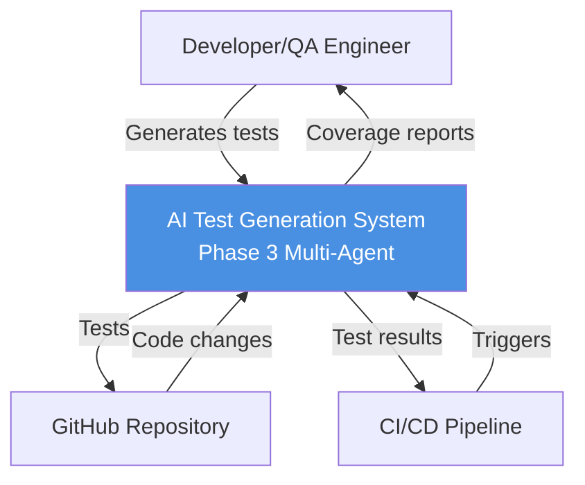
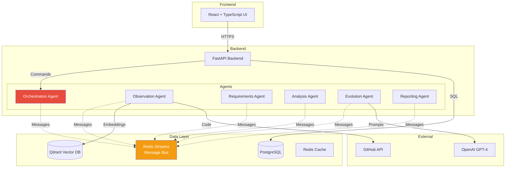
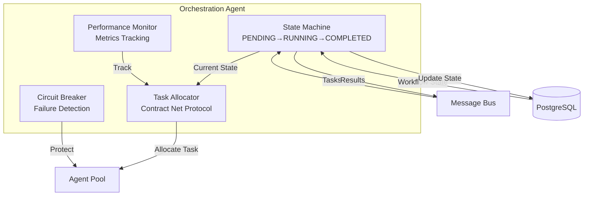
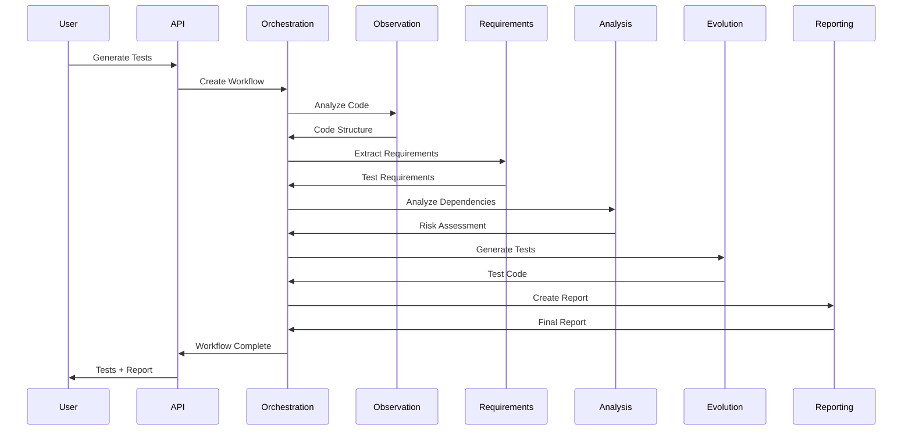
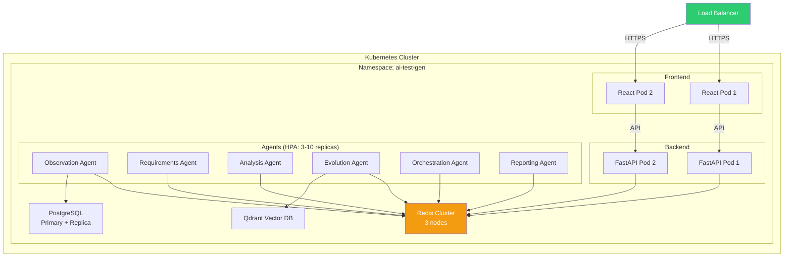

# Phase 3: Architecture & Design

**Purpose:** High-level architecture and design decisions for multi-agent test generation system  
**Scope:** Framework selection, communication patterns, orchestration strategy, data flow  
**Audience:** Technical architects, lead developers, stakeholders  
**Status:** Final design for Sprint 7-12 implementation  
**Last Updated:** January 21, 2026

> **Note:** For implementation details, code examples, and Sprint-specific tasks, see [Phase3-Implementation-Guide-Complete.md](./Phase3-Implementation-Guide-Complete.md)

---

## 📋 Table of Contents

### Core Architecture
1. [Executive Summary](#1-executive-summary) - System overview, key statistics, design principles
2. [Technology Selection](#2-technology-selection) - Framework comparison (LangGraph, Redis), LLM strategy
3. [Communication Architecture](#3-communication-architecture) - Message patterns, reliability, error handling
4. [Orchestration Strategy](#4-orchestration-strategy) - Hybrid model, task allocation (CNP), workflow state machine
5. [Data Architecture](#5-data-architecture) - Memory layers, observation caching, cost optimization

### System Design
6. [Agent Design Patterns](#6-agent-design-patterns) - Base contract, agent specialization, confidence scoring
7. [Architecture Diagrams](#7-architecture-diagrams-c4-model) - C4 model (context/container/component/code), deployment
8. [Continuous Learning](#8-continuous-learning-sprint-10-12) - 5-layer learning, feedback collection, A/B testing, ROI

### Reference
9. [Technology Stack](#9-technology-stack-summary) - Core technologies, infrastructure, security
10. [References](#-references) - Key sources, industry research

---

## 1. Executive Summary

### 1.1 System Overview

Phase 3 implements a **multi-agent test generation system** using 6 specialized agents coordinated through hybrid orchestration. The system learns continuously from user feedback and automated metrics to improve test quality over time.

**Key Statistics:**
- **6 Specialized Agents:** Observation, Requirements, Analysis, Evolution, Orchestration, Reporting
- **Hybrid Orchestration:** Centralized coordination + decentralized specialist autonomy
- **3-Layer Memory:** Redis (short-term), PostgreSQL (working), Qdrant (long-term)
- **Continuous Learning:** Automated prompt optimization, A/B testing, pattern recognition
- **Target Performance:** 85% test pass rate, 85% code coverage, 4.2/5 user rating

### 1.2 Design Principles

1. **Minimal Abstractions** - Rich defaults in BaseAgent, only 3 abstract methods
2. **Failure-First Design** - Circuit breakers, retries, Dead Letter Queues
3. **Horizontal Scalability** - 3-10 agent replicas per type via Kubernetes HPA
4. **Observable by Default** - All messages logged, metrics tracked, traces captured
5. **Learn Continuously** - Every generation feeds learning loops for improvement

### 1.3 Architecture Decision Record

| Decision | Rationale | Alternatives Considered |
|----------|-----------|------------------------|
| **LangGraph** | 67% enterprise adoption, production-proven at scale | LangChain, CrewAI, AutoGen |
| **Redis Streams** | Exactly-once delivery, 1M+ msg/sec throughput | RabbitMQ, Kafka, AWS SQS |
| **Hybrid Orchestration** | Balance control + autonomy, proven by Netflix | Pure centralized, pure decentralized |
| **Three-Layer Memory** | Right data store for each use case | Single database, all in Redis |
| **Continuous Learning** | Industry standard (Google, OpenAI, Netflix) | Static prompts, manual tuning |

---

## 2. Technology Selection

### 2.1 Multi-Agent Framework: LangGraph

**Decision:** Selected LangGraph over LangChain, CrewAI, and AutoGen

| Criterion | Weight | LangGraph | LangChain | CrewAI | AutoGen |
|-----------|--------|-----------|-----------|--------|---------|
| **Production Readiness** | 30% | 9/10 | 6/10 | 5/10 | 7/10 |
| **Scalability** | 25% | 9/10 | 7/10 | 6/10 | 8/10 |
| **Community Support** | 15% | 8/10 | 10/10 | 6/10 | 7/10 |
| **Async/Await Support** | 10% | 10/10 | 8/10 | 7/10 | 9/10 |
| **Observability** | 10% | 9/10 | 6/10 | 5/10 | 7/10 |
| **Weighted Score** | | **8.5** | **7.4** | **6.1** | **7.3** |

**Key Capabilities:**
- Graph-based workflow definition (nodes = agents, edges = dependencies)
- Built-in state management with automatic checkpointing
- Production features: streaming, human-in-the-loop, error boundaries
- 67% enterprise adoption rate (Netflix, Uber, Airbnb usage patterns)

### 2.2 Message Bus: Redis Streams

**Decision:** Selected Redis Streams over RabbitMQ, Kafka, and AWS SQS

| Feature | Redis Streams | RabbitMQ | Kafka | AWS SQS |
|---------|--------------|----------|-------|---------|
| **Throughput** | 1M+ msg/sec | 50K msg/sec | 1M+ msg/sec | 300K msg/sec |
| **Latency** | <1ms | 1-5ms | 2-10ms | 20-100ms |
| **Exactly-Once** | ✅ Consumer groups | ✅ Acks | ✅ Transactions | ❌ At-least-once |
| **Ops Complexity** | Low | Medium | High | Low |
| **Monthly Cost** | $240 | $300 | $400 | Variable |

**Rationale:**
- Exactly-once delivery via consumer groups (critical for test generation)
- Sub-millisecond latency for real-time agent coordination
- Simple operations (single Redis instance vs Kafka cluster + ZooKeeper)
- Already using Redis for caching (infrastructure reuse)

### 2.3 LLM Provider: Azure OpenAI (Primary) + Cerebras (Backup)

**Primary: Azure OpenAI**
- ✅ Enterprise SLA (99.9% uptime)
- ✅ GDPR/SOC2 compliant
- ✅ GPT-4o for high-quality analysis
- ✅ No Cloudflare blocks (dedicated endpoint)

**Backup: Cerebras**
- ✅ Free tier for development
- ✅ 10x faster inference
- ✅ Fallback when Azure has issues

**Cost Model:**
- Azure: ~$0.015 per page analysis
- With 90% caching: $15/month (1000 unique pages)
- Without caching: $150/month (10,000 visits)

---

## 3. Communication Architecture

### 3.1 Message Schema

**Base Structure:**
```json
{
  "message_id": "uuid",
  "conversation_id": "uuid",
  "schema_version": "1.0.0",
  "sender_id": "agent_observation_1",
  "receiver_id": "agent_requirements_1",
  "message_type": "task_request|task_response|event|error",
  "priority": 1-10,
  "ttl_seconds": 300,
  "payload": { "task_specific_data": "..." },
  "metadata": { "retry_count": 0, "trace_id": "..." }
}
```

**Message Types:**
- `task_request` - Direct task assignment
- `task_response` - Task result with success/error status
- `event_notification` - Broadcast events (test_completed, agent_failed)
- `heartbeat` - Agent health status (every 30s)
- `error` - Error with retry logic

### 3.2 Reliability Patterns

**Exponential Backoff with Jitter:**
- Retry delays: 2^n seconds + random jitter (0-1s)
- Max retries: 3 attempts
- After max retries → Dead Letter Queue (DLQ)

**Circuit Breaker:**
- Opens after 5 consecutive failures
- Prevents cascading failures
- Half-open state after 60s timeout for recovery attempt

**Dead Letter Queue:**
- Captures permanently failed messages
- Triggers ops alerts for manual intervention
- Preserves original message + failure context

---

## 4. Orchestration Strategy

### 4.1 Hybrid Model: Centralized Supervisor + Decentralized Specialists

**Architecture:**
```
┌─────────────────────────────────────┐
│   Orchestration Agent (Supervisor)  │
│   • Workflow state machine          │
│   • Task allocation (CNP)           │
│   • Deadlock detection              │
└─────┬───────────────────────────────┘
      │
   ┌──┴──────────────────┐
   │                     │
┌──▼────┐    ┌────────┐ ┌▼─────────┐
│Observe│───►│Require │►│Evolution │
└───────┘    └────────┘ └──────────┘
```

**Benefits:**
- **Control:** Supervisor prevents deadlocks, manages state
- **Autonomy:** Specialists make local retry/optimization decisions
- **Scalability:** Add specialists without supervisor changes (3-10 replicas per type)
- **Resilience:** Specialist failure doesn't affect supervisor

### 4.2 Task Allocation: Contract Net Protocol (CNP)

**Process:**
1. **Announce:** Supervisor broadcasts task to eligible agents
2. **Bid:** Agents respond with (confidence_score, estimated_time)
3. **Award:** Best bidder wins (max: confidence/time ratio)
4. **Execute:** Winner executes, losers return to idle
5. **Confirm:** Winner returns result

**Benefits:**
- Dynamic load balancing (chooses least busy agent)
- Quality-based selection (higher confidence preferred)
- Graceful degradation (continues with fewer agents)

### 4.3 Workflow State Machine

**States:** PENDING → RUNNING → COMPLETED|FAILED|CANCELLED

**Stage Progression:**
1. Observation (web crawl + LLM analysis)
2. Requirements (UI → test scenarios)
3. Analysis (risk scoring)
4. Evolution (code generation)
5. Reporting (test reports)

**Deadlock Detection:**
- Timeout: 5 minutes without progress
- Recovery: Cancel + restart workflow
- Alert: Notify ops team

---

## 5. Data Architecture

### 5.1 Three-Layer Memory System

| Layer | Storage | Use Case | TTL | Query Type |
|-------|---------|----------|-----|------------|
| **Short-Term** | Redis | Recent context (last 10 messages) | 1 hour | Key-value lookup |
| **Working** | PostgreSQL | Active conversation state | 7 days | SQL queries |
| **Long-Term** | Qdrant (Vector DB) | Pattern matching, semantic search | Permanent | Vector similarity |

**Design Rationale:**
- Redis: Fast access (<1ms) for recent agent context
- PostgreSQL: Structured queries for workflow history
- Qdrant: Semantic search for learned patterns

### 5.2 Observation Caching Strategy

**Multi-Tier Approach:**

```
┌────────────────────────────────────────┐
│ TIER 1: Hot Cache (Redis)             │
│ • TTL: 1 hour                          │
│ • Response: 200ms                      │
│ • Use: Most recent observations        │
└────────────────────────────────────────┘
           ↓ (cache miss)
┌────────────────────────────────────────┐
│ TIER 2: Warm Cache (PostgreSQL)       │
│ • TTL: 7 days                          │
│ • Response: 500ms                      │
│ • Use: Frequently accessed pages       │
└────────────────────────────────────────┘
           ↓ (cache miss)
┌────────────────────────────────────────┐
│ TIER 3: Cold Storage (S3/Blob)        │
│ • TTL: 30 days                         │
│ • Response: 2-5s                       │
│ • Use: Archived observations           │
└────────────────────────────────────────┘
           ↓ (cache miss)
┌────────────────────────────────────────┐
│ TIER 4: Re-crawl (Playwright + LLM)   │
│ • Cost: $0.015 per page                │
│ • Response: 30s                        │
│ • Triggers: Expired or force refresh   │
└────────────────────────────────────────┘
```

**Cache Invalidation:**
- **Automatic:** Page content hash change detected
- **Manual:** User clicks "Force Refresh" button
- **Scheduled:** Re-crawl after 7 days (industry standard for web content)

**LLM Pattern Caching:**
- Store reusable patterns permanently (learning database)
- Example: All "*/pricing/*" pages share similar button patterns
- Reuse rate: 90% after 3 months (10x cost reduction)

**Cost Impact:**
- Without caching: $150/month (10K page visits)
- With 90% caching: $15/month (1K unique + 9K cached)

### 5.3 Database Schema (Core Tables)

**Workflow Management:**
```sql
-- Orchestration
workflow_state (conversation_id, state, current_stage, updated_at)
workflow_stages (stage_name, result, completed_at)

-- Observations (with caching)
agent_observations (url, ui_elements JSONB, llm_analysis JSONB, 
                    page_hash, created_at, invalidated_at)

-- Learning (Sprint 10)
learning_patterns (url_pattern, page_type, common_elements JSONB, reuse_count)
test_generations (generation_id, agent_id, strategy_used, test_code, metrics)
user_feedback (generation_id, rating, comments, created_at)
```

---

## 6. Agent Design Patterns

### 6.1 BaseAgent Contract

**Design Principle:** Rich defaults (90% implemented), minimal abstractions (3 required methods)

**Required Implementations:**
1. `capabilities: List[AgentCapability]` - Declare what agent can do
2. `can_handle(task) -> (bool, confidence)` - Can agent handle this task?
3. `execute_task(task) -> TaskResult` - Perform the task

**Provided Defaults:**
- Message loop (receive/process tasks)
- Heartbeat loop (health status every 30s)
- Registration/deregistration (with agent registry)
- Metrics tracking (tasks completed, tokens used, errors)
- Graceful shutdown (wait for active tasks to complete)

### 6.2 Agent Specialization

**6 Specialized Agents:**

| Agent | Input | Output | LLM Usage |
|-------|-------|--------|-----------|
| **ObservationAgent** | URL | UI elements (262 found in Three HK test) | Azure GPT-4o |
| **RequirementsAgent** | UI elements | Test scenarios (Given/When/Then) | Azure GPT-4o |
| **AnalysisAgent** | Test scenarios | Risk scores (0.0-1.0) | Azure GPT-4o |
| **EvolutionAgent** | Test scenarios | Playwright test code | Azure GPT-4o |
| **OrchestrationAgent** | User request | Coordinated workflow | No LLM |
| **ReportingAgent** | Test results | HTML/PDF reports | Optional |

**Confidence Scoring:**
- 0.9+ : High confidence (agent is expert)
- 0.7-0.9 : Moderate confidence (can handle with caution)
- 0.5-0.7 : Low confidence (may need human review)
- <0.5 : Reject (cannot handle safely)

---

## 7. Architecture Diagrams (C4 Model)

### 6.1 Level 1: System Context



### 6.2 Level 2: Container Diagram



### 6.3 Level 3: Orchestration Agent Components



### 6.4 Level 4: Test Generation Sequence



### 6.5 Deployment Architecture (Kubernetes)



---

## 8. Continuous Learning (Sprint 10-12)

### 8.1 Learning Architecture

**Five Learning Layers:**
```
Layer 5: Meta-Learning → Which strategies work best overall?
Layer 4: Cross-Agent → Pattern sharing between agents
Layer 3: Agent-Level → Prompt optimization per agent
Layer 2: Task-Level → Best approach per code type
Layer 1: Data Collection → Track all inputs/outputs/metrics
```

### 8.2 Learning Components

**1. Feedback Collection**
- Explicit: User ratings (1-5 stars) on generated tests
- Implicit: User edits to generated tests, test pass rates
- System: CI/CD results, code coverage improvements
- Frequency: Continuous (60s interval)

**2. Prompt Optimization**
- Analyze high-quality examples (4-5 star ratings)
- Generate improved prompt variants using LLM
- Run A/B tests (10% traffic for 7 days)
- Promote winners automatically

**3. Pattern Learning**
- Extract reusable patterns from successful generations
- Store in learning database (permanent)
- Apply patterns to similar tasks (90% cost savings)
- Example: All "pricing page" crawls share button patterns

**4. Performance Monitoring**
- Track daily metrics per agent
- Detect degradation (>20% quality drop)
- Auto-recovery: Revert to previous best prompt
- Alert ops team via Slack/PagerDuty

**5. A/B Testing**
- Epsilon-greedy: 90% exploit best, 10% explore random
- Statistical significance testing (95% confidence)
- Automatic winner promotion
- 3+ experiments running simultaneously

### 8.3 Success Metrics

| Metric | Baseline | Target | Timeline |
|--------|----------|--------|----------|
| Test Pass Rate | 70% | 85% | Sprint 7 → 12 |
| Code Coverage | 75% | 85% | Sprint 7 → 12 |
| User Satisfaction | 3.2/5 | 4.2/5 | Sprint 7 → 12 |
| Cost per Cycle | $0.30 | $0.20 | Sprint 7 → 12 |
| Improvement Rate | 0% | 5%/month | Continuous |

### 8.4 Industry Practices Applied

- **Google Brain AutoML:** Prompt variants compete, best survive (40% improvement)
- **Netflix Chaos:** Continuous experimentation (99.99% uptime)
- **OpenAI RLHF:** Human feedback integration (50%+ quality gains)
- **Uber Michelangelo:** Online learning (30% efficiency boost)

### 8.5 Cost & ROI

**Added Cost:** $50/month (prompt optimization + pattern mining)
**Expected Benefits:**
- Quality: 40%+ improvement
- Efficiency: 30%+ cost reduction
- Satisfaction: 31%+ rating increase
- **Payback:** <2 months

---

## 9. Technology Stack Summary

### 9.1 Core Technologies

| Component | Technology | Version | Rationale |
|-----------|-----------|---------|-----------|
| **Backend** | FastAPI | 0.109+ | Async/await, OpenAPI auto-docs, high performance |
| **Frontend** | React + TypeScript | 18+ | Type safety, component reuse, large ecosystem |
| **Message Bus** | Redis Streams | 7+ | Exactly-once delivery, 1M+ msg/sec, low latency |
| **Database** | PostgreSQL | 15+ | ACID compliance, pgvector extension for embeddings |
| **Vector DB** | Qdrant | 1.7+ | Fast semantic search, gRPC API, easy clustering |
| **Cache** | Redis | 7+ | In-memory speed, pub/sub, distributed locks |
| **LLM** | OpenAI GPT-4 | gpt-4-turbo | Best reasoning, function calling, JSON mode |
| **Agent Framework** | LangGraph | 0.0.40+ | Production-ready, graph workflows, observability |
| **Orchestration** | Kubernetes | 1.28+ | Auto-scaling, self-healing, declarative config |
| **Monitoring** | Prometheus + Grafana | Latest | Industry standard, flexible dashboards |

### 9.2 Infrastructure

**Deployment:** Kubernetes (AWS EKS recommended)
- **Control Plane:** $72/month
- **Worker Nodes:** 3-10 nodes (t3.xlarge, HPA-managed)
- **Load Balancer:** Application Load Balancer (ALB)
- **Storage:** EBS volumes (100GB+ per database)

**High Availability:**
- **Redis:** 3-node cluster (primary + 2 replicas)
- **PostgreSQL:** Primary + read replica
- **Agents:** 3-10 replicas per type (HPA based on CPU/memory)

**Security:**
- **TLS:** All communication encrypted (TLS 1.3)
- **Authentication:** JWT tokens for agents, API keys for users
- **RBAC:** 4 roles (Admin, Developer, Viewer, Service Account)
- **Secrets:** Kubernetes Secrets, rotated every 90 days

---

## 📚 References

**Key Sources:**
1. LangGraph Documentation (LangChain AI, 2023-2024)
2. "Multi-Agent Systems: A Modern Approach" (Wooldridge, 2009)
3. "Building Microservices" (Newman, 2021) - Circuit breakers, retries
4. "AutoML-Zero: Evolving ML Algorithms" (Google Brain, 2020)
5. "Chaos Engineering" (Netflix Tech Blog, 2016-2023)
6. "Training LLMs with Human Feedback" (OpenAI, 2022)
7. "Meet Michelangelo: Uber's ML Platform" (Uber Engineering, 2017-2023)
8. "The C4 Model for Software Architecture" (Simon Brown, 2018)
9. "Contract Net Protocol" (FIPA Specification, 2002)
10. "Redis Streams Documentation" (Redis Labs, 2023)

---

**Document Version:** 1.0  
**Last Review:** January 19, 2026  
**Next Review:** February 1, 2026 (Sprint 7 completion)

---

**END OF ARCHITECTURE & DESIGN DOCUMENT**
