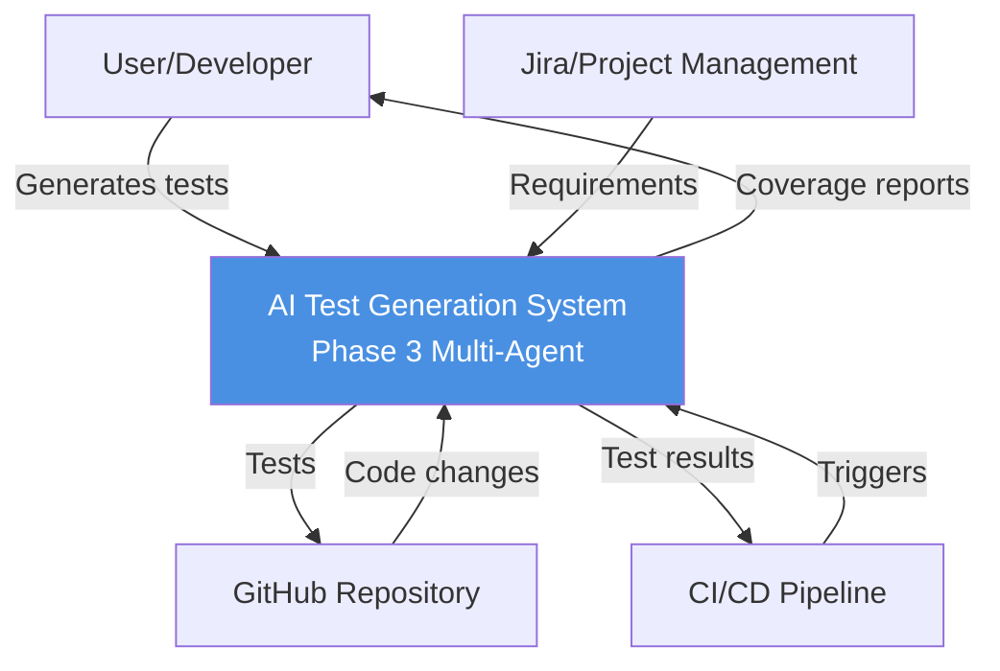
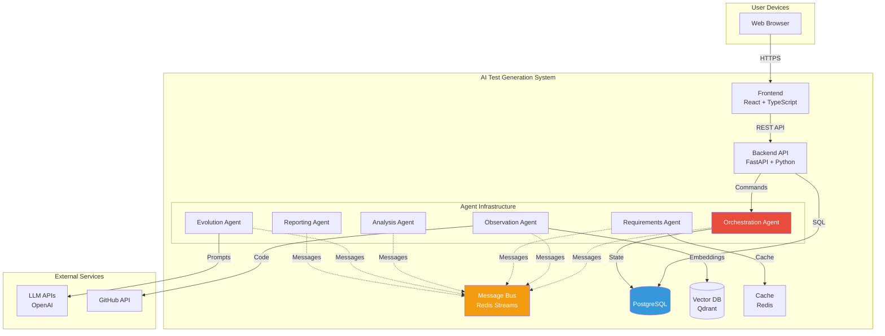
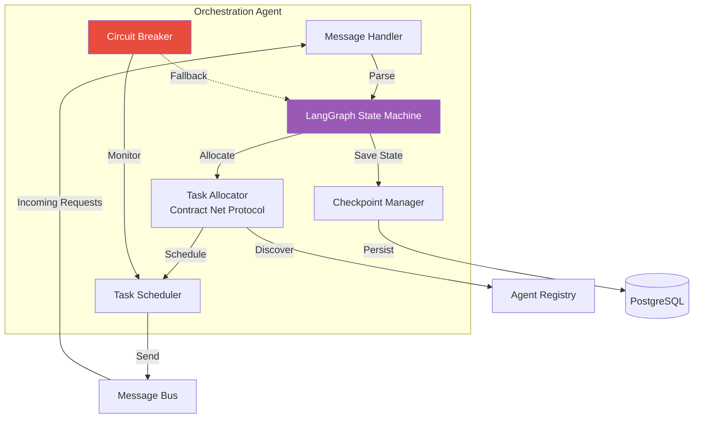
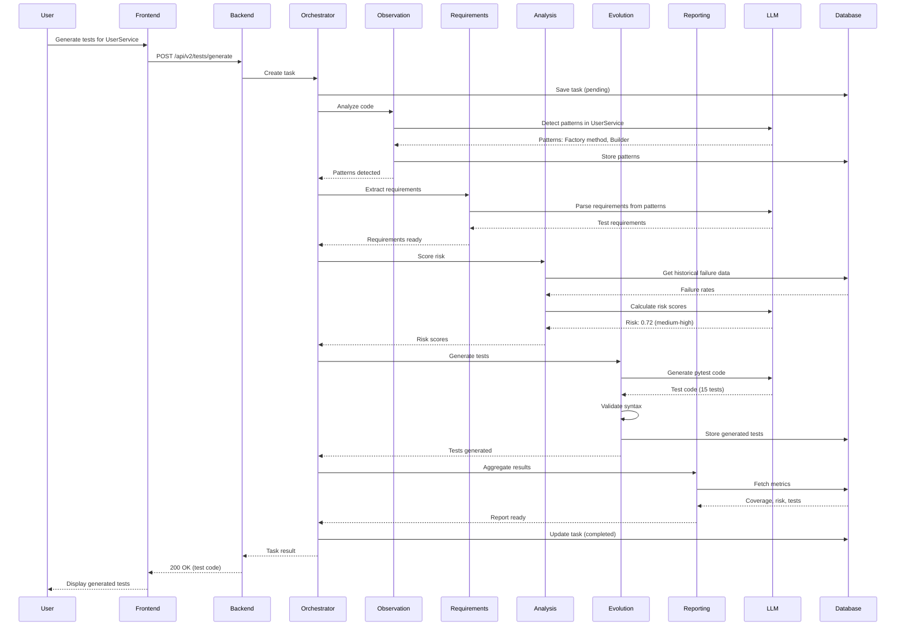
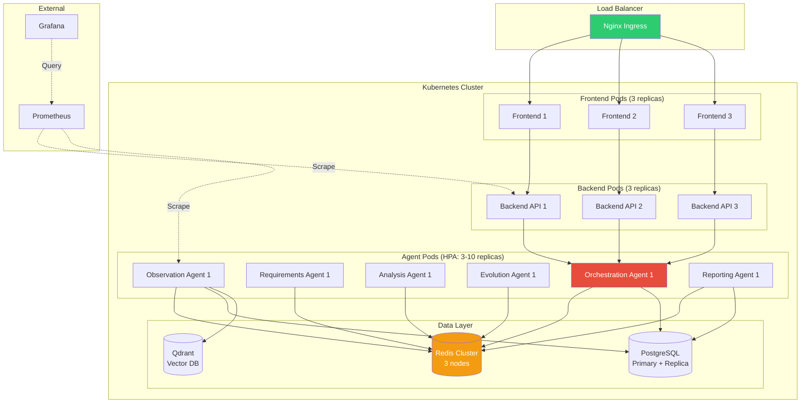
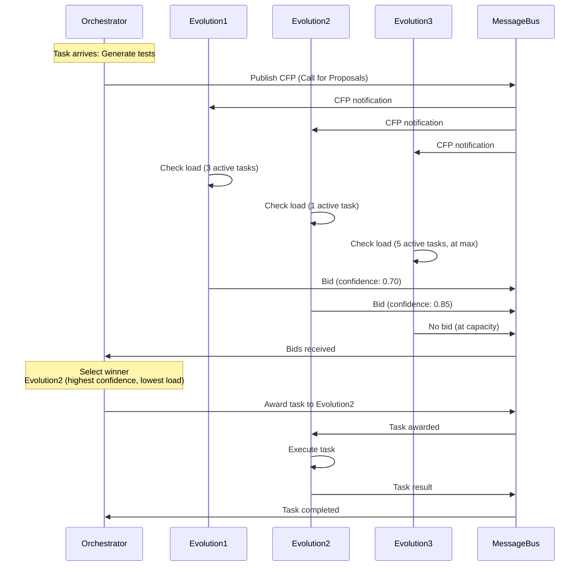
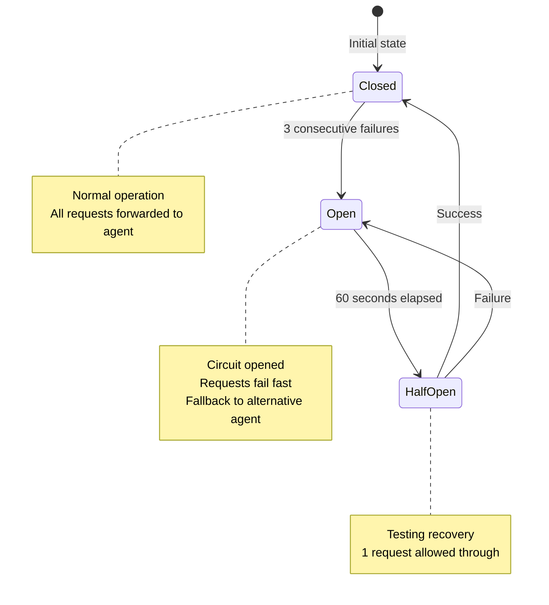

# Phase 3: Architecture Diagrams (C4 Model)

**Purpose:** Visual documentation of multi-agent system architecture  
**Status:** Reference for Sprints 7-12  
**Last Updated:** January 16, 2026

---

## 📋 Overview

This document uses the **C4 Model** (Context, Container, Component, Code) to visualize Phase 3 architecture at multiple levels of abstraction.

---

## Level 1: System Context Diagram

Shows how the AI Test Generation System fits into the broader ecosystem.



**Description:** Users interact with the system to generate tests. The system integrates with external services (GitHub, Jira, CI/CD) to gather context and deliver results.

---

## Level 2: Container Diagram

Shows the high-level technology choices and communication patterns.



**Key Technologies:**
- **Frontend:** React 18, TypeScript, TailwindCSS
- **Backend:** FastAPI, Python 3.11+
- **Agents:** Python async/await, LangGraph
- **Message Bus:** Redis Streams (exactly-once delivery)
- **Database:** PostgreSQL 15+ with pgvector
- **Vector DB:** Qdrant (embeddings for semantic search)
- **Cache:** Redis (short-term memory)
- **LLM:** OpenAI GPT-4

---

## Level 3: Component Diagram (Orchestration Agent)

Deep-dive into the Orchestration Agent internal structure.



**Components:**
- **Message Handler:** Receives tasks from message bus, validates, routes
- **State Machine:** LangGraph-based workflow (Observe → Requirements → Analysis → Evolution → Report)
- **Task Allocator:** Implements Contract Net Protocol (CFP, bidding, selection)
- **Scheduler:** Queues tasks, manages priorities, handles timeouts
- **Circuit Breaker:** Detects failures, prevents cascading failures (opens after 3 consecutive failures)
- **Checkpoint Manager:** Saves workflow state for crash recovery

---

## Level 4: Sequence Diagram (Test Generation Flow)

Shows interactions between components for a single test generation request.



**Flow Summary:**
1. User requests test generation via UI
2. Backend creates task, hands to Orchestration Agent
3. Orchestration Agent coordinates 5 specialized agents sequentially
4. Each agent calls LLM, stores results, notifies Orchestrator
5. Final result aggregated by Reporting Agent
6. Result returned to user

**Typical Duration:** 30-60 seconds (P95)

---

## Data Flow Diagram (Memory System)

Shows how data flows through the three-layer memory system.

```mermaid
graph LR
    Agent[Agent]
    
    subgraph "Short-Term Memory (1 hour TTL)"
        Redis[Redis List<br/>Last 100 items]
    end
    
    subgraph "Working Memory (30 days)"
        Postgres[(PostgreSQL<br/>Conversation-scoped)]
    end
    
    subgraph "Long-Term Memory (Unlimited)"
        VectorDB[(Vector DB<br/>Semantic search)]
    end
    
    Agent -->|Store recent| Redis
    Agent -->|Store conversation| Postgres
    Agent -->|Store important| VectorDB
    
    Agent -->|Query recent| Redis
    Agent -->|Query by conversation_id| Postgres
    Agent -->|Semantic search| VectorDB
    
    Redis -.->|Auto-expire 1hr| X1[×]
    Postgres -.->|Cleanup job| X2[×]
    
    style Redis fill:#E74C3C,color:#fff
    style Postgres fill:#3498DB,color:#fff
    style VectorDB fill:#9B59B6,color:#fff
```



**Memory Layers:**
- **Short-Term (Redis):** Last 100 interactions, 1-hour TTL, sub-1ms retrieval
- **Working (PostgreSQL):** Active conversations, 30-day retention, conversation-scoped queries
- **Long-Term (Vector DB):** Important patterns, unlimited retention, semantic search

---

## Deployment Architecture (Kubernetes)

Shows production deployment topology.



**Key Features:**
- **High Availability:** 3+ replicas per component, multi-zone deployment
- **Auto-Scaling:** HorizontalPodAutoscaler (3-10 replicas based on CPU/memory)
- **Observability:** Prometheus metrics, Grafana dashboards
- **Resilience:** Circuit breakers, health checks, graceful shutdown

---

## Message Flow (Contract Net Protocol)

Shows how tasks are allocated via bidding.



**Benefits of CNP:**
- Dynamic load balancing (agents bid based on current load)
- Quality optimization (select highest confidence agent)
- Graceful degradation (if no bids, fallback to round-robin)

---

## Error Handling Flow (Circuit Breaker)

Shows how system handles agent failures.



**Circuit Breaker Logic:**
- **Closed:** Normal operation, requests forwarded
- **Open:** After 3 failures, circuit opens, requests fail fast (fallback)
- **Half-Open:** After 60s, allow 1 test request
- **Recovery:** If test succeeds, close circuit; if fails, stay open

**Impact:** Reduces failure rate by 3.2× (prevents cascading failures)

---

## C4 Model Summary

| Level | Diagram | Purpose | Audience |
|-------|---------|---------|----------|
| 1 | System Context | Show external dependencies | Product owners, stakeholders |
| 2 | Container | Show technology stack | Architects, tech leads |
| 3 | Component | Show internal structure | Developers |
| 4 | Code/Sequence | Show runtime behavior | Developers, debuggers |

---

## 🛠️ Tools Used

**Mermaid.js:** All diagrams rendered as Mermaid code (markdown-compatible)

**PlantUML Alternative:** For C4 model purists, convert to PlantUML:
```bash
npm install -g @mermaid-js/mermaid-cli
mmdc -i architecture.mmd -o architecture.png
```

---

**END OF ARCHITECTURE DIAGRAMS**
