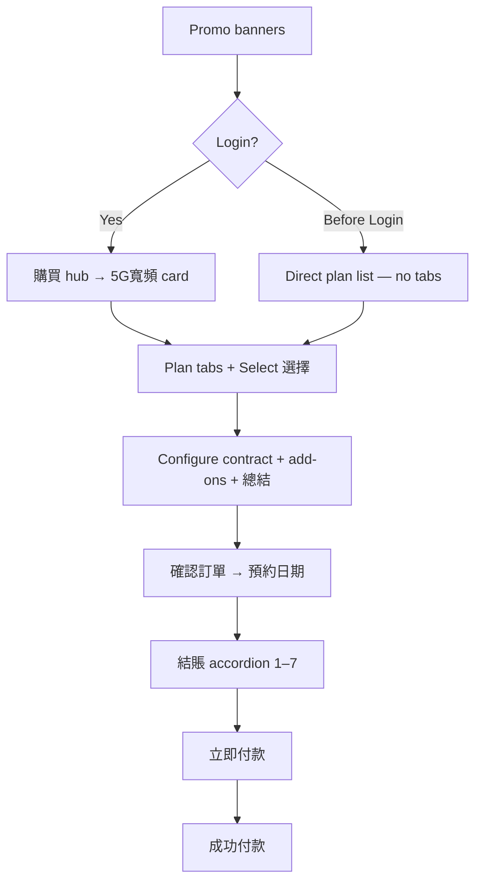

# 5GBB Purchase Flows — My3 App DT (Figma)

> **Auto-generation:** Upload these PNGs to a product workspace → **Update summary** runs vision extraction into wiki `## Purchase journeys`. Manual reference below.

Reference for E2E test design. Re-analysed from **high-resolution** Figma exports in this folder (Jul 2026).

| Source | File | Resolution | Status |
|--------|------|------------|--------|
| **Wi-Fi 7 Unlimited (canonical)** | `5GBB Wi-Fi 7 Unlimited Plans.png` | 15645×5105 — **full detail** | Active — primary reference |
| HSBC Unlimited | `5GBB Wi-Fi 6 & 7 Unlimited Plan - HSBC Offer.png` | 1121×512 — overview | Active co-brand variant |
| Dec Offer | `5GBB Wi-Fi 7 - Dec Offer (Updated 29 Dec 2025).png` | 1207×512 — overview | **Ended** 29 Dec 2025 |
| Student Plan | `5GBB Wi-Fi 6&7 Student Plan (Updated 20 Aug 2025).png` | 1570×512 — overview | Eligibility-gated |

**Related offer data:** `../Sample of DT Offer Table_20250729_updated.xlsx`

> **Note:** §3 below is derived from the **high-res** Wi-Fi 7 Unlimited board (readable UI copy). §1, §2, §4 are overview-level until those boards are re-exported at similar resolution.

---

## 3. Wi-Fi 7 Unlimited Plans — canonical flow (high-res)

**Figma board:** `5GBB Wi-Fi 7 Unlimited Plans.png`  
**App:** My3 mobile (購買 tab, bottom nav)  
**Product:** 5G 流動寬頻 — Wi-Fi 6 / Wi-Fi 7 unlimited plans  
**Offer tracks on board:** `mbase offer` (standard) and `Hsbc offer` (discounted)

### Flow diagram



---

### Phase 1 — Banner entry & routing (steps 1–5)

| Step | Screen (UI copy) | User action | Expected / assert | xAPI |
|------|------------------|-------------|-------------------|------|
| 1 | **Promo banners** (top of board) | Tap banner creative | Enters 5GBB flow; banner promo context preserved | `GET /promo/{bannerId}` |
| 2 | **Login** diamond | System detects session | **Login** → step 3a; **Before Login** → step 3b | `GET /session` |
| 3a | **購買** (Purchase hub) — logged in | Tap **5G寬頻** card (dark blue) | Opens plan list with category tabs | — |
| 3b | Plan list — guest | Land directly on plan page | **No tab bar** (大學校園優惠 / 5G寬頻 / Wi-Fi 7寬頻) | — |
| 4 | Plan list — logged in | View tabs: **大學校園優惠 \| 5G寬頻 \| Wi-Fi 7寬頻** | Correct tab shows Wi-Fi 7 unlimited plans | `GET /offers?category=5gbb` |
| 5 | Plan card | Tap **選擇** (Select) | Plan selected — e.g. **$238**/mo (was $298) or **$191**/mo (was $238) | `POST /offer/select` |

**Phase 1 test focus**

- Banner deep-link attribution (which promo was clicked).
- **Login vs Before Login** — guest skips 購買 hub and tab navigation.
- Logged-in user must navigate **購買 → 5G寬頻** before plan selection.

---

### Phase 2 — Plan configuration & summary (steps 6–9)

| Step | Screen (UI copy) | User action | Expected / assert | xAPI |
|------|------------------|-------------|-------------------|------|
| 6 | **5G Broadband Wi-Fi 7** plan page | Select contract: **12 / 24 / 30 / 48** months | Price updates; HSBC track may show **$191** for 30/48m | `POST /offer/configure` |
| 7 | Add-ons section | Toggle **Extra 5G SIM Card** (up to 4) and/or **PIA VPN Pass** (+$488) | Add-ons reflected in summary; SIM in-base may get **6 months free** | `POST /cart/vas` |
| 8 | **優惠碼/推廣碼** (HSBC track) | Enter promo code or skip | Valid code applies; invalid shows error | `POST /promo/validate` |
| 9 | **總結** (Summary) | Review fees; tap **立即上台** (Subscribe Now) | See fee table below; tick T&C; proceed | `GET /cart/summary` |

**Summary screen fee rules (from Figma annotations)**

| Line item | Typical value |
|-----------|---------------|
| Average monthly fee | $191 or $238 / month |
| Admin fee ($28) | **豁免** (waived) |
| Wi-Fi 7 T30 router rental | **豁免** (waived) |
| SIM card fee | **$100** |
| Deposit | $0 |
| First month payment | $0 |
| **Total amount due now** | **$100** (SIM fee) |

**MoneyBack rules (mbase track)**

| Contract | MoneyBack |
|----------|-----------|
| 12 / 24 months | **No** MoneyBack provision |
| 30 months | **50,000** points |
| 48 months | **80,000** points |

HSBC track annotation: **24-month has no MB provision.**

---

### Phase 3 — Order confirm & appointment (steps 10–11)

| Step | Screen (UI copy) | User action | Expected / assert | xAPI |
|------|------------------|-------------|-------------------|------|
| 10 | **確認訂單** (Confirm order) | Review 5G流動寬頻 unlimited plan; tap **下一步** | Shows plan name, contract, router; **應繳款項** total (e.g. $300) | — |
| 11 | **預約日期** modal | Pick **5G寬頻生效日期** on calendar; tap **確定** | Effective date stored | `GET /delivery/slots` → `POST /appointment` |

---

### Phase 4 — Checkout accordion 結賬 (steps 12–17)

Seven numbered sections expand one at a time. User taps **確定** (Confirm) on each before the next opens.

| Step | # | Section (UI copy) | User action | Expected / assert | xAPI |
|------|---|-------------------|-------------|-------------------|------|
| 12 | 1 | **登入/註冊** | Already complete if logged in | Email/account shown with checkmark | — |
| 13 | 2 | **登記人資料** | Upload **香港身份證** (HKID) | Upload prompt: 請上載閣下或受託人之身份證明文件 | `POST /identity/upload` |
| 14 | 3 | **收貨方式** | Select **SIM卡與指定5G路由器一併寄送** | Router variant: **指定Wi-Fi 6** or **指定Wi-Fi 7 5G路由器**; enter recipient name, phone, ID | `POST /delivery/method` |
| 15 | 4 | **賬單地址** | Choose **與收貨地址相同** or enter billing address | Billing address saved | `POST /address/billing` |
| 16 | 5 | **自動繳費方式** | Enter autopay credit card (Visa/Mastercard) | Card number, name, expiry validated | `POST /autopay/setup` |
| 17 | 6 | **簽署上台合約** | View **銷售及服務合約**; sign digitally | Contract names plan (e.g. 和記寬頻 5G SIM 月費計劃); signature captured | `POST /contract/sign` |
| 18 | 7 | **付款方式** | Select Visa/MC, **AlipayHK**, **WeChat Pay**, or **UnionPay** | Upfront amount shown (e.g. $159); tap **付款** | `POST /payment/charge` |

---

### Phase 5 — Payment & success (steps 19–20)

| Step | Screen (UI copy) | User action | Expected / assert | xAPI |
|------|------------------|-------------|-------------------|------|
| 19 | Payment review | Tap **立即付款** (Pay Now) — e.g. **$168** | All T&C checkboxes ticked; payment processes | `POST /payment/confirm` |
| 20 | **成功付款** (Payment successful) | View confirmation | Message: 您的付款已成功辦理; **交易編號** shown; tap **前往我的服務詳情** | `GET /order/{id}` |

---

### Wi-Fi 7 Unlimited — priority test cases

| ID | Scenario | Key steps |
|----|----------|-----------|
| W7-01 | Banner → logged-in → 購買 → 5G寬頻 → $238 30m | 1–6, 9–20 |
| W7-02 | Banner → before login → direct plan (no tabs) | 1–2, 3b, 5–20 |
| W7-03 | HSBC track $191 / 48m + promo code | 6 (HSBC), 8, 9 |
| W7-04 | MoneyBack 48m — 80,000 points eligibility | 6 (mbase 48m), 9 |
| W7-05 | Add Extra 5G SIM + PIA VPN | 7, 9 |
| W7-06 | Wi-Fi 7 router delivery path | 14 (Wi-Fi 7 variant) |
| W7-07 | Autopay setup + wallet payment | 16, 18 (AlipayHK) |
| W7-08 | Contract signing required | 17 — cannot skip signature |
| W7-09 | 預約日期 — effective date boundary | 11 |

---

## 1. HSBC Unlimited — overview flow

**File:** `5GBB Wi-Fi 6 & 7 Unlimited Plan - HSBC Offer.png` (overview resolution)

| Step | Phase | Screen | Notes |
|------|-------|--------|-------|
| 1 | Entry | **HSBC banner** (top) or Dec banner (bottom) | Two banner entry points on same landing |
| 2 | Promo | HSBC co-brand plan detail | Wi-Fi 6 & 7 unlimited; purple Subscribe CTA |
| 3 | Config | Plan / hardware / VAS | Contract and router selection |
| 4 | Auth | Login / registration | Personal info + HKID |
| 5 | Address | Installation address | 5GBB service location |
| 6 | Schedule | **Calendar** — delivery / install | Appointment picker |
| 7 | Delivery | Method — home vs store pickup | Logistics choice |
| 8 | Payment | HSBC credit card | Co-brand payment path |
| 9 | Legal | T&C checkboxes | SSA + auto-renew |
| 10 | Summary | Order review | Fees before confirm |
| 11 | Success | Thank you + order ref | Confirmation |

**Maps to:** §3 HSBC track (`Hsbc offer`, $191/mo, 優惠碼) when tested on UAT.

---

## 2. Wi-Fi 7 Dec Offer — overview flow

**File:** `5GBB Wi-Fi 7 - Dec Offer (Updated 29 Dec 2025).png`  
**Status:** Expired — template only

### Alternative entry points (beyond banners)

| Entry | Description |
|-------|-------------|
| **Notification Center** | Push notification deep-links into Dec promo landing |
| **Coupon / Wallet** | User opens My Wallet / coupon → enters flow |
| **SMS deep link** | Text message URL opens subscription funnel |

### Main path (overview)

| Step | Phase | Notes |
|------|-------|-------|
| 1–3 | Discovery | Homepage → Dec promo tile → Wi-Fi 7 Dec landing |
| 4–7 | Config + VAS | Plan, contract, multi-screen VAS toggles |
| 8–10 | Auth | Mobile + SMS OTP |
| 11–14 | Customer + address | Details, HKID, coverage check |
| 15 | Branch | New Pattern A / B / CRM / Existing / Notification |
| 16–19 | Checkout | Summary, T&C, auto-renew |
| 20–21 | Payment | **QR code** (FPS) + wait for confirmation |
| 22 | Success | Order ref; may include QR for pickup |

**Red paths on board:** error / manual verification fallback if automated flow fails.

---

## 4. Student Plan — overview flow

**File:** `5GBB Wi-Fi 6&7 Student Plan (Updated 20 Aug 2025).png`

| Step | Phase | Notes |
|------|-------|-------|
| 1 | Entry | Homepage banner → Back to School promo |
| 2–4 | Plan | Wi-Fi 6 or 7 unlimited student pricing |
| 5 | Eligibility | **Student ID / staff card** validation — maps to Excel Back to School rows |
| 6–8 | Config + address | Plan config, address, calendar |
| 9–12 | Checkout | Same accordion pattern as §3 |
| 13 | Success | Confirmation |

**Excel mapping:** `5GBB NS Back to School Wi-Fi 6/7 Unlimited …` rows; gadget and MoneyBack variants.

---

## 5. Side-by-side comparison

| Dimension | Wi-Fi 7 Unlimited (§3) | HSBC (§1) | Dec Offer (§2) | Student (§4) |
|-----------|------------------------|-----------|----------------|--------------|
| Resolution | **High** | Overview | Overview | Overview |
| Entry | **Banners** → Login/Before Login | HSBC banner | Banner + Notification/Wallet/SMS | Student banner |
| Navigation | **購買 → 5G寬頻** (if logged in) | Linear | Multi-branch | Linear + ID check |
| Checkout UI | **7-step 結賬 accordion** | Linear screens | Multi-branch | Accordion (assumed) |
| CPE | Wi-Fi 6 **or** 7 at delivery step | Wi-Fi 6 or 7 | Wi-Fi 7 | Wi-Fi 6 or 7 |
| Payment | Card / wallets / UnionPay | HSBC card | QR / FPS | Standard |
| Appointment | **預約日期** modal | Calendar | — | Calendar |
| Identity | **HKID upload** in accordion | Form | OTP + form | Student document |

---

## 6. Reusable 5GBB purchase template

| # | Template step | §3 WiFi7 | §1 HSBC | §2 Dec | §4 Student |
|---|---------------|----------|---------|--------|------------|
| T1 | Tap promo **banner** | ✓ | ✓ | ✓ | ✓ |
| T2 | Login vs before-login routing | ✓ | — | — | — |
| T3 | Navigate to plan (購買 hub or direct) | ✓ | ✓ | ✓ | ✓ |
| T4 | Select plan + contract months | ✓ | ✓ | ✓ | ✓ |
| T5 | VAS / add-on SIM / VPN | ✓ | ✓ | ✓ | — |
| T6 | **總結** — verify fee breakdown | ✓ | ✓ | ✓ | ✓ |
| T7 | **確認訂單** + **預約日期** | ✓ | ✓ | — | ✓ |
| T8 | Checkout accordion (7 sections) | ✓ | partial | partial | ✓ |
| T9 | HKID upload | ✓ | — | — | — |
| T10 | Delivery: SIM + router (Wi-Fi 6/7) | ✓ | ✓ | — | ✓ |
| T11 | Autopay setup | ✓ | — | — | — |
| T12 | Contract sign + payment | ✓ | ✓ | ✓ | ✓ |
| T13 | **成功付款** + transaction ref | ✓ | ✓ | ✓ | ✓ |
| T14 | Eligibility gate (student / HSBC / Dec) | Conditional | HSBC | Dec | Student ID |

### Suggested E2E test pack

| Test ID | Name | Primary reference |
|---------|------|-------------------|
| E2E-5GBB-01 | Wi-Fi 7 — logged-in banner → 購買 → 30m mbase | §3 W7-01 |
| E2E-5GBB-02 | Wi-Fi 7 — guest banner (no tabs) | §3 W7-02 |
| E2E-5GBB-03 | Wi-Fi 7 — HSBC $191 + promo code | §3 W7-03 |
| E2E-5GBB-04 | Wi-Fi 7 — 48m MoneyBack 80k points | §3 W7-04 |
| E2E-5GBB-05 | Wi-Fi 7 — full accordion + HKID + sign | §3 steps 12–17 |
| E2E-5GBB-06 | HSBC co-brand card path | §1 |
| E2E-5GBB-07 | Dec — SMS deep-link entry | §2 |
| E2E-5GBB-08 | Student — ID validation gate | §4 |
| E2E-5GBB-09 | Expired Dec promo blocked | §2 |
| E2E-5GBB-10 | Add-on SIM + 6-month in-base free | §3 W7-05 |

---

## 7. Wiki upload structure

```
wiki/
├── Offer matrix          ← Excel / 5GBB_Summary
├── Purchase journey      ← §3 canonical + §1/2/4 variants
├── Checkout accordion    ← §3 Phase 4 (結賬 steps 1–7)
├── Reusable template     ← §6
└── API map (TBD)
```

---

*Last updated from high-res `5GBB Wi-Fi 7 Unlimited Plans.png` (15645×5105). Re-export HSBC / Dec / Student boards at ≥4× for step-level label confirmation.*
