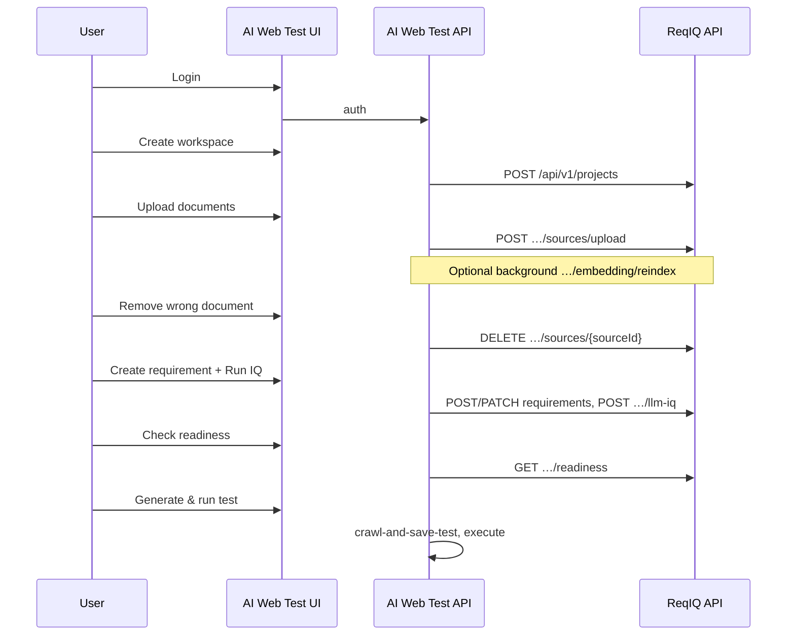

# AI Web Test — ReqIQ integration handoff

**Audience:** AI Web Test backend/frontend developers  
**Version:** 1.1 · **Date:** 2026-05-18  
**ReqIQ contract:** [`openapi/reqiq-api-v1.yaml`](openapi/reqiq-api-v1.yaml) · [`openapi/README.md`](openapi/README.md)  
**AI Web Test API (crawl, execute, KB):** [`ReqIQ-API-Integration-Guide.md`](ReqIQ-API-Integration-Guide.md) · **§12** ReqIQ proxy (partial — extend per below)

---

## 0. What changed in ReqIQ (give this section to your team)

| Change | ReqIQ API | AI Web Test action |
| --- | --- | --- |
| **Delete uploaded document** | `DELETE /api/v1/projects/{projectId}/sources/{sourceId}` → **204** | Add proxy + UI “Remove document” (see §5.4) |
| **Collaboration (comments)** | `GET/POST …/requirements/{id}/comments` | Optional v1.1 — review threads, `@email` mentions |
| **Trace links** | `GET/POST/DELETE …/requirements/{id}/trace-links` | Optional — link requirement ↔ test case / Jira / defect |
| **Multi-pass LLM IQ** | `POST …/revisions/{index}/llm-iq-multipass` | Optional / power-user — needs admin flag (§5.5) |
| **Docker uploads** | Upload dir `/var/lib/reqiq/uploads` in Compose | No proxy change — ensure `REQIQ_URL` hits a **running** API (`GET /live`) |
| **Sprint 7 live harness** | `npm run test:sprint7:live` in ReqIQ repo | Use to validate ReqIQ before blaming the proxy |

**Validated (2026-05-17):** AI Web Test → ReqIQ `POST …/rag/query` returns **200** when ReqIQ is up. **502** from your API usually means ReqIQ is down or wrong base URL (see §4, §9).

---

## 1. Product split

| Tier | Primary UI | Who | Capabilities |
| --- | --- | --- | --- |
| **Standard users** | **AI Web Test** (`:5173` UI, `:8000` API) | QA, BAs, most testers | Workspaces (projects), document upload/**delete**, **requirements**, **IQ**, readiness, suggested tests, **test execution** |
| **Power users** | **ReqIQ** (`:8080/app`) | RAG engineers, index admins | **RAG** (query, threads, retrieve), **chunks**, embedding reindex/snapshots/rollback, admin scorecard, **Collab** panel |

**Rule:** Most users never open ReqIQ directly. AI Web Test **backend** proxies ReqIQ using a service account (or forwards the user JWT). **Do not** expose `REQIQ_SERVICE_TOKEN` to the browser.

**Canonical requirement documents** live in ReqIQ (`sources/upload`), not only AI Web Test’s native `/api/v1/kb/*` (see integration guide §2 vs §12).

---

## 2. Documents to read (order)

1. **This file** — scope, proxy checklist, MVP flows, deliverables.
2. [`openapi/reqiq-api-v1.yaml`](openapi/reqiq-api-v1.yaml) — machine-readable ReqIQ contract (import Postman/codegen). **Includes DELETE source, comments, trace-links, llm-iq-multipass.**
3. [`openapi/README.md`](openapi/README.md) — login, multipart upload, rate limits.
4. [`ReqIQ-API-Integration-Guide.md`](ReqIQ-API-Integration-Guide.md) — AI Web Test endpoints (§1–11) + existing §12 proxies.

Optional (agents only, not main UI): [`Hermes_QA_MultiAgent_Profiles_v3.md`](Hermes_QA_MultiAgent_Profiles_v3.md).

---

## 3. Architecture

```
┌─────────────────────────────┐         ┌─────────────────────────────┐
│  AI Web Test UI  :5173      │  HTTPS  │  AI Web Test API  :8000     │
│  (standard users)           │ ──────► │  • crawl / execute / tests  │
└─────────────────────────────┘         │  • ReqIQ proxy  /api/v1/    │
                                        │    requirements/...       │
                                        └──────────────┬────────────┘
                                                       │ server-side
                                                       ▼
                                        ┌─────────────────────────────┐
                                        │  ReqIQ API  :3001           │
                                        │  projects · sources · reqs  │
                                        │  IQ · readiness · comments  │
                                        └─────────────────────────────┘

Power users ──► ReqIQ SPA  :8080/app  (RAG · chunks · embedding admin)
```

| System | Dev URL | Role |
| --- | --- | --- |
| ReqIQ API | `http://localhost:3001` | Requirements hub |
| ReqIQ web | `http://localhost:8080/app` | Power-user UI |
| AI Web Test API | `http://localhost:8000` | Primary API + proxy |
| AI Web Test UI | `http://localhost:5173` | Primary UI |

**Production:** use **LAN IP or DNS** per host (`127.0.0.1` is local to that machine only). Update AI Web Test `BACKEND_CORS_ORIGINS` for both UIs.

**If AI Web Test runs in Docker** while ReqIQ runs on the host: use `http://host.docker.internal:3001`, not `http://127.0.0.1:3001`.

---

## 4. Server configuration (AI Web Test `.env`)

```bash
# ReqIQ backend (server-side only)
REQIQ_URL=http://localhost:3001
REQIQ_SERVICE_EMAIL=aiwebtest@reqiq.local
REQIQ_SERVICE_PASSWORD=...
# Or cache JWT from POST /api/v1/login (refresh on 401, TTL ~8h):
# REQIQ_SERVICE_TOKEN=eyJhbGci...
# Optional link for "Advanced" button:
REQIQ_WEB_URL=http://localhost:8080
```

1. Create a ReqIQ user with role **LIBRARIAN**, **ANALYST**, or **ADMIN** (not **AUDITOR** for mutations).
2. `POST {REQIQ_URL}/api/v1/login` with `{ "email", "password" }` → use **`accessToken`** as `Authorization: Bearer …`.
3. Resolve **`projectId`** from `GET /api/v1/projects` → field **`id`** (cuid), not display name.

**Health check before proxying:** `GET {REQIQ_URL}/live` → `{"status":"ok"}`. If this fails, all proxied routes will **502**.

After document upload, optionally call ReqIQ `POST …/embedding/reindex` **in the background**; standard users see source **`status`** only (`PARSED`, `FAILED`, etc.).

---

## 5. Standard-user API — proxy from AI Web Test

Implement **backend** routes (suggested prefix `/api/v1/requirements/…`, matching integration guide §12 style). Each proxies to ReqIQ with the service Bearer token. Forward status codes and JSON error bodies where practical.

### 5.1 Core proxy table (MVP + documents)

| AI Web Test (proposed) | ReqIQ | Purpose |
| --- | --- | --- |
| `GET /api/v1/requirements/projects` | `GET /api/v1/projects` | List workspaces |
| `POST /api/v1/requirements/projects` | `POST /api/v1/projects` | Create workspace `{ "name" }` |
| `PATCH /api/v1/requirements/projects/{id}` | `PATCH /api/v1/projects/{id}` | Rename workspace |
| `GET /api/v1/requirements/projects/{id}` | `GET /api/v1/projects/{id}` | Get one workspace |
| `GET …/requirements/{projectId}/requirements` | `GET …/requirements` | List requirements (`latestCompositeScore`) |
| `POST …/requirements` | `POST …/requirements` | Create `{ "title", "body" }` |
| `GET/PATCH …/requirements/{requirementId}` | `GET/PATCH …/requirements/{id}` | Get / update |
| `POST …/requirements/{id}/transition` | `POST …/transition` | Lifecycle (DRAFT → REVIEWED → BASELINE, etc.) |
| `GET …/requirements/{id}/audit` | `GET …/audit` | Audit trail |
| `GET …/requirements/{id}/revisions` | `GET …/revisions` | Revision list |
| `GET …/revisions/{revisionIndex}` | `GET …/revisions/{index}` | Revision detail |
| `POST …/revisions/{index}/stub-iq` | `POST …/stub-iq` | Stub IQ (no LLM) |
| `POST …/revisions/{index}/llm-iq` | `POST …/llm-iq` | LLM IQ (**503** `llm_not_configured` if chat off) |
| `GET …/requirements/{id}/latest-iq` | `GET …/latest-iq` | Latest IQ on requirement |
| `GET …/requirements/{projectId}/readiness?query=…` | `GET …/readiness` | Ready-for-testing gate |
| `POST …/requirements/{projectId}/sources/upload` | `POST …/sources/upload` | Multipart upload (DOCX, PDF, MD, TXT, PPTX, PNG) |
| `POST …/requirements/{projectId}/sources/upload-zip` | `POST …/sources/upload-zip` | Single ZIP batch (optional) |
| `GET …/requirements/{projectId}/sources` | `GET …/sources` | List documents (`status`, `_count.chunks`) |
| **`DELETE …/requirements/{projectId}/sources/{sourceId}`** | **`DELETE …/sources/{sourceId}`** | **Remove document (§5.4)** |
| `POST …/requirements/{projectId}/query` | `POST …/rag/query` | RAG Q&A *(optional — prefer readiness for gate)* |
| `POST …/…/suggest-tests` | `POST …/suggested-tests/generate` | LLM suggested tests |
| `GET/POST/PATCH/DELETE …/suggested-tests` | same under `…/suggested-tests` | Suggested test CRUD |
| `POST …/suggested-tests/import` | `POST …/import` | Import without LLM |

**Bodyless POSTs:** do not send `Content-Type: application/json` without a body (Fastify returns `FST_ERR_CTP_EMPTY_JSON_BODY`).

**Multipart upload:** forward `multipart/form-data` file part(s) to ReqIQ; do not JSON-wrap files.

### 5.2 Collaboration (optional v1.1 — review loops)

| AI Web Test (proposed) | ReqIQ | Purpose |
| --- | --- | --- |
| `GET …/requirements/{id}/comments` | `GET …/comments` | List comments |
| `POST …/requirements/{id}/comments` | `POST …/comments` | Body `{ "body": "… @user@example.com …" }` → **201**; `mentionEmails` parsed |
| `GET …/requirements/{id}/trace-links` | `GET …/trace-links` | List links to tests, defects, Jira, etc. |
| `POST …/requirements/{id}/trace-links` | `POST …/trace-links` | `{ "kind": "TEST"\|"DEFECT"\|"COMMIT"\|"JIRA"\|"OTHER", "externalId", "label?", "url?" }` → **201** |
| `DELETE …/trace-links/{linkId}` | `DELETE …/trace-links/{linkId}` | **204** |

**AUDITOR** role: read-only on ReqIQ — no POST/PATCH/DELETE.

### 5.3 Power-user only — do **not** expose in standard UI

| ReqIQ path | Notes |
| --- | --- |
| `POST …/rag/query`, `…/rag/retrieve`, `…/rag/threads` | RAG playground |
| `GET/PATCH …/chunks`, `…/chunks/{chunkId}` | Chunk metadata |
| `POST …/embedding/reindex`, `snapshot`, `rollback-hard` | Index ops (server may call reindex silently after upload) |
| `POST …/revisions/{index}/llm-iq-multipass` | Multi-sample IQ consensus (§5.5) |
| `/api/v1/admin/*` | Tenant admin, IQ weights, integration toggles |

Link: **“Open ReqIQ advanced”** → `{REQIQ_WEB_URL}/app` (e.g. `http://localhost:8080/app`).

### 5.4 Document delete — behavior (important for UX)

When the user removes a document, proxy:

```http
DELETE /api/v1/projects/{projectId}/sources/{sourceId}
Authorization: Bearer <token>
```

| ReqIQ response | Meaning |
| --- | --- |
| **204** | Deleted: file on disk, all DB chunks, Qdrant vectors for that `sourceId` |
| **404** `not_found` | Unknown `sourceId` or wrong project |
| **403** `forbidden` | AUDITOR or no mutate role |
| **500** `delete_source_failed` | Often Qdrant unreachable — show retry |

**Does not happen automatically:**

- No full-project **reindex**
- No re-chunking of other files

**Other documents stay indexed.** RAG/readiness should stop citing the deleted file immediately. Optional: call `POST …/embedding/reindex` only after bulk deletes or if your team wants a full refresh.

**UI copy suggestion:** “Remove document” with confirm: *This deletes the file and its search index entries. Other documents are not affected.*

### 5.5 Multi-pass LLM IQ (optional / advanced)

```http
POST /api/v1/projects/{projectId}/requirements/{requirementId}/revisions/{revisionIndex}/llm-iq-multipass
```

| Response | Meaning |
| --- | --- |
| **200** | `iqSnapshot.multiPass`, `consensusCompositeScore`, `sampleCount` |
| **403** `multipass_disabled` | Tenant admin must set `iqMultiPassCritiqueEnabled: true` via `PATCH /api/v1/admin/integration-config` |
| **503** `llm_not_configured` | Chat LLM not configured on ReqIQ |

Not required for standard AI Web Test MVP unless product asks for “consensus IQ” on revisions.

---

## 6. User-facing labels (standard UI)

| ReqIQ concept | Show as |
| --- | --- |
| Project | **Workspace** |
| Source | **Document** |
| Requirement | **Requirement** |
| `latestCompositeScore` | **Quality score** |
| `readinessScore` / `status` | **Ready for testing?** |
| `Source.status` | **Processing** / **Ready** / **Failed** (map `PARSED` → Ready, `FAILED` → Failed) |
| Comment / trace link | **Review note** / **Linked item** (if you ship §5.2) |
| RAG / chunk / reindex | *(hidden — advanced link only)* |

---

## 7. MVP build order

1. **Login** — AI Web Test auth; proxy ReqIQ when needed; handle **401** (re-login ReqIQ token).
2. **Workspaces** — list, create, rename; persist selected `projectId`.
3. **Documents** — multipart upload, list with status; **delete** with confirm (§5.4).
4. **Requirements** — list (with score), create, edit, optional transition.
5. **IQ** — run stub/LLM IQ on revisions; show `latest-iq` on list.
6. **Readiness** — query + `readinessScore`, `wikiContent`, `status` (no “RAG” label).
7. **Suggested tests** — generate → map steps to existing **crawl-and-save-test** (integration guide §3).
8. **Execute** — existing AI Web Test flows (§3–8); label `triggered_by: "AI Web Test"`.
9. **Advanced link** — ReqIQ `/app` for power users.
10. *(Optional)* **Comments / trace links** (§5.2).

---

## 8. End-to-end flow (reference)



---

## 9. Verification

### ReqIQ is up (do this first)

```powershell
curl.exe http://localhost:3001/live
# Expect: {"status":"ok"}
```

If **502** from AI Web Test: check `REQIQ_URL`, Docker (`docker compose ps`), and that the API container is not exited.

### ReqIQ repo smoke tests

```powershell
$env:REQIQ_API_BASE = "http://localhost:3001"
$env:REQIQ_ACCESS_TOKEN = "<from POST /api/v1/login>"
$env:REQIQ_PROJECT_ID = "<cuid from GET /api/v1/projects>"
npm run test:sprint6:live
npm run test:sprint7:live   # comments, trace-links, optional multipass (ADMIN token)
```

Your proxy should support the same **standard** operations your UI uses. Import [`reqiq-api-v1.yaml`](openapi/reqiq-api-v1.yaml) into Postman; set server URL and Bearer token from login.

**Key response fields:**

- RAG answer text: **`content`** (not `answer`)
- Readiness: **`readinessScore`**, **`status`**, **`wikiContent`**
- Login: **`accessToken`** (JWT, three dot-separated segments)
- Source list: **`id`**, **`originalFilename`**, **`status`**, **`_count.chunks`**
- Delete source: **204** empty body

**Manual delete test (Postman / curl):**

```http
DELETE http://localhost:3001/api/v1/projects/{projectId}/sources/{sourceId}
Authorization: Bearer <accessToken>
```

---

## 10. Deliverables back to ReqIQ team

1. **OpenAPI or markdown** listing all **new/updated** proxy routes (extends integration guide §12) — include **DELETE source** at minimum.
2. **Demo or screenshots:** workspace → upload → **delete document** → requirement → IQ → readiness → test run.
3. **`.env.example`** entries for `REQIQ_URL`, `REQIQ_SERVICE_*`, optional `REQIQ_WEB_URL`.
4. **Short note:** what is proxied vs what still requires ReqIQ `/app`.
5. **Troubleshooting note:** how you detect ReqIQ down vs ReqIQ 4xx (avoid masking as generic 502).

---

## 11. Out of scope for v1

- Hermes / Telegram / MCP tool wiring (separate track; see Hermes profiles doc).
- Chunk editor, RAG thread UI, embedding rollback UI in AI Web Test.
- ReqIQ admin scorecard UI (stay in ReqIQ admin).
- Multi-pass IQ unless explicitly requested (§5.5).

---

## 12. One-line summary

> Build AI Web Test as the primary QA app: **proxy the ReqIQ standard API** (projects, documents including **delete**, requirements, IQ, readiness) from your **backend**; keep **test execution** on AI Web Test; hide RAG/chunks/reindex from normal users and link **ReqIQ advanced** at `:8080/app`; use **`reqiq-api-v1.yaml` v1.1+** as the contract and **extend integration guide §12** until §5.1 is fully implemented.
