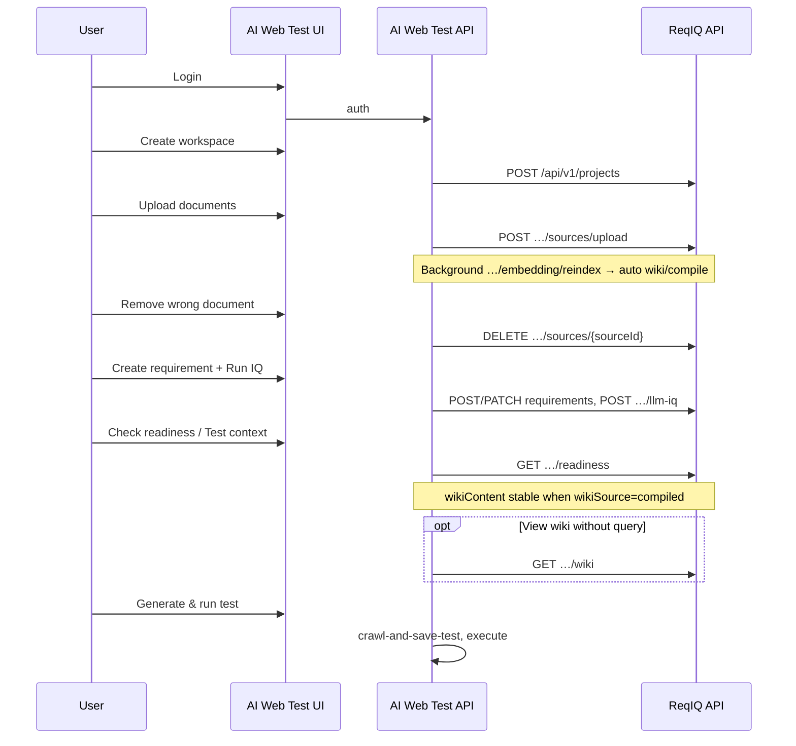

# AI Web Test — ReqIQ integration handoff

**Audience:** AI Web Test backend/frontend developers  
**Version:** 2.2 · **Date:** 2026-05-19  

**This is the single handoff document.** It contains product split, proxy checklist, ReqIQ HTTP essentials (auth, uploads, limits), shipped ReqIQ APIs, and verification — you do **not** need a separate `openapi/README.md` to integrate.

| Also useful (optional) | Purpose |
| --- | --- |
| [`openapi/reqiq-api-v1.yaml`](openapi/reqiq-api-v1.yaml) | Postman / codegen only — machine-readable paths and schemas |
| [`ReqIQ-API-Integration-Guide.md`](ReqIQ-API-Integration-Guide.md) | **Your** AI Web Test API (crawl, execute, KB) · extend **§12** with proxies from §5 |

---

## 0. ReqIQ shipped (2026-05) — what exists today

| Feature | ReqIQ API (all on `/api/v1`) | AI Web Test proxy |
| --- | --- | --- |
| **Compiled wiki (7.5)** | `GET/POST …/wiki`, readiness `wikiSource` / `wikiStale` | **Yes — §5.6** |
| **Business UAT fields (8a)** | `capabilityKey`, `scenarioKind`, `verificationLevel`, `customerOutcome` | **Yes — §5.1** |
| **Wiki → scenario drafts (8b)** | `POST …/requirements/suggest-from-wiki` | **Yes — §5.1a** (Inc 2+) |
| **Wiki suggest feedback (8c)** | `POST …/wiki-feedback`, `GET/PATCH/DELETE …/wiki-suggest-feedback`, `GET …/wiki-suggest-profile` | **Yes — §5.1a** (Inc 2+); `PATCH …/requirements` records `accept_edited` |
| **Delete DRAFT scenario** | `DELETE …/requirements/{id}` → **204** | **Yes — §5.1a** |
| **Delete all DRAFT scenarios** | `DELETE …/requirements/drafts?confirm=1` → `{ deleted }` | **Yes — §5.1a** |
| **Coverage matrix (9)** | `GET …/coverage-matrix` | **Yes — §5.1a** (Inc 3) |
| **Document citations (9)** | `GET/POST/DELETE …/requirements/{id}/source-refs` | **Yes — §5.1a** (Inc 3) |
| **BASELINE snapshot (9)** | `baselineSnapshot` on requirement after BASELINE transition | Forward on `GET …/requirements` |
| **Export bundle (8)** | `GET …/export?format=markdown\|pdf\|manifest` | **Yes — §5.1a** (Inc 3); stream attachment to browser |
| **Delete uploaded document** | `DELETE …/sources/{sourceId}` → **204** | **Yes — §5.4** |
| **Comments / trace links (7)** | `…/comments`, `…/trace-links` | Optional v1.1 (§5.2) |
| **Multi-pass LLM IQ** | `POST …/revisions/{index}/llm-iq-multipass` | Power-user / ReqIQ only (§5.5) |

**Validated (2026-05-17):** AI Web Test → ReqIQ `POST …/rag/query` returns **200** when ReqIQ is up. **502** from your proxy usually means ReqIQ is down or wrong `REQIQ_URL` (§4, §9).

**Wiki (PO locked):** [Wiki-Compile-Strategy.md](Wiki-Compile-Strategy.md). After upload + **reindex**, ReqIQ **auto-compiles** persisted wiki. **`GET …/readiness`** returns stable **`wikiContent`** when `wikiSource: "compiled"`.

---

## 1. Product split

| Tier | Primary UI | Who | Capabilities |
| --- | --- | --- | --- |
| **Standard users** | **AI Web Test** (`:5173` UI, `:8000` API) | QA, BAs, most testers | Workspaces, documents, **requirements**, **IQ**, **readiness + Test context (wiki)**, suggested tests, **test execution** |
| **Power users** | **ReqIQ** (`:8080/app`) | RAG engineers, index admins | **RAG** playground, **chunks**, reindex/snapshots/rollback, **Compiled wiki** recompile, admin scorecard, **Collab** |

**Rule:** Most users never open ReqIQ directly. AI Web Test **backend** proxies ReqIQ using a service account (or forwards the user JWT). **Do not** expose `REQIQ_SERVICE_TOKEN` to the browser.

**Canonical requirement documents** live in ReqIQ (`sources/upload`), not only AI Web Test’s native `/api/v1/kb/*` (see integration guide §2 vs §12).

---

## 2. What to read (minimal set)

1. **This file (start to finish)** — everything required to proxy ReqIQ for standard users.
2. **`reqiq-api-v1.yaml`** — only if you use Postman/OpenAPI codegen; optional.
3. **`ReqIQ-API-Integration-Guide.md`** — your crawl/execute/KB API; mirror §5 proxies under your §12.

Hermes / MCP (separate track): [`Hermes_QA_MultiAgent_Profiles_v3.md`](Hermes_QA_MultiAgent_Profiles_v3.md).

---

## 3. Architecture

```
┌─────────────────────────────┐         ┌─────────────────────────────┐
│  AI Web Test UI  :5173      │  HTTPS  │  AI Web Test API  :8000     │
│  (standard users)           │ ──────► │  • crawl / execute / tests  │
└─────────────────────────────┘         │  • ReqIQ proxy  /api/v1/    │
                                        │    requirements/...       │
                                        └──────────────┬────────────┘
                                                       │ server-side
                                                       ▼
                                        ┌─────────────────────────────┐
                                        │  ReqIQ API  :3001           │
                                        │  projects · sources · reqs  │
                                        │  IQ · wiki · readiness      │
                                        └─────────────────────────────┘

Power users ──► ReqIQ SPA  :8080/app  (RAG · chunks · embedding admin)
```

| System | Dev URL | Role |
| --- | --- | --- |
| ReqIQ API | `http://localhost:3001` | Requirements hub |
| ReqIQ web | `http://localhost:8080/app` | Power-user UI |
| AI Web Test API | `http://localhost:8000` | Primary API + proxy |
| AI Web Test UI | `http://localhost:5173` | Primary UI |

**Production:** use **LAN IP or DNS** per host (`127.0.0.1` is local to that machine only). Update AI Web Test `BACKEND_CORS_ORIGINS` for both UIs.

**If AI Web Test runs in Docker** while ReqIQ runs on the host: use `http://host.docker.internal:3001`, not `http://127.0.0.1:3001`.

---

## 4. Server configuration (AI Web Test `.env`)

```bash
# ReqIQ backend (server-side only)
REQIQ_URL=http://localhost:3001
REQIQ_SERVICE_EMAIL=aiwebtest@reqiq.local
REQIQ_SERVICE_PASSWORD=...
# Or cache JWT from POST /api/v1/login (refresh on 401, TTL ~8h):
# REQIQ_SERVICE_TOKEN=eyJhbGci...
# Optional link for "Advanced" button:
REQIQ_WEB_URL=http://localhost:8080
```

1. Create a ReqIQ user with role **LIBRARIAN**, **ANALYST**, or **ADMIN** (not **AUDITOR** for mutations).
2. `POST {REQIQ_URL}/api/v1/login` with `{ "email", "password" }` → use **`accessToken`** as `Authorization: Bearer …`.
3. Resolve **`projectId`** from `GET /api/v1/projects` → field **`id`** (cuid), not display name.

**Health check before proxying:** `GET {REQIQ_URL}/live` → `{"status":"ok"}`. If this fails, all proxied routes will **502**.

After document upload, call ReqIQ `POST …/embedding/reindex` **in the background** (server-side from your API is fine). ReqIQ then **auto-compiles the project wiki** when vectors are upserted. Standard users see document **`status`** and **Test context** via readiness (§5.6) — they do not need to know about “RAG” or “reindex”.

### 4.1 Health checks (no JWT)

Paths are at the **API root**, not under `/api/v1`:

| Method | Path | Use |
| --- | --- | --- |
| `GET` | `/live` | Liveness → `{"status":"ok"}` |
| `GET` | `/ready` | Postgres readiness → **503** if DB down |
| `GET` | `/version` | Build label |

### 4.2 Quick ReqIQ sequence (service account)

1. `POST {REQIQ_URL}/api/v1/login` — body `{"email":"…","password":"…"}` → **`accessToken`** (JWT, ~8h TTL; **401** when expired).
2. All secured calls: `Authorization: Bearer <accessToken>`.
3. `GET /api/v1/projects` → use field **`id`** (cuid) as **`projectId`**, not display name.
4. `POST …/sources/upload` (multipart) → `POST …/embedding/reindex` (server-side, no UI).
5. `GET …/readiness?query=…` and/or `GET …/wiki` for **Test context** (§5.6).
6. `GET …/requirements` — pick **BASELINE** scenarios for test generation.

**Roles:** **ADMIN**, **LIBRARIAN**, **ANALYST** may upload, mutate requirements, export. **AUDITOR** is read-only (no POST/PATCH/DELETE on ReqIQ).

### 4.3 Multipart document upload

| Endpoint | Body |
| --- | --- |
| `POST /api/v1/projects/{projectId}/sources/upload` | `multipart/form-data`, one or more **file** parts (field names not prescribed: `file`, `file1`, …) |
| `POST …/sources/upload-zip` | Single `.zip` part |

**Response:** `uploadedCount`, `rejectedCount`, `uploaded[]`, `rejected[]`.

**Errors:** `400` `no_files`; `413` `file_too_large`.

**Supported types:** DOCX, PDF, Markdown, TXT, PPTX, PNG (see YAML `SourceUploadBatchResponse`).

Forward multipart **as-is** from AI Web Test — do not JSON-wrap files.

### 4.4 RAG rate limiting

Paths under `/api/v1/projects/{projectId}/rag/*` are rate-limited per tenant/role.

| Response | Meaning |
| --- | --- |
| **429** | `error: rate_limited` + **`Retry-After`** (seconds) |

Retry with backoff. Standard users should use **readiness** + **wiki**, not raw RAG, in the main UI.

### 4.5 OpenAPI import (optional)

- Import [`reqiq-api-v1.yaml`](openapi/reqiq-api-v1.yaml) into Postman; set server URL to `{REQIQ_URL}`.
- Collection variable `accessToken` from login.
- If YAML and a running server disagree, implementation wins (`apps/api/src/routes/api.ts`).

---

## 5. Standard-user API — proxy from AI Web Test

Implement **backend** routes (suggested prefix `/api/v1/requirements/…`, matching integration guide §12 style). Each proxies to ReqIQ with the service Bearer token. Forward status codes and JSON error bodies where practical.

### 5.1 Core proxy table (MVP + documents)

| AI Web Test (proposed) | ReqIQ | Purpose |
| --- | --- | --- |
| `GET /api/v1/requirements/projects` | `GET /api/v1/projects` | List workspaces |
| `POST /api/v1/requirements/projects` | `POST /api/v1/projects` | Create workspace `{ "name" }` |
| `PATCH /api/v1/requirements/projects/{id}` | `PATCH /api/v1/projects/{id}` | Rename workspace |
| `GET /api/v1/requirements/projects/{id}` | `GET /api/v1/projects/{id}` | Get one workspace |
| `GET …/requirements/{projectId}/capabilities` | `GET …/capabilities` | Telecom capability map (Sprint 8a) |
| `GET …/requirements/{projectId}/requirements` | `GET …/requirements` | List UAT scenarios (`latestCompositeScore`, scenario fields) |
| `POST …/requirements` | `POST …/requirements` | Create scenario (`title` and/or `customerOutcome`, `capabilityKey`, …) |
| `GET/PATCH …/requirements/{requirementId}` | `GET/PATCH …/requirements/{id}` | Get / update |
| `POST …/requirements/{id}/transition` | `POST …/transition` | Lifecycle (DRAFT → REVIEWED → BASELINE, etc.) |
| `GET …/requirements/{id}/audit` | `GET …/audit` | Audit trail |
| `GET …/requirements/{id}/revisions` | `GET …/revisions` | Revision list |
| `GET …/revisions/{revisionIndex}` | `GET …/revisions/{index}` | Revision detail |
| `POST …/revisions/{index}/stub-iq` | `POST …/stub-iq` | Stub IQ (no LLM) |
| `POST …/revisions/{index}/llm-iq` | `POST …/llm-iq` | LLM IQ (**503** `llm_not_configured` if chat off) |
| `GET …/requirements/{id}/latest-iq` | `GET …/latest-iq` | Latest IQ on requirement |
| `GET …/requirements/{projectId}/readiness?query=…` | `GET …/readiness` | **Required** — gate + **`wikiContent`** + `wikiSource`, `wikiStale` (§5.6) |
| **`GET …/requirements/{projectId}/wiki`** | **`GET …/wiki`** | **Recommended** — read compiled wiki without readiness query |
| **`POST …/requirements/{projectId}/wiki/compile?feature=…`** | **`POST …/wiki/compile`** | **Optional** — manual recompile (LIBRARIAN+); usually automatic after reindex |
| `POST …/requirements/{projectId}/sources/upload` | `POST …/sources/upload` | Multipart upload (DOCX, PDF, MD, TXT, PPTX, PNG) |
| `POST …/requirements/{projectId}/sources/upload-zip` | `POST …/sources/upload-zip` | Single ZIP batch (optional) |
| `GET …/requirements/{projectId}/sources` | `GET …/sources` | List documents (`status`, `_count.chunks`) |
| **`DELETE …/requirements/{projectId}/sources/{sourceId}`** | **`DELETE …/sources/{sourceId}`** | **Remove document (§5.4)** |
| `POST …/requirements/{projectId}/query` | `POST …/rag/query` | RAG Q&A *(optional — prefer readiness for gate)* |
| `POST …/…/suggest-tests` | `POST …/suggested-tests/generate` | LLM suggested tests |
| `GET/POST/PATCH/DELETE …/suggested-tests` | same under `…/suggested-tests` | Suggested test CRUD |
| `POST …/suggested-tests/import` | `POST …/import` | Import without LLM |
| **`DELETE …/requirements/{requirementId}`** | **`DELETE …/requirements/{id}`** | Remove **DRAFT** scenario only → **204**; **409** if not DRAFT |
| **`DELETE …/requirements/drafts?confirm=1`** | **`DELETE …/requirements/drafts?confirm=1`** | Bulk remove all **DRAFT** → `{ "deleted": N }` |
| **`GET …/coverage-matrix`** | **`GET …/coverage-matrix`** | Optional — capability × state counts (§5.7) |
| **`GET …/projects/{id}/export?format=…`** | same | Markdown / PDF / manifest — **§5.1a** |
| **`GET/POST/DELETE …/source-refs`** | same under `…/requirements/{id}/source-refs` | URS citations — **§5.1a** |
| **`POST …/requirements/suggest-from-wiki`** | same | Wiki drafts — **§5.1a** |

See **§5.1a** for the full Sprint 8 / 8c proxy table (wiki feedback, export query params, `isWikiSuggest` on list).

**Bodyless POSTs:** do not send `Content-Type: application/json` without a body (Fastify returns `FST_ERR_CTP_EMPTY_JSON_BODY`).

**Multipart upload:** forward `multipart/form-data` file part(s) to ReqIQ; do not JSON-wrap files.

### 5.2 Collaboration (optional v1.1 — review loops)

| AI Web Test (proposed) | ReqIQ | Purpose |
| --- | --- | --- |
| `GET …/requirements/{id}/comments` | `GET …/comments` | List comments |
| `POST …/requirements/{id}/comments` | `POST …/comments` | Body `{ "body": "… @user@example.com …" }` → **201**; `mentionEmails` parsed |
| `GET …/requirements/{id}/trace-links` | `GET …/trace-links` | List links to tests, defects, Jira, etc. |
| `POST …/requirements/{id}/trace-links` | `POST …/trace-links` | `{ "kind": "TEST"\|"DEFECT"\|"COMMIT"\|"JIRA"\|"OTHER", "externalId", "label?", "url?" }` → **201** |
| `DELETE …/trace-links/{linkId}` | `DELETE …/trace-links/{linkId}` | **204** |

**AUDITOR** role: read-only on ReqIQ — no POST/PATCH/DELETE.

### 5.1a Sprint 8 / 8c — full API proxy table (integrate in AI Web Test backend)

**All paths below exist on ReqIQ today** ([`openapi/reqiq-api-v1.yaml`](openapi/reqiq-api-v1.yaml)). Add matching routes on AI Web Test API (prefix `/api/v1/requirements/…`) that forward the **same method, path suffix, query string, and body** to ReqIQ with the service Bearer token. Return the same status code; for downloads, forward `Content-Type`, `Content-Disposition`, and `X-ReqIQ-Content-SHA256`.

| AI Web Test (proposed) | ReqIQ | Method | Notes |
| --- | --- | --- | --- |
| `…/requirements/suggest-from-wiki` | `POST /api/v1/projects/{projectId}/requirements/suggest-from-wiki` | POST | Body: `capabilityKeys?`, `maxScenarios?`, `hints?`. **201:** `batchId`, `created[]`, `dedupeDropped`, `feedbackApplied` |
| `…/requirements/{id}/wiki-feedback` | `POST …/requirements/{requirementId}/wiki-feedback` | POST | `{ "decision": "accept"\|"reject", "reason?", "reasonTags?" }`. **Reject** deletes DRAFT |
| `…/wiki-suggest-profile` | `GET …/wiki-suggest-profile` | GET | Aggregated learning stats |
| `…/wiki-suggest-feedback` | `GET …/wiki-suggest-feedback` | GET | `limit`, `offset` → `{ items[], total }` |
| `…/wiki-suggest-feedback` | `DELETE …/wiki-suggest-feedback?confirm=1` | DELETE | LIBRARIAN+ clear all |
| `…/wiki-suggest-feedback/{feedbackId}` | `DELETE` / `PATCH` | DELETE / PATCH | **204** delete; patch `reason` / `reasonTags` |
| `…/requirements/{id}` | `PATCH …/requirements/{requirementId}` | PATCH | Wiki DRAFT edit → **`accept_edited`** feedback (automatic) |
| `…/requirements/{id}` | `DELETE …/requirements/{requirementId}` | DELETE | **204** if DRAFT only |
| `…/requirements/drafts?confirm=1` | `DELETE …/requirements/drafts?confirm=1` | DELETE | Bulk **Delete all DRAFT scenarios** → `{ deleted }` |
| `…/requirements` | `GET …/requirements` | GET | **`isWikiSuggest`**, **`wikiSuggestBatchId`** on wiki-generated rows |
| `…/requirements/{id}/transition` | `POST …/requirements/{id}/transition` | POST | `{ "to": "REVIEWED" \| "BASELINE" \| … }` — lifecycle after Keep/edit |
| `…/coverage-matrix` | `GET …/coverage-matrix` | GET | Capability × state counts |
| `…/requirements/{id}/source-refs` | `GET/POST/DELETE …/source-refs` | * | Citation CRUD |
| `…/projects/{id}/export` | `GET /api/v1/projects/{projectId}/export` | GET | `format=markdown\|pdf\|manifest` + filters (below) |
| `…/requirements/{id}/export` | `GET …/requirements/{requirementId}/export` | GET | Single scenario: `format=markdown\|pdf` |

**Export query params (forward verbatim):** `states`, `capabilityKeys`, `includeWiki`, `includeWikiSuggestFeedback`, `sign`, `detachedSig=1` (manifest signature file).

**File download proxy:** stream or buffer ReqIQ response; pass through attachment headers.

**Minimum proxy sets:** Inc 2 — suggest + wiki-feedback + requirements CRUD; Inc 3 — export + coverage-matrix + source-refs.

### 5.3 Power-user only — do **not** expose in standard UI

| ReqIQ path | Notes |
| --- | --- |
| `POST …/rag/query`, `…/rag/retrieve`, `…/rag/threads` | RAG playground |
| `GET/PATCH …/chunks`, `…/chunks/{chunkId}` | Chunk metadata |
| `POST …/embedding/reindex`, `snapshot`, `rollback-hard` | Index ops (server may call reindex silently after upload) |
| `POST …/revisions/{index}/llm-iq-multipass` | Multi-sample IQ consensus (§5.5) |
| `/api/v1/admin/*` | Tenant admin, IQ weights, integration toggles |

Link: **“Open ReqIQ advanced”** → `{REQIQ_WEB_URL}/app` (e.g. `http://localhost:8080/app`).

### 5.4 Document delete — behavior (important for UX)

When the user removes a document, proxy:

```http
DELETE /api/v1/projects/{projectId}/sources/{sourceId}
Authorization: Bearer <token>
```

| ReqIQ response | Meaning |
| --- | --- |
| **204** | Deleted: file on disk, all DB chunks, Qdrant vectors for that `sourceId` |
| **404** `not_found` | Unknown `sourceId` or wrong project |
| **403** `forbidden` | AUDITOR or no mutate role |
| **500** `delete_source_failed` | Often Qdrant unreachable — show retry |

**Does not happen automatically:**

- No full-project **reindex**
- No re-chunking of other files

**Other documents stay indexed.** RAG/readiness should stop citing the deleted file immediately. Optional: call `POST …/embedding/reindex` only after bulk deletes or if your team wants a full refresh.

**UI copy suggestion:** “Remove document” with confirm: *This deletes the file and its search index entries. Other documents are not affected.*

### 5.5 Multi-pass LLM IQ (optional / advanced)

```http
POST /api/v1/projects/{projectId}/requirements/{requirementId}/revisions/{revisionIndex}/llm-iq-multipass
```

| Response | Meaning |
| --- | --- |
| **200** | `iqSnapshot.multiPass`, `consensusCompositeScore`, `sampleCount` |
| **403** `multipass_disabled` | Tenant admin must set `iqMultiPassCritiqueEnabled: true` via `PATCH /api/v1/admin/integration-config` |
| **503** `llm_not_configured` | Chat LLM not configured on ReqIQ |

Not required for standard AI Web Test MVP unless product asks for “consensus IQ” on revisions.

### 5.6 Compiled wiki — Test context (Sprint 7.5) **← implement for AI Web Test**

ReqIQ now stores a **compile-once Markdown wiki** per project (workspace). This is the artifact test generation should use — not ad hoc `POST …/rag/query` answers.

**Product rules**

| Rule | Detail |
| --- | --- |
| **Primary path for standard UI** | `GET …/readiness?query=…` — use returned **`wikiContent`** as **Test context** for crawl / suggest-tests |
| **Stable wiki** | When `wikiSource === "compiled"`, repeated readiness calls return the **same** `wikiContent` (until reindex recompiles) |
| **Provisional fallback** | When `wikiSource === "rag"`, show a non-blocking banner: *Test context is provisional — upload documents and wait for indexing* |
| **Stale wiki** | When `wikiStale === true`, show warning: *Documents or index changed — refresh Test context* (do **not** block `ready` unless product asks) |
| **Do not expose** | `POST …/rag/query` in standard UI (power users use ReqIQ `/app`) |
| **Recompile** | Optional in AI Web Test; default is ReqIQ auto-compile after reindex. Power users can use ReqIQ **Compiled wiki** panel |

#### Proxy: `GET …/wiki`

```http
GET /api/v1/projects/{projectId}/wiki
Authorization: Bearer <token>
```

**AI Web Test (proposed):** `GET /api/v1/requirements/projects/{projectId}/wiki`

| Status | Body |
| --- | --- |
| **200** | See JSON below |
| **404** `wiki_not_compiled` | No compile yet — prompt user to upload + index, or call compile |
| **404** `not_found` | Bad `projectId` |

**Response 200 (example):**

```json
{
  "projectId": "cmp0zdx4g0004alp8z77ess7a",
  "embeddingIndexVersion": 3,
  "featureHint": null,
  "markdown": "# My Project — Compiled wiki\n\n## Overview\n…",
  "citationCount": 8,
  "compileStatus": "ok",
  "compiledAt": "2026-05-18T10:00:00.000Z",
  "wikiStale": false
}
```

| Field | Use in AI Web Test |
| --- | --- |
| `markdown` | Display as **Test context**; pass to test-gen / crawl `user_instruction` |
| `compileStatus` | `ok` \| `no_sources` \| `failed` — show status chip |
| `wikiStale` | Show refresh banner when true |
| `embeddingIndexVersion` | Debug only / optional “Index vN” label |
| `citationCount` | Optional “Based on N source excerpts” |

#### Proxy: `POST …/wiki/compile` (optional)

```http
POST /api/v1/projects/{projectId}/wiki/compile?feature=5G%20Voucher%20Plan
Authorization: Bearer <token>
```

**No request body.** Bodyless POST — do not send `Content-Type: application/json` with an empty body.

**AI Web Test (proposed):** `POST /api/v1/requirements/projects/{projectId}/wiki/compile?feature=…`

| Status | Meaning |
| --- | --- |
| **200** | Same shape as `GET …/wiki` |
| **400** `no_sources` | No embedded chunks — `{ "error": "no_sources", "message": "…" }` |
| **403** `forbidden` | AUDITOR or read-only role |
| **502** `wiki_compile_failed` | LLM/retrieval error — show retry |

**When to call:** “Refresh Test context” button after bulk upload/delete, or when `wikiStale` is true. Otherwise rely on ReqIQ auto-compile after your backend triggers `POST …/embedding/reindex`.

#### Readiness — updated fields (required proxy passthrough)

```http
GET /api/v1/projects/{projectId}/readiness?query={naturalLanguage}&feature={optional}
Authorization: Bearer <token>
```

**Response 200 (excerpt — new fields in bold):**

```json
{
  "projectId": "cmp0zdx4g0004alp8z77ess7a",
  "query": "5G voucher purchase flow",
  "readinessScore": 87,
  "status": "ready",
  "threshold": 60,
  "missing": [],
  "wikiContent": "# My Project — Compiled wiki\n\n…",
  "wikiSource": "compiled",
  "wikiCompiledAt": "2026-05-18T10:00:00.000Z",
  "wikiEmbeddingIndexVersion": 3,
  "wikiStale": false,
  "matchedRequirement": { "id": "…", "title": "…", "state": "BASELINE", "latestCompositeScore": 87 },
  "rag": { "content": "…", "citationCount": 8, "skippedLlm": false, "abstained": false }
}
```

| Field | AI Web Test behavior |
| --- | --- |
| `wikiContent` | **Test context** — primary payload for downstream test generation |
| `wikiSource` | `compiled` = stable; `rag` = provisional banner; `none` = empty |
| `wikiStale` | Warning banner; suggest “Refresh Test context” |
| `wikiCompiledAt` | “Last compiled” timestamp in UI |
| `status` | `ready` \| `insufficient` \| `no_sources` \| `error` — map to **Ready for testing?** |
| `readinessScore` | Show 0–100; default gate **≥ 60** (unchanged) |
| `missing[]` | Bullet list under readiness (may include stale/provisional hints) |

**Implementation checklist (copy to your sprint)**

1. [ ] Proxy **`GET …/readiness`** — forward all fields above (do not strip `wikiSource` / `wikiStale`).
2. [ ] **Readiness UI** — feature/scenario query, score, status, expandable **Test context** (`wikiContent` markdown render).
3. [ ] Proxy **`GET …/wiki`** — load Test context on workspace open without a readiness query.
4. [ ] After upload (and optional background reindex), poll **`GET …/wiki`** or re-call readiness until `wikiSource === "compiled"` or timeout.
5. [ ] Map `wikiStale` / `wikiSource === "rag"` to user-visible banners (§6).
6. [ ] *(Optional)* Proxy **`POST …/wiki/compile`** + “Refresh Test context” for LIBRARIAN+ roles.
7. [ ] Pass **`wikiContent`** (not raw RAG `content`) into **suggest-tests** / **crawl-and-save** `user_instruction` per [ReqIQ-API-Integration-Guide.md](ReqIQ-API-Integration-Guide.md) §12.8.
8. [ ] Validate with ReqIQ `npm run test:sprint7_5:live` against your `REQIQ_URL` before shipping proxy.

**ReqIQ verification (direct, no proxy):**

```powershell
$env:REQIQ_API_BASE = "http://localhost:3001"
$env:REQIQ_ACCESS_TOKEN = "<from login>"
$env:REQIQ_PROJECT_ID = "<cuid>"
npm run test:sprint7_5:live
```

### 5.8 UAT scenarios screen (ReqIQ `/app`) → API map

**All rows below are implemented on ReqIQ today** (`http://localhost:3001/api/v1/...`). AI Web Test does **not** get them automatically — your **backend must proxy** the same paths (§5.1a) with the service Bearer token. ReqIQ `/app` is the reference UI.

| ReqIQ UI (UAT scenarios panel) | ReqIQ API | AI Web Test proxy (proposed) |
| --- | --- | --- |
| **Coverage matrix** table | `GET /api/v1/projects/{projectId}/coverage-matrix` | `GET …/requirements/{projectId}/coverage-matrix` |
| **Export handoff bundle** — Markdown / PDF / Manifest | `GET …/export?format=markdown\|pdf\|manifest` + query filters | `GET …/requirements/projects/{id}/export?…` (stream attachment headers) |
| **Create scenario** (capability, outcome, Given/When/Then) | `POST …/requirements` | `POST …/requirements` |
| **Insert UAT template** | *(client-only)* | Ship same template string in your UI |
| **Generate drafts from wiki** | `POST …/requirements/suggest-from-wiki` | same |
| **Review history (N)** / **Clear all feedback** | `GET/DELETE …/wiki-suggest-feedback` | same |
| **Wiki draft review** — Keep | `POST …/requirements/{id}/wiki-feedback` `{ "decision": "accept" }` | same |
| **Reject** / **Reject with reasons…** | `POST …/wiki-feedback` `{ "decision": "reject", "reason?", "reasonTags?" }` | same (reject deletes DRAFT) |
| **Edit** draft | `PATCH …/requirements/{id}` | same (`accept_edited` recorded automatically) |
| **Delete** one DRAFT | `DELETE …/requirements/{id}` | same |
| **Delete all DRAFT scenarios** | `DELETE …/requirements/drafts?confirm=1` | same |
| Promote to **REVIEWED** / **BASELINE** | `POST …/requirements/{id}/transition` `{ "to": "REVIEWED" }` etc. | same |
| Capability dropdown | `GET …/capabilities` | `GET …/requirements/{projectId}/capabilities` |
| List + quality score | `GET …/requirements` | same (`latestCompositeScore`, `isWikiSuggest`) |
| URS **citations** on scenario | `GET/POST/DELETE …/requirements/{id}/source-refs` | same (Inc 3) |

**Prerequisites for wiki drafts:** documents uploaded → `POST …/embedding/reindex` (your backend, silent) → compiled wiki (`GET …/wiki` or readiness `wikiSource: "compiled"`).

**Not the same metric:** **`latestCompositeScore`** = RQ‑IQ on requirement text. **Keep/Reject** = wiki-suggest reviewer feedback for the *next* generation run.

### 5.9 UAT / wiki API reference (deep dive)

These endpoints are **live on ReqIQ** (`http://localhost:8080/app` is the reference UI). AI Web Test **Inc 1** can skip wiki review; **Inc 2–3** should proxy via §5.1a (or link **“Review wiki drafts in ReqIQ”** until proxies ship).

#### `POST …/requirements/suggest-from-wiki` (Sprint 8b)

LLM drafts **DRAFT** UAT scenarios from the **compiled wiki** (not live RAG).

**Prerequisites:** sources uploaded → `POST …/embedding/reindex` → wiki `compileStatus: ok` (`GET …/wiki`).

**Request:**

```json
{
  "hints": "3HK 5G Voucher plan; journey 01→08; map URS FR-PS…",
  "maxScenarios": 12,
  "capabilityKeys": ["purchase_journey", "pricing_promo", "terms_content", "partner_vas"]
}
```

| Response | Meaning |
| --- | --- |
| **201** | `{ "batchId", "created", "errors", "wikiStale", "feedbackApplied", "dedupeDropped" }` — `dedupeDropped` = scenarios removed by journeyStep dedupe (S8c-07) |
| **409** `wiki_not_compiled` | Compile wiki first |
| **422** `invalid_llm_json` | LLM output truncated — retry with `maxScenarios` ≤ 10 |
| **503** `llm_not_configured` | ReqIQ server has no chat LLM |

**Delete drafts:** `DELETE …/requirements/{id}` — **204** only when `state === "DRAFT"`. **Bulk:** `DELETE …/requirements/drafts?confirm=1` → `{ "deleted": N }`.

**Journey labels in drafts:** LLM may set **`journeyStep`** (`01`–`08`). Server dedupes to at most one positive + one negative per step before create; response includes **`dedupeDropped`** when extras were removed. Re-rank uses capability accept rates from feedback profile.

#### Wiki suggest reviewer feedback (Sprint 8c — **shipped**, ReqIQ only)

Reviewer **Keep** / **Reject** trains the next wiki suggest run (separate from **`latestCompositeScore`** / RQ‑IQ).

| UI area | Purpose |
| --- | --- |
| Yellow **Wiki draft review** | Latest generate batch only; **Keep** / **Reject** / **Reject with reasons…**; queue restored from `localStorage` per project |
| Main requirements list | All scenarios; wiki DRAFTs show **Keep/Reject** when `isWikiSuggest`; manual DRAFTs keep **Delete** only (no learning) |
| **Review history (N)** | Browse/edit/delete feedback rows; **Clear all feedback** (LIBRARIAN+) |

**BA workflow (ReqIQ `/app`):** upload → reindex → compile wiki → **Generate drafts from wiki** → review (yellow box and/or main list) → **Review history** to fix mistakes → edit survivors (records **`accept_edited`** feedback) → **REVIEWED** → **BASELINE** → **Markdown / PDF / Manifest** export.

**ReqIQ APIs** (shipped `b7f0807`, `3c353ce`, `dd2e90e` — see OpenAPI + [sprint plan](ReqIQ_Project_Management_and_Sprint_Plan.md) § Sprint 8c):

| Endpoint | Purpose |
| --- | --- |
| `POST …/requirements/{id}/wiki-feedback` | `decision`: `accept` \| `reject`; optional `reason`, `reasonTags[]`. **Reject** deletes DRAFT after snapshot. |
| *(automatic)* | `PATCH …/requirements/{id}` on wiki-suggested **DRAFT** creates **`accept_edited`** feedback when title/body/outcome changes meaningfully |
| `GET …/projects/{projectId}/wiki-suggest-profile` | Aggregated stats + snippets for prompt injection / UI hint |
| `GET …/projects/{projectId}/wiki-suggest-feedback` | Paginated feedback list (`?limit`, `?cursor`) |
| `PATCH …/projects/{projectId}/wiki-suggest-feedback/{id}` | Edit `reason` / `reasonTags` on a stored row |
| `DELETE …/projects/{projectId}/wiki-suggest-feedback/{id}` | Remove one row from learning history |
| `DELETE …/projects/{projectId}/wiki-suggest-feedback?confirm=1` | Clear all feedback for project (LIBRARIAN+) |

**Requirements list enrichment:** `GET …/requirements` and `GET …/requirements/{id}` include **`isWikiSuggest`** and **`wikiSuggestBatchId`** when the scenario was created by `suggest-from-wiki` (from CREATED audit `meta.source === 'wiki_suggest'`).

**AI Web Test:** All endpoints above are on ReqIQ — implement proxies in **§5.1a** / **§5.8** so users never need ReqIQ `/app` for the UAT panel. Until proxies ship, link **“Review wiki drafts in ReqIQ”** → `{REQIQ_WEB_URL}/app`.

#### `GET …/coverage-matrix` (Sprint 9)

Returns per-capability counts: `DRAFT`, `REVIEWED`, `BASELINE`, `SUPERSEDED`. Use for a read-only “coverage” widget.

#### `GET/POST/DELETE …/requirements/{id}/source-refs` (Sprint 9)

Link a scenario to an ingested document chunk (URS section, filename, `traceRef`). Body on create: `{ "sourceChunkId", "citationNote?" }`.

#### Project export bundle (Sprint 8 — **shipped** `dd2e90e`)

`GET /api/v1/projects/{projectId}/export` — **LIBRARIAN+** (not **AUDITOR**). AppShell: **Markdown**, **PDF**, **Manifest** buttons.

| `format` | Response | Notes |
| --- | --- | --- |
| `markdown` | `text/markdown` | YAML frontmatter + `content_sha256`; header **`X-ReqIQ-Content-SHA256`** |
| `pdf` | `application/pdf` | Selectable text; TOC when ≥3 headings; optional **`REQIQ_PDF_WATERMARK`** |
| `manifest` | `application/json` | Per-requirement fingerprints; use **`sign=true`** + **`REQIQ_EXPORT_SIGNING_KEY`** for HMAC |

**Common query params:** `states=REVIEWED,BASELINE`, `capabilityKeys=…`, `includeWiki=true|false`, `includeWikiSuggestFeedback=true|false` (review history section in MD).

**Manifest verify (ops):** `node --import tsx apps/api/scripts/verify-export-manifest.mts path/to/export.manifest.json` (same signing key as API).

**Optional proxy for AI Web Test Inc 3:** “Download requirements pack” — proxy `format=markdown` or `pdf`; manifest only if you run compliance checks server-side.

---

## 6. User-facing labels (standard UI)

| ReqIQ concept | Show as |
| --- | --- |
| Project | **Workspace** |
| Source | **Document** |
| Requirement | **Requirement** |
| `latestCompositeScore` | **Quality score** (RQ‑IQ on requirement text — not wiki draft accept/reject) |
| Wiki draft **Keep** / **Reject** | **Review wiki drafts in ReqIQ** (power user); **Review history** for past decisions |
| `isWikiSuggest` | *(internal)* scenario came from wiki suggest — show ReqIQ link for review |
| `readinessScore` / `status` | **Ready for testing?** |
| `wikiContent` | **Test context** — Markdown wiki for test generation |
| `wikiSource` | *(internal)* `compiled` = stable; `rag` = show “provisional” banner |
| `wikiStale` | **Test context may be outdated** — offer refresh |
| `compileStatus` | **Wiki status** — Ready / No sources / Failed (if you proxy `GET …/wiki`) |
| `Source.status` | **Processing** / **Ready** / **Failed** (map `PARSED` → Ready, `FAILED` → Failed) |
| Comment / trace link | **Review note** / **Linked item** (if you ship §5.2) |
| RAG / chunk / reindex | *(hidden — advanced link only)* |

---

## 7. MVP build order

1. **Login** — AI Web Test auth; proxy ReqIQ when needed; handle **401** (re-login ReqIQ token).
2. **Workspaces** — list, create, rename; persist selected `projectId`.
3. **Documents** — multipart upload, list with status; **delete** with confirm (§5.4).
4. **Requirements** — list (with score), create, edit, optional transition.
5. **IQ** — run stub/LLM IQ on revisions; show `latest-iq` on list.
6. **Readiness + Test context** — proxy `GET …/readiness`; show score, status, **`wikiContent`**; handle `wikiSource` / `wikiStale` (§5.6).
7. **Compiled wiki (recommended)** — proxy `GET …/wiki`; load Test context on workspace detail; optional `POST …/compile` for refresh.
8. **Suggested tests** — generate using **`wikiContent`** from readiness/wiki as context → **crawl-and-save-test** (integration guide §3).
9. **Execute** — existing AI Web Test flows (§3–8); label `triggered_by: "AI Web Test"`.
10. **Advanced link** — ReqIQ `/app` for power users (RAG, manual recompile).
11. *(Optional)* **Comments / trace links** (§5.2).

---

## 8. End-to-end flow (reference)



---

## 9. Verification

### ReqIQ is up (do this first)

```powershell
curl.exe http://localhost:3001/live
# Expect: {"status":"ok"}
```

If **502** from AI Web Test: check `REQIQ_URL`, Docker (`docker compose ps`), and that the API container is not exited.

### ReqIQ repo smoke tests

```powershell
$env:REQIQ_API_BASE = "http://localhost:3001"
$env:REQIQ_ACCESS_TOKEN = "<from POST /api/v1/login>"
$env:REQIQ_PROJECT_ID = "<cuid from GET /api/v1/projects>"
npm run test:sprint6:live
npm run test:sprint7:live   # comments, trace-links, optional multipass (ADMIN token)
npm run test:sprint7_5:live # compiled wiki + readiness artifact (Sprint 7.5)
```

Your proxy should support the same **standard** operations your UI uses. Import [`reqiq-api-v1.yaml`](openapi/reqiq-api-v1.yaml) into Postman; set server URL and Bearer token from login.

**Key response fields:**

- RAG answer text (power-user only): **`content`** (not `answer`)
- Readiness / Test context: **`readinessScore`**, **`status`**, **`wikiContent`**, **`wikiSource`**, **`wikiStale`**
- Compiled wiki: **`markdown`**, **`compileStatus`**, **`wikiStale`** on `GET …/wiki`
- Login: **`accessToken`** (JWT, three dot-separated segments)
- Source list: **`id`**, **`originalFilename`**, **`status`**, **`_count.chunks`**
- Delete source: **204** empty body

**Manual delete test (Postman / curl):**

```http
DELETE http://localhost:3001/api/v1/projects/{projectId}/sources/{sourceId}
Authorization: Bearer <accessToken>
```

---

## 10. Deliverables back to ReqIQ team

1. **OpenAPI or markdown** listing all **new/updated** proxy routes (extends integration guide §12) — include **`GET/POST …/wiki`**, readiness fields, **DELETE source**.
2. **Demo or screenshots:** workspace → upload → (index) → **Test context / readiness** → requirement → IQ → test run.
3. **`.env.example`** entries for `REQIQ_URL`, `REQIQ_SERVICE_*`, optional `REQIQ_WEB_URL`.
4. **Short note:** what is proxied vs what still requires ReqIQ `/app`.
5. **Troubleshooting note:** how you detect ReqIQ down vs ReqIQ 4xx (avoid masking as generic 502).

---

## 11. Out of scope for v1

- Hermes / Telegram / MCP tool wiring (separate track; see Hermes profiles doc).
- Chunk editor, RAG thread UI, embedding rollback UI in AI Web Test (reindex may run server-side; wiki refresh via readiness/`GET …/wiki`).
- ReqIQ admin scorecard UI (stay in ReqIQ admin).
- Multi-pass IQ unless explicitly requested (§5.5).

---

## 12. One-line summary

> Build AI Web Test as the primary QA app: **proxy ReqIQ** (§5.1 + §5.6 + §5.8) from your **backend** using this document; pass **`wikiContent`** into test generation; hide RAG/chunks from standard users; **UAT scenarios (coverage, export, wiki drafts, lifecycle) are already on the ReqIQ API** — proxy §5.1a or link **ReqIQ advanced** at `:8080/app` until your UI catches up; optional **`reqiq-api-v1.yaml`** for Postman only.

---

## 13. Agile increments — AI Web Test checklist

ReqIQ **8a / 8b / 9 / Markdown export** are **shipped** on the ReqIQ API. Your work is **which proxies to build** in AI Web Test.

### Increment 1 — **Your MVP** (build now)

| # | Task | ReqIQ API |
| --- | --- | --- |
| 1 | Proxy **`GET …/readiness`** — `wikiContent`, `wikiSource`, `wikiStale`, `wikiCompiledAt` | §5.6 |
| 2 | Proxy **`GET …/wiki`** — Test context panel | §5.6 |
| 3 | UI: readiness gate + expandable Test context | §6 |
| 4 | Banners: `wikiSource=rag`, `wikiStale` | §6 |
| 5 | Proxy **`GET …/capabilities`** | §5.1 |
| 6 | Proxy **`GET/POST/PATCH …/requirements`** + lifecycle **`POST …/transition`** | §5.1 |
| 7 | List: **`customerOutcome`**, **`capabilityKey`**, **`latestCompositeScore`**, state | — |
| 8 | Proxy upload + **`DELETE …/sources/{id}`** | §5.4 |
| 9 | Background **`POST …/embedding/reindex`** after upload | §4.2 |
| 10 | Test gen uses **`wikiContent`** + **BASELINE** scenario body | Integration guide §12.8 |

**Requirement fields to forward:**

| Field | Type |
| --- | --- |
| `capabilityKey` | string |
| `scenarioKind` | `positive` \| `negative` \| `edge` \| `smoke` |
| `verificationLevel` | `document_grounded` \| `behaviour_only` \| `smoke` |
| `customerOutcome` | string |

**Definition of done:** Upload → Test context → readiness **ready** → pick BASELINE scenario → run test. No “RAG” in standard UI.

### Increment 2 — Wiki drafts + review (proxy §5.1a)

| # | AI Web Test builds | Proxy ReqIQ endpoints |
| --- | --- | --- |
| 1 | **Generate drafts** button | `POST …/suggest-from-wiki` |
| 2 | Draft list with `isWikiSuggest` badge | `GET …/requirements` |
| 3 | **Keep** / **Reject** actions | `POST …/requirements/{id}/wiki-feedback` |
| 4 | Edit draft text | `PATCH …/requirements/{id}` (learning via `accept_edited`) |
| 5 | Learning hint / stats | `GET …/wiki-suggest-profile` |
| 6 | Review history admin | `GET/PATCH/DELETE …/wiki-suggest-feedback` |
| 7 | Remove unwanted DRAFT | `DELETE …/requirements/{id}` |
| 8 | **Delete all DRAFT scenarios** | `DELETE …/requirements/drafts?confirm=1` |
| 9 | Promote kept drafts | `POST …/requirements/{id}/transition` |

**Definition of done:** User never opens ReqIQ for the wiki draft loop (optional link to ReqIQ advanced remains).

### Increment 3 — Sign-off pack (proxy §5.1a)

| # | AI Web Test builds | Proxy ReqIQ endpoints |
| --- | --- | --- |
| 1 | Coverage widget | `GET …/coverage-matrix` |
| 2 | Document citations on scenario | `…/source-refs` |
| 3 | **Download pack** (MD / PDF / manifest) | `GET …/projects/{id}/export?format=…` |

### ReqIQ `/app` only (no ReqIQ API gap — optional link)

Chunk editor, RAG threads, IQ diff/multipass, full Collab editor — power-user tier (§1). Wiki review **can** be proxied (§5.1a); ReqIQ `/app` is the reference UI.

**Progress tracking:** ReqIQ delivery — [ReqIQ_Project_Management_and_Sprint_Plan.md](ReqIQ_Project_Management_and_Sprint_Plan.md) (v2.32). **OpenAPI:** [`reqiq-api-v1.yaml`](openapi/reqiq-api-v1.yaml) — import for Postman/codegen.
