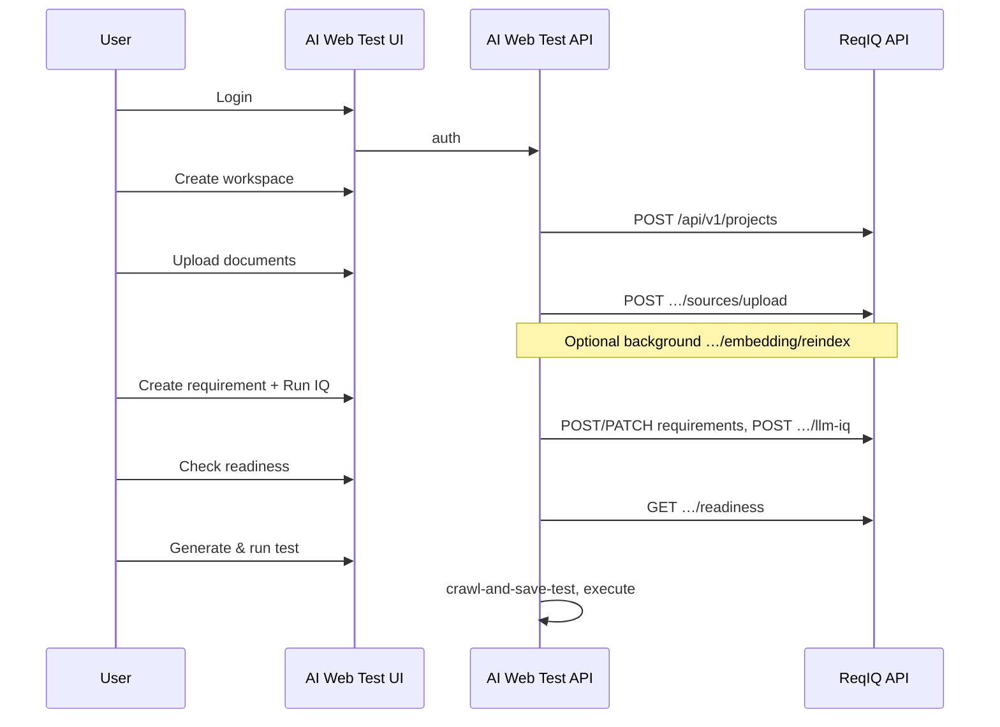

# AI Web Test — ReqIQ integration handoff

**Audience:** AI Web Test backend/frontend developers  
**Version:** 1.0 · **Date:** 2026-05-17  
**ReqIQ contract:** [`openapi/reqiq-api-v1.yaml`](openapi/reqiq-api-v1.yaml) · [`openapi/README.md`](openapi/README.md)  
**AI Web Test API (crawl, execute, KB):** [`ReqIQ-API-Integration-Guide.md`](ReqIQ-API-Integration-Guide.md) · **§12** ReqIQ proxy (partial — extend per below)

---

## 1. Product split

| Tier | Primary UI | Who | Capabilities |
| --- | --- | --- | --- |
| **Standard users** | **AI Web Test** (`:5173` UI, `:8000` API) | QA, BAs, most testers | Workspaces (projects), document upload, **requirements**, **IQ**, readiness, suggested tests, **test execution** |
| **Power users** | **ReqIQ** (`:8080/app`) | RAG engineers, index admins | **RAG** (query, threads, retrieve), **chunks**, embedding reindex/snapshots/rollback, admin scorecard |

**Rule:** Most users never open ReqIQ directly. AI Web Test **backend** proxies ReqIQ using a service account (or forwards the user JWT). **Do not** expose `REQIQ_SERVICE_TOKEN` to the browser.

**Canonical requirement documents** live in ReqIQ (`sources/upload`), not only AI Web Test’s native `/api/v1/kb/*` (see integration guide §2 vs §12).

---

## 2. Documents to read (order)

1. **This file** — scope, proxy checklist, MVP flows, deliverables.
2. [`openapi/reqiq-api-v1.yaml`](openapi/reqiq-api-v1.yaml) — machine-readable ReqIQ contract (import Postman/codegen).
3. [`openapi/README.md`](openapi/README.md) — login, multipart upload, rate limits.
4. [`ReqIQ-API-Integration-Guide.md`](ReqIQ-API-Integration-Guide.md) — AI Web Test endpoints (§1–11) + existing §12 proxies.

Optional (agents only, not main UI): [`Hermes_QA_MultiAgent_Profiles_v3.md`](Hermes_QA_MultiAgent_Profiles_v3.md).

---

## 3. Architecture

```
┌─────────────────────────────┐         ┌─────────────────────────────┐
│  AI Web Test UI  :5173      │  HTTPS  │  AI Web Test API  :8000     │
│  (standard users)           │ ──────► │  • crawl / execute / tests  │
└─────────────────────────────┘         │  • ReqIQ proxy  /api/v1/    │
                                        │    requirements/...       │
                                        └──────────────┬────────────┘
                                                       │ server-side
                                                       ▼
                                        ┌─────────────────────────────┐
                                        │  ReqIQ API  :3001           │
                                        │  projects · sources · reqs  │
                                        │  IQ · readiness             │
                                        └─────────────────────────────┘

Power users ──► ReqIQ SPA  :8080/app  (RAG · chunks · embedding admin)
```

| System | Dev URL | Role |
| --- | --- | --- |
| ReqIQ API | `http://localhost:3001` | Requirements hub |
| ReqIQ web | `http://localhost:8080/app` | Power-user UI |
| AI Web Test API | `http://localhost:8000` | Primary API + proxy |
| AI Web Test UI | `http://localhost:5173` | Primary UI |

**Production:** use **LAN IP or DNS** per host (`127.0.0.1` is local to that machine only). Update AI Web Test `BACKEND_CORS_ORIGINS` for both UIs.

---

## 4. Server configuration (AI Web Test `.env`)

```bash
# ReqIQ backend (server-side only)
REQIQ_URL=http://localhost:3001
REQIQ_SERVICE_EMAIL=aiwebtest@reqiq.local
REQIQ_SERVICE_PASSWORD=...
# Or cache JWT from POST /api/v1/login (refresh on 401, TTL ~8h):
# REQIQ_SERVICE_TOKEN=eyJhbGci...
```

1. Create a ReqIQ user with role **LIBRARIAN**, **ANALYST**, or **ADMIN** (not **AUDITOR** for mutations).
2. `POST {REQIQ_URL}/api/v1/login` with `{ "email", "password" }` → use **`accessToken`** as `Authorization: Bearer …`.
3. Resolve **`projectId`** from `GET /api/v1/projects` → field **`id`** (cuid), not display name.

After document upload, optionally call ReqIQ `POST …/embedding/reindex` **in the background**; standard users see source **`status`** only (`processing` → `ready`).

---

## 5. Standard-user API — proxy from AI Web Test

Implement **backend** routes (suggested prefix `/api/v1/requirements/…`, matching integration guide §12 style). Each proxies to ReqIQ with the service Bearer token.

### 5.1 Already documented in §12 (implement or verify)

| AI Web Test (proposed) | ReqIQ | Purpose |
| --- | --- | --- |
| `GET /api/v1/requirements/projects` | `GET /api/v1/projects` | List workspaces |
| `GET …/requirements/{projectId}/requirements` | `GET …/requirements` | List requirements (`latestCompositeScore`) |
| `POST …/requirements/{projectId}/query` | `POST …/rag/query` | Ask KB *(optional in UI — prefer readiness)* |
| `POST …/requirements/{projectId}/sources/upload` | `POST …/sources/upload` | Upload documents |
| `GET …/requirements/{projectId}/sources` | `GET …/sources` | List documents |
| `POST …/…/suggest-tests` | `POST …/suggested-tests/generate` | LLM suggested tests |
| `GET …/…/latest-iq` | `GET …/latest-iq` | Latest IQ score |
| `GET …/requirements/{projectId}/readiness?query=…` | `GET …/readiness` | Ready-for-testing gate |

### 5.2 **Required extensions** (not in §12 yet — add proxies)

| AI Web Test (proposed) | ReqIQ | Purpose |
| --- | --- | --- |
| `POST /api/v1/requirements/projects` | `POST /api/v1/projects` | Create workspace `{ "name" }` |
| `PATCH /api/v1/requirements/projects/{id}` | `PATCH /api/v1/projects/{id}` | Rename workspace |
| `GET /api/v1/requirements/projects/{id}` | `GET /api/v1/projects/{id}` | Get one workspace |
| `POST …/requirements` | `POST …/requirements` | Create requirement |
| `GET/PATCH …/requirements/{requirementId}` | `GET/PATCH …/requirements/{id}` | Get / update |
| `POST …/requirements/{id}/transition` | `POST …/transition` | Lifecycle (DRAFT → BASELINE, etc.) |
| `GET …/requirements/{id}/audit` | `GET …/audit` | Audit trail |
| `GET …/requirements/{id}/revisions` | `GET …/revisions` | Revision list |
| `GET …/revisions/{revisionIndex}` | `GET …/revisions/{index}` | Revision detail |
| `POST …/revisions/{index}/stub-iq` | `POST …/stub-iq` | Stub IQ (no LLM) |
| `POST …/revisions/{index}/llm-iq` | `POST …/llm-iq` | LLM IQ (**503** if chat not configured) |
| `GET/POST/PATCH/DELETE …/suggested-tests` | same | Suggested test CRUD |
| `POST …/suggested-tests/import` | `POST …/import` | Import without LLM |

**Bodyless POSTs:** do not send `Content-Type: application/json` without a body (Fastify returns `FST_ERR_CTP_EMPTY_JSON_BODY`).

### 5.3 Power-user only — do **not** expose in standard UI

| ReqIQ path | Notes |
| --- | --- |
| `POST …/rag/query`, `…/rag/retrieve`, `…/rag/threads` | RAG playground |
| `GET/PATCH …/chunks`, `…/chunks/{chunkId}` | Chunk metadata |
| `POST …/embedding/reindex`, `snapshot`, `rollback-hard` | Index ops (server may call reindex silently) |
| `/api/v1/admin/*` | Tenant admin |

Link: **“Open ReqIQ advanced”** → `{REQIQ_WEB_URL}/app` (e.g. `http://localhost:8080/app`).

---

## 6. User-facing labels (standard UI)

| ReqIQ concept | Show as |
| --- | --- |
| Project | **Workspace** |
| Source | **Document** |
| Requirement | **Requirement** |
| `latestCompositeScore` | **Quality score** |
| `readinessScore` / `status` | **Ready for testing?** |
| RAG / chunk / reindex | *(hidden — advanced link only)* |

---

## 7. MVP build order

1. **Login** — AI Web Test auth; proxy ReqIQ when needed; handle **401** (re-login).
2. **Workspaces** — list, create, rename; persist selected `projectId`.
3. **Documents** — multipart upload, list with processing status.
4. **Requirements** — list (with score), create, edit, optional transition.
5. **IQ** — run stub/LLM IQ on revisions; show `latest-iq` on list.
6. **Readiness** — query + `readinessScore`, `wikiContent`, `status` (no “RAG” label).
7. **Suggested tests** — generate → map steps to existing **crawl-and-save-test** (integration guide §3).
8. **Execute** — existing AI Web Test flows (§3–8); label `triggered_by: "AI Web Test"`.
9. **Advanced link** — ReqIQ `/app` for power users.

---

## 8. End-to-end flow (reference)



---

## 9. Verification

**ReqIQ repo** (against running API `3001`):

```powershell
$env:REQIQ_ACCESS_TOKEN = "<from POST /api/v1/login>"
$env:REQIQ_PROJECT_ID = "<cuid from GET /api/v1/projects>"
npm run test:sprint6:live
```

Your proxy should support the same **standard** operations your UI uses. Import [`reqiq-api-v1.yaml`](openapi/reqiq-api-v1.yaml) into Postman; set server URL and Bearer token from login.

**Key response fields:**

- RAG answer text: **`content`** (not `answer`)
- Readiness: **`readinessScore`**, **`status`**, **`wikiContent`**
- Login: **`accessToken`** (JWT, three dot-separated segments)

---

## 10. Deliverables back to ReqIQ team

1. **OpenAPI or markdown** listing all **new** proxy routes (extends §12).
2. **Demo or screenshots:** workspace → upload → requirement → IQ → readiness → test run.
3. **`.env.example`** entries for `REQIQ_URL`, service account, optional `REQIQ_WEB_URL`.
4. **Short note:** what is proxied vs what still requires ReqIQ `/app`.

---

## 11. Out of scope for v1

- Hermes / Telegram / MCP tool wiring (separate track; see Hermes profiles doc).
- Chunk editor, RAG thread UI, embedding rollback UI in AI Web Test.
- ReqIQ admin scorecard UI (stay in ReqIQ admin).

---

## 12. One-line summary

> Build AI Web Test as the primary QA app: **proxy the ReqIQ standard API** (projects, documents, requirements, IQ, readiness) from your **backend**; keep **test execution** on AI Web Test; hide RAG/chunks/reindex from normal users and link **ReqIQ advanced** at `:8080/app`; use **`reqiq-api-v1.yaml`** as the contract and **extend integration guide §12** until the proxy table in §5 is complete.
