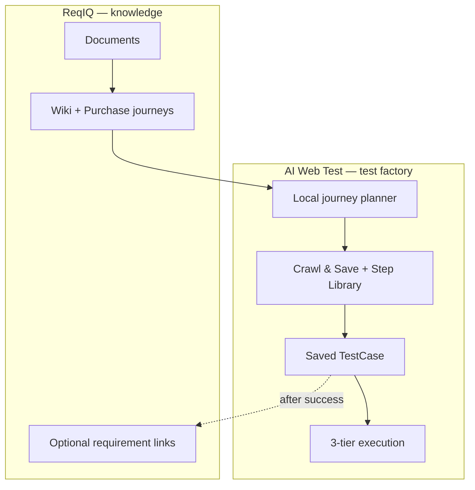

# Quality test generation — ReqIQ vs AI Web Test

**Version:** 1.0 · **Date:** 2026-07-17  
**Track:** UF follow-on (quality path for 3-tier execution)  
**Status:** 📋 Planned (docs locked; implementation next)

---

## 1. Problem (pilot finding — 5G Mobile Broadband)

Product workspace **Create tests from summary** (`suggest-from-wiki`) produced **13 ReqIQ DRAFT scenarios** that are poor inputs for the 3-tier engine:

| Symptom | Why it hurts |
|---------|----------------|
| Screen-level fragments (Step 01–08) | Not one E2E happy path |
| Empty / template bodies | No imperative browser steps |
| Template bleed from other products | Wrong UI labels / flows |
| No Crawl & Save | Nothing saved for Playwright → Hybrid → Stagehand |
| Wiki recompile strips `## Purchase journeys` | Journey hints never reach suggest |

**Root cause:** ReqIQ `suggest-from-wiki` is built for **UAT acceptance criteria**, not **executable browser tests**. AWT already extracts high-quality Purchase journey step tables (vision); the product UX then asks the wrong engine to invent scenarios.

---

## 2. Ownership split (decision)

| System | Owns | Does **not** own |
|--------|------|------------------|
| **ReqIQ** | Documents, wiki, requirements lifecycle, RAG Q&A, human review, optional IQ | Executable browser tests, Crawl & Save, 3-tier runs |
| **AI Web Test** | Journey planning, Crawl & Save, Step Library, saved `TestCase`, factory, 3-tier | Canonical document store |

**Rule:** Generation of **production-quality E2E tests lives in AWT**. ReqIQ remains the **knowledge / requirements hub**. Optional sync of **proven** tests back to ReqIQ is for traceability only — never push draft LLM text.

---

## 3. LLM IQ scoring — keep or drop?

| Use | Verdict |
|-----|---------|
| Human review of requirement **text** (clarity, testability) | **Keep** — Advanced (ReqIQ) only |
| Readiness gate (~60) before investing in automation | **Optional** — advisory |
| Gate Crawl & Save / factory / overnight | **Do not use** — IQ is never read by automation today |

**Automation gates instead:** structured E2E shape → Crawl & Save success → dry-run Tier 1 → human “Add to regression”.

---

## 4. Target pipeline



**User-visible steps stay simple:** Upload → Update summary → **Generate browser tests** → Run overnight. Under the hood, “Create tests” must produce **saved tests**, not only ReqIQ drafts.

---

## 5. Phased implementation

### Phase 0 — Wiki compile preserves Purchase journeys 🔜

| Change | Location |
|--------|----------|
| Recompile = merge, not replace | `product_wiki_compile.py` + `wiki_journey_merge.py` |
| Never bare-recompile before suggest without merge | `products.py` `generate_tests_from_wiki` |

**Acceptance:** After Update summary and before/after Create tests, wiki still contains `## Purchase journeys`.

### Phase 1 — Local journey planner replaces suggest-from-wiki in main UX 🔜

Inputs: Purchase journey tables, product `webapp_url`, Step Library modules, Active promotions.  
Output: **1 E2E happy path** + ~4–5 branch/negative scenarios (`automatable: true` only).  
Reject: T+1 channel, CRM-only, manual ops.

### Phase 2 — One-click Generate browser test (UF-4.3 wired) 🔜

```
POST /products/{id}/generate-browser-tests
  → plan scenarios (local)
  → Crawl & Save per scenario
  → return test_case_ids[]
```

Rename UI so users see **browser tests**, not ReqIQ DRAFT cards as the primary list.

### Phase 3 — Optional push to ReqIQ (after crawl success)

Use existing proxied CRUD (`create_requirement`, suggested-tests). No new ReqIQ OpenAPI required for pilot. Prefer a dedicated import API later only if scale/audit demands it.

### Phase 4 — Automation quality gates

Structure (≥5 steps, navigate → verify), journey coverage vs wiki, crawl success, Tier 1 dry-run, human approve for regression. Optional cheap LLM review of saved test vs wiki steps (store on `TestCase.metadata`, not ReqIQ IQ).

### Phase 5 — Overnight / factory fixes

- Overnight ≈ `full_cycle` (drain backlog → regression)
- Filter by `factory.program_tags`
- Fill registry `feature_url` from product `webapp_url` (no `about:blank`)

---

## 6. What to do with current ReqIQ drafts

1. Treat the 13 as a **review draft**, not automation input.
2. Merge Steps 01–07 into **one** E2E happy-path scenario (planner).
3. Keep ~5–6 human-readable acceptance criteria in ReqIQ if needed for audit.
4. Run **Suggest tests → Crawl & Save** (or Phase 2 one-click) on the happy path **first**.

---

## 7. Related docs

| Doc | Role |
|-----|------|
| [User-Friendly-Implementation-Plan.md](User-Friendly-Implementation-Plan.md) | UF-0…UF-6 shipped; UF-4 limitations + follow-on link here |
| [AI-Web-Test-Developer-Handoff.md](../AI-Web-Test-Developer-Handoff.md) | ReqIQ proxy contracts |
| [Hermes_QA_Autonomous_Workflow_v5.md](../Hermes_QA_Autonomous_Workflow_v5.md) | Factory / overnight |
| [examples/5g-mobile-broadband/Pilot-Checklist.md](examples/5g-mobile-broadband/Pilot-Checklist.md) | Updated pilot checks |

---

## 8. Decision log

| Date | Decision |
|------|----------|
| 2026-07-17 | ReqIQ = knowledge/requirements hub; AWT = E2E test factory |
| 2026-07-17 | Do not rely on `suggest-from-wiki` for 3-tier-ready tests |
| 2026-07-17 | IQ scoring = human review only; not automation gate |
| 2026-07-17 | Push to ReqIQ only after Crawl & Save success (optional) |
| 2026-07-17 | Implement Phase 0 + Phase 2 first (wiki fix + one E2E crawl chain) |
