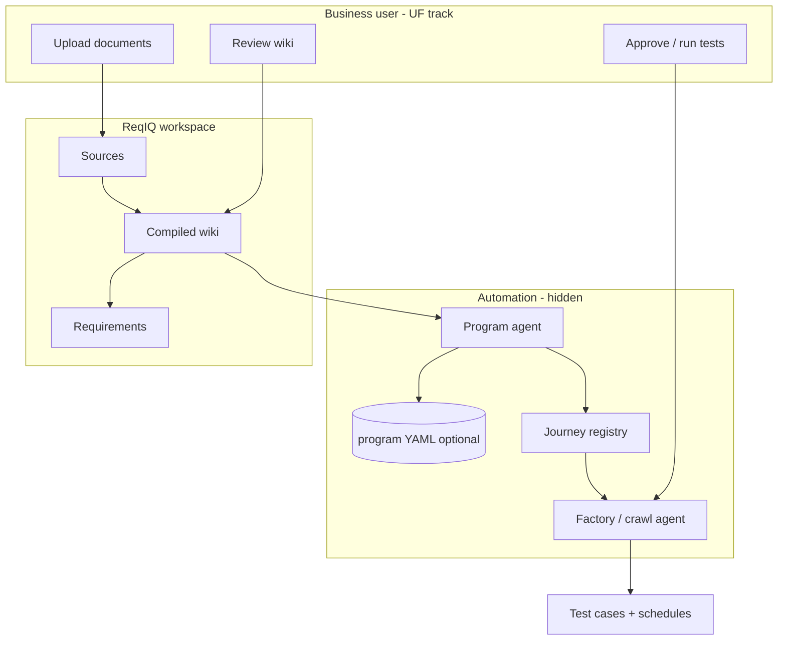

# User-friendly product workspace — Implementation plan

**Version:** 1.1 · **Date:** 2026-07-07  
**Track code:** **UF** (user-facing)  
**Status:** ✅ **UF-0 … UF-6 implemented** (2026-07-07)  
**Replaces for business users:** PG sidebar / YAML hub workflow  
**Keeps under the hood:** PG backend services (agent-operated)

**Legend:** ⬜ Not started · 🔜 Next · ⚠️ Partial · ✅ Done

---

## 1. Problem statement

Business users (Marketing, SSCO, SMCD) work from **mixed documents** arriving at different times:

| Source | Examples |
|--------|----------|
| Marketing | PowerPoint decks, promo briefs |
| SSCO | URS, MVP offer config files |
| SMCD | UX/UI layout images |
| Legal / ops | T&C (EN + 繁中), SMS / email / push templates |

They need a system that:

1. Accepts documents **in one go or in batches**, and **any time later**.
2. **Understands** heterogeneous formats and builds a **readable wiki summary**.
3. **Generates relevant test cases** from that wiki.
4. **Runs automation** (AI agent / factory) without YAML, slugs, or “seed journeys”.

**Example — 5G mobile broadband:**

| Period | Commercial reality | System behaviour |
|--------|-------------------|------------------|
| Months ago | Base offer launched | Base regression always on |
| Jun 2026 | June-only promo | Test June overlay; wiki shows date window |
| 1 Jul 2026 | June ends | Stop June tests; revert to base |
| Jul 2026 | New July offer docs | Test July; June retired automatically |

Users must **never** edit `initiatives[]`, `relationship: stack`, or manifest files.

---

## 2. Target experience (three screens max)

### Screen A — **Product workspace** (primary entry)

One row per product line (pilot: **5G Mobile Broadband**).

```
┌────────────────────────────────────────────────────────────┐
│  5G Mobile Broadband                    [Upload documents] │
│  Status: Wiki ready · 12 sources · Last compile: today     │
├────────────────────────────────────────────────────────────┤
│  Step 1  Documents (12)     PPT, URS, images, T&C…        │
│  Step 2  Wiki summary       [View / Edit]  [Recompile]    │
│  Step 3  Tests              8 suggested · 5 automated      │
│          [Generate tests]   [Run overnight]                │
└────────────────────────────────────────────────────────────┘
```

### Screen B — **Wiki** (read + light edit)

Structured sections the AI maintains (users fix mistakes in plain language):

- Base offer
- Active promotions (with **effective dates**)
- Ended promotions (auto-moved when dates pass)
- UX / UI notes (from SMCD images)
- Notifications (SMS / email / push copy)
- Terms & conditions (EN / 繁中 pointers)
- Open questions / gaps

### Screen C — **Tests** (outcomes)

List of generated tests with status: suggested → approved → running → passed/failed.  
No journey registry columns visible to business users.

---

## 3. Architecture shift



| Layer | User sees | System does |
|-------|-----------|-------------|
| **UF** | Upload, wiki, tests | ReqIQ compile + suggest |
| **PG (hidden)** | Nothing | Agent syncs YAML/registry from wiki dates |
| **HF** | “Last run” status only | Crawl, execute, schedule |

---

## 4. What to remove or hide (slug / PG **user-facing**)

### 4.1 Remove from sidebar and routes (business roles)

| Item | Path / file | Action |
|------|-------------|--------|
| Programs menu | `Sidebar.tsx` → `/programs` | **Remove** for default users |
| Program list | `ProgramsListPage.tsx` | **Hide** (admin-only or delete) |
| Program hub | `ProgramHubPage.tsx` | **Hide** |
| Initiative detail | `InitiativeDetailPage.tsx` | **Hide** |
| YAML manifest editor | `ProgramManifestEditorPage.tsx` | **Admin / dev only** |
| Create program wizard | `CreateProgramModal.tsx` | **Remove** from business flow |
| App routes | `App.tsx` `/programs/*` | Guard with `admin` role or remove |

### 4.2 Remove from business documentation emphasis

| Document / concept | Action |
|--------------------|--------|
| “Edit YAML manifest” as pilot path | **Deprecate** in README; point to UF plan |
| Manual **Seed journeys** button | **Hide** from hub; agent calls API |
| ReqIQ onboarding checklist on Programs hub | **Remove**; upload is self-explanatory |
| Initiative timeline table for PM/SSCO | **Replace** with wiki “Active promotions” section |
| `source_files` lists in manifest | **Optional**; documents live in ReqIQ only |

### 4.3 Simplify Journey Registry (business view)

| Column / concept | Action |
|------------------|--------|
| Program slug column | **Hide** for non-admin |
| Initiative id column | **Hide** |
| Retired badge | Show on **Tests** list as “Ended offer” instead |

### 4.4 Keep backend — do **not** delete (agent-operated)

These stay; only **operators/agents** touch them:

| Component | Why keep |
|-----------|----------|
| `program_registry_service.py` | Agent writes manifest when wiki changes |
| `program_journey_seed.py` + retire | Agent retires June when wiki says ended |
| `program_factory_scope.py` | Factory skips ended offers |
| `program_test_retire.py` | Retire test cases with journeys |
| `backend/config/programs/*.yaml` | Machine config; seeded from wiki |
| `POST /programs/{slug}/seed-journeys` | Agent-only trigger |
| PG unit tests | Regression for agent contract |

**Rule:** PG becomes **write-only from agent**, **read-only for admins**, **invisible for business users**.

---

## 5. UF implementation phases

### UF-0 — Align docs and roles ✅

**Estimate:** 0.5 day

| ID | Story | Deliverable |
|----|-------|-------------|
| UF-0.1 | Mark PG hub as **internal** | Update [README.md](README.md) |
| UF-0.2 | Link UF plan as **primary** | This document |
| UF-0.3 | Role matrix | `user` / `ssco` → workspace only; `admin` → PG optional |

---

### UF-1 — Product workspace page ✅

**Estimate:** 5–7 days  
**Route:** `/products/5g-mobile-broadband` (pilot); later `/products/:id`

Wraps existing ReqIQ APIs — **no new AI logic** in v1.

| ID | Story | API / reuse | Acceptance |
|----|-------|-------------|------------|
| UF-1.1 | Product picker | Map product → ReqIQ `project_id` (config table or env) | One card: 5G broadband |
| UF-1.2 | Document upload zone | `POST …/sources/upload` | Multi-file, drag-drop, batch |
| UF-1.3 | Document list | `GET …/sources` | Filename, type, uploaded date, processing status |
| UF-1.4 | Wiki status strip | `GET …/wiki`, `GET …/readiness` | “Wiki ready / stale / needs compile” |
| UF-1.5 | One-click **Recompile wiki** | `POST …/wiki/compile` | Button + spinner; no jargon |
| UF-1.6 | Wiki preview panel | `GET …/wiki` | First 2k chars + “View full” |
| UF-1.7 | Test summary counts | `GET …/requirements`, executions | Suggested / automated / last run |
| UF-1.8 | Sidebar | Replace **Programs** with **Products** | Single pilot entry |

**Config (pilot):**

```yaml
# backend/config/product-workspaces.yaml (new, simple)
products:
  - id: 5g-mobile-broadband
    title: "5G Mobile Broadband"
    reqiq_project_id: "<existing cuid>"
    locale: zh-HK
    default_urls:
      webapp: "https://wwwuat.three.com.hk/..."
```

No `initiatives[]` in this file — dates live in **wiki**.

---

### UF-2 — Document ingest improvements ✅

**Estimate:** 5–10 days (depends on format support)

| ID | Story | Deliverable | Acceptance |
|----|-------|-------------|------------|
| UF-2.1 | Accept **PPTX** | ReqIQ upload or pre-convert service | Marketing deck uploads without error |
| UF-2.2 | Accept **images** (PNG/JPG) | Vision pass → text chunks in ReqIQ | SMCD layout described in wiki |
| UF-2.3 | Accept **MVP config** | Parser for known JSON/CSV templates | Plan codes appear in wiki |
| UF-2.4 | Notification templates | Tag source type `notification` | Wiki section “Notifications” |
| UF-2.5 | T&C dual language | Tag `tc-en`, `tc-zh` | Wiki links both; tests check key clauses |
| UF-2.6 | Re-upload / version | Same filename replaces or versions | “Added 3 docs today” message |

**Out of scope v1:** Perfect OCR on all slides; human wiki edit is the safety net.

---

### UF-3 — Wiki structure for offer lifecycle ✅

**Estimate:** 4–6 days

| ID | Story | Deliverable | Acceptance |
|----|-------|-------------|------------|
| UF-3.1 | Compile **profile** for telecom promos | ReqIQ compile `feature` prompt / template | Wiki has fixed headings (see §2 Screen B) |
| UF-3.2 | Extract **effective dates** from docs | LLM section “Active promotions” | June promo shows 2026-06-01 – 2026-06-30 |
| UF-3.3 | **Stale wiki** indicator | Existing `wikiStale` | Orange banner: “New documents — recompile” |
| UF-3.4 | Light wiki editor | Existing `PATCH …/wiki` | SSCO fixes one paragraph without ReqIQ Advanced |
| UF-3.5 | Gap list | LLM “Open questions” | Missing T&C flagged in wiki |

**June → July example (acceptance):**

- After July docs uploaded + recompile:
  - Wiki lists June under **Ended promotions**
  - July under **Active promotions**
  - Base offer unchanged

---

### UF-4 — Test generation (user-friendly) ✅

**Estimate:** 4–5 days

| ID | Story | API / reuse | Acceptance |
|----|-------|-------------|------------|
| UF-4.1 | **Generate test ideas** button | `POST …/suggest-from-wiki` | Creates DRAFT requirements; no capability jargon |
| UF-4.2 | Plain-language requirement cards | Existing requirements list | Title = user story, not `PLANS_ABC` |
| UF-4.3 | **Generate browser test** per card | `suggest-tests` → Crawl & Save | Pre-filled URL from product config |
| UF-4.4 | Approve / reject | `wiki-feedback` accept/reject | One click |
| UF-4.5 | Bulk “Generate all pending” | Batch suggest + import | ≤10 scenarios for pilot |

**User flow:** Upload → Recompile → **Generate tests** → Review list → **Run overnight**.

---

### UF-5 — Program agent (hide PG complexity) ✅

**Estimate:** 5–8 days  
**Depends on:** UF-3 wiki dates, existing PG backend

| ID | Story | Deliverable | Acceptance |
|----|-------|-------------|------------|
| UF-5.1 | **Sync agent** job | Reads wiki + `product-workspaces.yaml` | Updates `5g-mobile-broadband.yaml` initiatives |
| UF-5.2 | Infer `stack` vs `replace` | Rules in agent prompt | June `stack` on base; July `replace` June if URS says so |
| UF-5.3 | Auto **seed journeys** | `POST …/seed-journeys` | No human button |
| UF-5.4 | Auto **retire** ended offers | Existing replace/retire | July 1: June tests show “Ended offer” |
| UF-5.5 | Nightly schedule | Factory + `PROGRAM_REGISTRY_SEED` or cron | Regression runs base + active promo only |
| UF-5.6 | Agent console skill | “Sync 5G from wiki” tool | Operator fallback |

**Trigger options (pick one for pilot):**

- After `wiki/compile` webhook → enqueue sync  
- Nightly cron  
- Manual admin “Sync now” (hidden)

---

### UF-6 — Pilot validation (5G broadband) ✅

**Estimate:** 3–5 days with real SSCO docs

| # | Scenario | Pass criteria |
|---|----------|---------------|
| 1 | Upload base offer pack (batch) | Wiki describes base plan |
| 2 | Add June promo PPT + URS later | Recompile → June section with dates |
| 3 | Generate tests from wiki | ≥3 browser tests suggested |
| 4 | Run overnight | Executions visible; no YAML edited by user |
| 5 | Upload July pack on 1 Jul | Recompile → June ended, July active; June tests retired |
| 6 | SSCO edits one wiki paragraph | Tests unchanged unless they click regenerate |

---

## 6. Suggested timeline

| Week | Focus | User-visible outcome |
|------|--------|----------------------|
| 1 | UF-0 + UF-1 | **Products** page: upload + recompile wiki |
| 2 | UF-3 (partial) + UF-4 | Generate tests from wiki |
| 3 | UF-2 (PPT + images) | Marketing + SMCD docs work |
| 4 | UF-5 | Agent sync; hide Programs UI |
| 5 | UF-6 | Pilot sign-off with real 5G docs |

---

## 7. PG → UF mapping (for engineers)

| PG concept | UF user-facing equivalent |
|------------|---------------------------|
| `program.slug` | Product name on workspace card |
| `initiatives[]` | Wiki sections “Active / Ended promotions” |
| `effective_from` / `effective_to` | Dates extracted in wiki (not typed by user) |
| `relationship: stack` | Wiki: “June promo overlays base offer” |
| `relationship: replace` | Wiki: “July offer replaces June” |
| `journey_templates` | Agent creates from wiki + URLs in product config |
| `source_files` in YAML | Documents in ReqIQ workspace only |
| `reference_layers` (MCS) | Wiki appendix “BAU reference (parity only)” |
| Seed journeys | Automatic after agent sync |
| Programs hub | **Removed** |

---

## 8. Unified UX (no admin split)

All users — Marketing, SSCO, SMCD, QA — use the same **Products** flow:

1. **+ New product** (or open existing)
2. **Add documents** (any time, any batch)
3. **Update summary** — compiles wiki + auto-syncs offers (June ends → tests retired)
4. **Create tests** → **Run tests overnight**

No YAML, Programs hub, or Sync automation button. Backend automation runs inside **Update summary** and **Run overnight**.

---

## 9. Success metrics

| Metric | Target |
|--------|--------|
| Time to first wiki | < 15 min after first upload batch |
| User steps to first test | ≤ 4 clicks (upload → update summary → create tests → run overnight) |
| YAML edits by users | **0** |
| Admin-only steps | **0** |
| Documents added mid-month | Recompile only; no re-setup |
| Promo end (June 30) | June tests auto-stopped by 1 Jul without ticket |

---

## 10. Related documents

| Doc | Role after UF |
|-----|----------------|
| [Program-Framework.md](Program-Framework.md) | **Internal** — agent contract |
| [Manifest-Schema.md](Manifest-Schema.md) | **Internal** — agent output format |
| [Implementation-Plan.md](Implementation-Plan.md) | **PG track** — frozen; agent-only |
| [examples/5g-mobile-broadband/](examples/5g-mobile-broadband/) | Pilot reference content |
| Knowledge Base page | **Absorbed** into Product workspace (UF-1) |
| [Hermes_QA_Autonomous_Workflow_v5.md](../Hermes_QA_Autonomous_Workflow_v5.md) | Factory/agent execution |

---

## 11. Decision log

| Date | Decision |
|------|----------|
| 2026-07-07 | Business UX = **Product workspace** (UF), not Programs hub (PG) |
| 2026-07-07 | PG backend **retained**; operated by agent, not users |
| 2026-07-07 | Pilot product: **5G mobile broadband** single workspace |
| 2026-07-07 | YAML + redeploy remains valid for **devs/admins** only |
