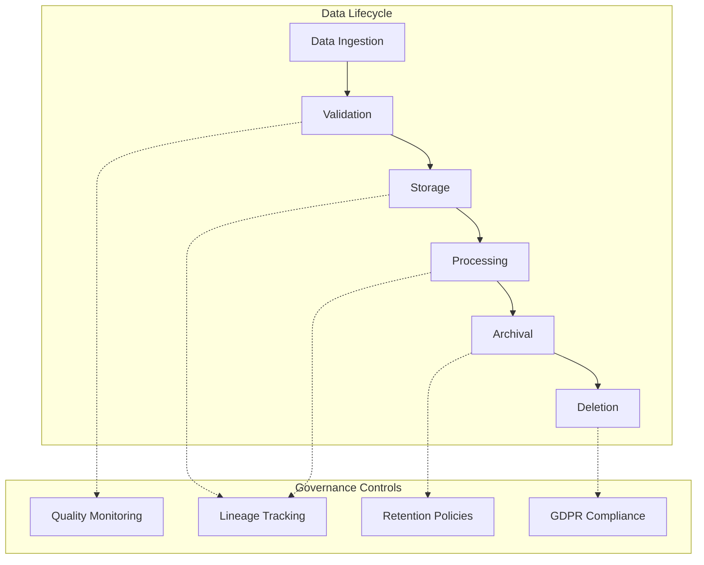

# AI-Web-Test v1 - Data Governance & Quality Architecture

## Document Information
- **Version**: 1.0
- **Last Updated**: 2025-01-31
- **Status**: Architecture Specification
- **Related Documents**: 
  - [PRD](../AI-Web-Test-v1-PRD.md)
  - [SRS](../AI-Web-Test-v1-SRS.md)
  - [MLOps Architecture](./AI-Web-Test-v1-MLOps-Architecture.md)
  - [Security Architecture](./AI-Web-Test-v1-Security-Architecture.md)

---

## Executive Summary

This document defines the **comprehensive data governance and quality architecture** for the AI-Web-Test v1 platform, implementing automated data validation, quality monitoring, retention policies, GDPR compliance, and data lineage tracking.

### Key Data Governance Capabilities

| Component | Technology | Purpose |
|-----------|-----------|---------|
| **Data Validation** | Pydantic + Great Expectations | Schema validation at ingestion |
| **Quality Monitoring** | Custom metrics + Great Expectations | Completeness, accuracy, consistency, timeliness |
| **Retention Policies** | PostgreSQL + S3 Lifecycle | Automated archival and deletion |
| **GDPR Compliance** | Custom implementation | Right to deletion, data portability, consent |
| **Data Lineage** | Apache Atlas / Custom | Track data origin and transformations |
| **Data Catalog** | DataHub / Amundsen | Searchable metadata repository |
| **Quality Dashboard** | Grafana + Custom | Real-time data quality metrics |

### Implementation Timeline
- **Total Effort**: 8 days
- **Phase 1** (Days 1-3): Data Validation + Quality Monitoring
- **Phase 2** (Days 4-6): Retention Policies + GDPR Compliance
- **Phase 3** (Days 7-8): Data Lineage + Catalog

---

## Table of Contents
1. [Data Governance Principles](#data-governance-principles)
2. [Data Validation Pipeline](#data-validation-pipeline)
3. [Data Quality Monitoring](#data-quality-monitoring)
4. [Data Retention Policies](#data-retention-policies)
5. [GDPR Compliance](#gdpr-compliance)
6. [Data Lineage Tracking](#data-lineage-tracking)
7. [Data Catalog](#data-catalog)
8. [Data Quality Dashboard](#data-quality-dashboard)
9. [Implementation Roadmap](#implementation-roadmap)
10. [Summary & Integration](#summary--integration)

---

## Data Governance Principles

### Overview
Data governance ensures data is **accurate, consistent, secure, and compliant** throughout its lifecycle.



### Governance Principles

| Principle | Description | Implementation |
|-----------|-------------|----------------|
| **Data Quality** | Data must be accurate, complete, consistent, timely | Pydantic + Great Expectations |
| **Data Security** | Data must be protected (encryption, access control) | AES-256, RBAC (see Security Architecture) |
| **Data Lineage** | Track data origin and transformations | Apache Atlas or custom tracking |
| **Data Retention** | Automated archival and deletion based on policies | PostgreSQL + S3 lifecycle policies |
| **Compliance** | GDPR, SOC 2, ISO 27001 compliance | Audit logs, data portability, consent |
| **Data Catalog** | Searchable metadata for data discovery | DataHub or Amundsen |

---

## Data Validation Pipeline

### 1.1 Schema Validation with Pydantic

**Purpose**: Validate data structure and types at ingestion.

#### Pydantic Models
```python
# app/models/validation.py
from pydantic import BaseModel, Field, validator, constr, conint
from datetime import datetime
from typing import List, Optional, Literal

class TestExecutionData(BaseModel):
    """Validation for test execution data"""
    test_id: constr(regex=r'^TEST-\d{6}$') = Field(
        ..., 
        description="Test ID in format TEST-XXXXXX"
    )
    execution_time: float = Field(
        ..., 
        gt=0, 
        lt=3600,
        description="Execution time in seconds (max 1 hour)"
    )
    result: Literal['pass', 'fail', 'skip'] = Field(
        ...,
        description="Test result status"
    )
    started_at: datetime = Field(..., description="Test start timestamp")
    completed_at: datetime = Field(..., description="Test completion timestamp")
    user_id: conint(gt=0) = Field(..., description="User ID who executed test")
    browser: Literal['chrome', 'firefox', 'edge'] = Field(..., description="Browser used")
    screenshots: List[str] = Field(default_factory=list, max_items=20)
    logs: Optional[str] = Field(None, max_length=50000)
    
    @validator('execution_time')
    def validate_reasonable_time(cls, v):
        """Ensure execution time is reasonable"""
        if v > 1800:  # 30 minutes
            raise ValueError('Execution time unreasonably high (>30 minutes)')
        if v < 0.1:  # 100ms
            raise ValueError('Execution time unreasonably low (<100ms)')
        return v
    
    @validator('completed_at')
    def validate_completion_after_start(cls, v, values):
        """Ensure completion is after start"""
        if 'started_at' in values and v < values['started_at']:
            raise ValueError('Completion time must be after start time')
        return v
    
    @validator('screenshots')
    def validate_screenshot_paths(cls, v):
        """Validate screenshot paths"""
        for path in v:
            if not path.startswith('s3://') and not path.startswith('/data/'):
                raise ValueError(f'Invalid screenshot path: {path}')
        return v

class TestCaseData(BaseModel):
    """Validation for test case data"""
    title: constr(min_length=5, max_length=255) = Field(..., description="Test case title")
    description: constr(min_length=10, max_length=5000) = Field(..., description="Test case description")
    test_type: Literal['unit', 'integration', 'e2e', 'performance'] = Field(...)
    priority: Literal['high', 'medium', 'low'] = Field(default='medium')
    tags: List[str] = Field(default_factory=list, max_items=10)
    estimated_duration: conint(gt=0, le=3600) = Field(..., description="Estimated duration in seconds")
    
    @validator('tags')
    def validate_tags(cls, v):
        """Ensure tags are non-empty and unique"""
        if not all(len(tag) > 0 for tag in v):
            raise ValueError('Tags must not be empty')
        if len(v) != len(set(v)):
            raise ValueError('Tags must be unique')
        return v

class MLModelData(BaseModel):
    """Validation for ML model metadata"""
    model_id: constr(regex=r'^MODEL-\d{6}$') = Field(...)
    model_type: Literal['generation', 'analysis', 'evolution'] = Field(...)
    version: constr(regex=r'^\d+\.\d+\.\d+$') = Field(..., description="Semantic version")
    metrics: dict = Field(..., description="Model performance metrics")
    
    @validator('metrics')
    def validate_metrics(cls, v):
        """Ensure required metrics are present"""
        required = ['accuracy', 'precision', 'recall', 'f1_score']
        missing = set(required) - set(v.keys())
        if missing:
            raise ValueError(f'Missing required metrics: {missing}')
        
        # Validate metric ranges
        for metric, value in v.items():
            if not isinstance(value, (int, float)):
                raise ValueError(f'Metric {metric} must be numeric')
            if not 0 <= value <= 1:
                raise ValueError(f'Metric {metric} must be between 0 and 1')
        return v

# Validation middleware
from fastapi import Request, HTTPException

async def validate_request_data(request: Request, model: BaseModel):
    """Validate incoming request data"""
    try:
        body = await request.json()
        validated_data = model(**body)
        return validated_data
    except ValueError as e:
        raise HTTPException(status_code=422, detail=str(e))

# Usage in API
@app.post("/api/tests/execute")
async def execute_test(request: Request):
    """Execute test with validated data"""
    test_data = await validate_request_data(request, TestExecutionData)
    # Proceed with execution
    return {"status": "success", "test_id": test_data.test_id}
```

### 1.2 Data Quality Checks with Great Expectations

**Purpose**: Deep data quality validation beyond schema.

#### Great Expectations Configuration
```python
# app/data_quality/great_expectations_setup.py
import great_expectations as ge
from great_expectations.core.batch import RuntimeBatchRequest

class DataQualityValidator:
    def __init__(self):
        self.context = ge.get_context()
    
    def validate_test_execution_batch(self, df):
        """Validate batch of test executions"""
        
        # Create expectation suite
        suite = self.context.create_expectation_suite(
            expectation_suite_name="test_execution_suite",
            overwrite_existing=True
        )
        
        # Define expectations
        validator = self.context.get_validator(
            batch_request=RuntimeBatchRequest(
                datasource_name="pandas_datasource",
                data_connector_name="default_runtime_data_connector",
                data_asset_name="test_executions",
                runtime_parameters={"batch_data": df},
                batch_identifiers={"default_identifier_name": "default_identifier"}
            ),
            expectation_suite_name="test_execution_suite"
        )
        
        # Completeness checks
        validator.expect_column_values_to_not_be_null(column="test_id")
        validator.expect_column_values_to_not_be_null(column="execution_time")
        validator.expect_column_values_to_not_be_null(column="result")
        validator.expect_column_values_to_not_be_null(column="user_id")
        
        # Accuracy checks
        validator.expect_column_values_to_match_regex(
            column="test_id",
            regex=r'^TEST-\d{6}$'
        )
        validator.expect_column_values_to_be_in_set(
            column="result",
            value_set=['pass', 'fail', 'skip']
        )
        validator.expect_column_values_to_be_in_set(
            column="browser",
            value_set=['chrome', 'firefox', 'edge']
        )
        
        # Consistency checks
        validator.expect_column_values_to_be_between(
            column="execution_time",
            min_value=0.1,
            max_value=3600
        )
        
        # Timeliness checks (data freshness)
        validator.expect_column_values_to_be_dateutil_parseable(
            column="started_at"
        )
        
        # Custom expectation: completion after start
        validator.expect_column_pair_values_a_to_be_greater_than_b(
            column_A="completed_at",
            column_B="started_at"
        )
        
        # Run validation
        results = validator.validate()
        
        return results
    
    def generate_data_docs(self):
        """Generate HTML documentation of data quality"""
        self.context.build_data_docs()
        print("Data docs generated at: file://great_expectations/uncommitted/data_docs/local_site/index.html")

# Usage
validator = DataQualityValidator()

# Validate test execution data
import pandas as pd
test_executions_df = pd.read_sql("SELECT * FROM test_executions WHERE created_at > NOW() - INTERVAL '1 day'", engine)
results = validator.validate_test_execution_batch(test_executions_df)

if not results["success"]:
    print("Data quality issues detected:")
    for result in results["results"]:
        if not result["success"]:
            print(f"  - {result['expectation_config']['expectation_type']}: {result['exception_info']['raised_exception']}")
```

### 1.3 Real-Time Validation at Ingestion

**PostgreSQL Constraints**:
```sql
-- database/migrations/003_data_validation_constraints.sql

-- Test executions table with constraints
CREATE TABLE test_executions (
    id SERIAL PRIMARY KEY,
    test_id VARCHAR(20) NOT NULL CHECK (test_id ~ '^TEST-\d{6}$'),
    execution_time FLOAT NOT NULL CHECK (execution_time >= 0.1 AND execution_time <= 3600),
    result VARCHAR(10) NOT NULL CHECK (result IN ('pass', 'fail', 'skip')),
    started_at TIMESTAMP NOT NULL,
    completed_at TIMESTAMP NOT NULL CHECK (completed_at >= started_at),
    user_id INTEGER NOT NULL REFERENCES users(id) ON DELETE CASCADE,
    browser VARCHAR(20) NOT NULL CHECK (browser IN ('chrome', 'firefox', 'edge')),
    created_at TIMESTAMP DEFAULT NOW(),
    CONSTRAINT reasonable_duration CHECK ((completed_at - started_at) <= INTERVAL '1 hour')
);

-- Test cases table with constraints
CREATE TABLE test_cases (
    id SERIAL PRIMARY KEY,
    title VARCHAR(255) NOT NULL CHECK (LENGTH(title) >= 5),
    description TEXT NOT NULL CHECK (LENGTH(description) >= 10 AND LENGTH(description) <= 5000),
    test_type VARCHAR(20) NOT NULL CHECK (test_type IN ('unit', 'integration', 'e2e', 'performance')),
    priority VARCHAR(10) NOT NULL DEFAULT 'medium' CHECK (priority IN ('high', 'medium', 'low')),
    estimated_duration INTEGER NOT NULL CHECK (estimated_duration > 0 AND estimated_duration <= 3600),
    created_at TIMESTAMP DEFAULT NOW(),
    updated_at TIMESTAMP DEFAULT NOW()
);

-- Create indexes for common queries
CREATE INDEX idx_test_executions_test_id ON test_executions(test_id);
CREATE INDEX idx_test_executions_result ON test_executions(result);
CREATE INDEX idx_test_executions_created_at ON test_executions(created_at);
CREATE INDEX idx_test_cases_test_type ON test_cases(test_type);
CREATE INDEX idx_test_cases_priority ON test_cases(priority);
```

---

## Data Quality Monitoring

### 2.1 Quality Dimensions

**Four Pillars of Data Quality**:

| Dimension | Description | Metrics |
|-----------|-------------|---------|
| **Completeness** | All required fields are present | Null rate, missing values % |
| **Accuracy** | Data matches expected format and range | Validation pass rate |
| **Consistency** | Data is consistent across sources | Duplicate rate, constraint violations |
| **Timeliness** | Data is up-to-date | Data freshness (lag time) |

### 2.2 Quality Metrics Collection

```python
# app/data_quality/metrics.py
from datetime import datetime, timedelta
from sqlalchemy import func, and_

class DataQualityMetrics:
    def __init__(self, db_session):
        self.db = db_session
    
    def calculate_completeness(self, table_name: str, time_window_hours: int = 24) -> dict:
        """Calculate completeness metrics for a table"""
        cutoff = datetime.utcnow() - timedelta(hours=time_window_hours)
        
        if table_name == 'test_executions':
            total = self.db.query(func.count(TestExecution.id)).filter(
                TestExecution.created_at >= cutoff
            ).scalar()
            
            # Check null rates for each column
            null_counts = {
                'test_id': self.db.query(func.count(TestExecution.id)).filter(
                    and_(TestExecution.created_at >= cutoff, TestExecution.test_id.is_(None))
                ).scalar(),
                'execution_time': self.db.query(func.count(TestExecution.id)).filter(
                    and_(TestExecution.created_at >= cutoff, TestExecution.execution_time.is_(None))
                ).scalar(),
                'result': self.db.query(func.count(TestExecution.id)).filter(
                    and_(TestExecution.created_at >= cutoff, TestExecution.result.is_(None))
                ).scalar(),
            }
            
            completeness = {
                col: 100 * (1 - null_count / total) if total > 0 else 100
                for col, null_count in null_counts.items()
            }
            
            return {
                'table': table_name,
                'time_window_hours': time_window_hours,
                'total_records': total,
                'completeness': completeness,
                'overall_completeness': sum(completeness.values()) / len(completeness)
            }
    
    def calculate_accuracy(self, table_name: str, time_window_hours: int = 24) -> dict:
        """Calculate accuracy metrics (validation pass rate)"""
        cutoff = datetime.utcnow() - timedelta(hours=time_window_hours)
        
        if table_name == 'test_executions':
            total = self.db.query(func.count(TestExecution.id)).filter(
                TestExecution.created_at >= cutoff
            ).scalar()
            
            # Count validation failures
            invalid_test_id = self.db.query(func.count(TestExecution.id)).filter(
                and_(
                    TestExecution.created_at >= cutoff,
                    ~TestExecution.test_id.op('~')('^TEST-\d{6}$')
                )
            ).scalar()
            
            invalid_result = self.db.query(func.count(TestExecution.id)).filter(
                and_(
                    TestExecution.created_at >= cutoff,
                    ~TestExecution.result.in_(['pass', 'fail', 'skip'])
                )
            ).scalar()
            
            invalid_duration = self.db.query(func.count(TestExecution.id)).filter(
                and_(
                    TestExecution.created_at >= cutoff,
                    (TestExecution.execution_time < 0.1) | (TestExecution.execution_time > 3600)
                )
            ).scalar()
            
            accuracy = {
                'test_id_accuracy': 100 * (1 - invalid_test_id / total) if total > 0 else 100,
                'result_accuracy': 100 * (1 - invalid_result / total) if total > 0 else 100,
                'duration_accuracy': 100 * (1 - invalid_duration / total) if total > 0 else 100,
            }
            
            return {
                'table': table_name,
                'time_window_hours': time_window_hours,
                'total_records': total,
                'accuracy': accuracy,
                'overall_accuracy': sum(accuracy.values()) / len(accuracy)
            }
    
    def calculate_consistency(self, time_window_hours: int = 24) -> dict:
        """Calculate consistency metrics (duplicates, constraint violations)"""
        cutoff = datetime.utcnow() - timedelta(hours=time_window_hours)
        
        # Find duplicate test executions (same test_id + started_at)
        duplicates = self.db.query(
            TestExecution.test_id,
            TestExecution.started_at,
            func.count(TestExecution.id).label('count')
        ).filter(
            TestExecution.created_at >= cutoff
        ).group_by(
            TestExecution.test_id,
            TestExecution.started_at
        ).having(
            func.count(TestExecution.id) > 1
        ).all()
        
        total = self.db.query(func.count(TestExecution.id)).filter(
            TestExecution.created_at >= cutoff
        ).scalar()
        
        duplicate_rate = len(duplicates) / total if total > 0 else 0
        
        return {
            'time_window_hours': time_window_hours,
            'total_records': total,
            'duplicate_count': len(duplicates),
            'duplicate_rate': duplicate_rate,
            'consistency_score': 100 * (1 - duplicate_rate)
        }
    
    def calculate_timeliness(self) -> dict:
        """Calculate timeliness metrics (data freshness)"""
        # Latest test execution
        latest = self.db.query(func.max(TestExecution.created_at)).scalar()
        
        if not latest:
            return {'status': 'no_data'}
        
        lag = (datetime.utcnow() - latest).total_seconds()
        
        # Data is considered fresh if < 5 minutes old
        is_fresh = lag < 300
        
        return {
            'latest_record': latest.isoformat(),
            'lag_seconds': lag,
            'is_fresh': is_fresh,
            'timeliness_score': max(0, 100 * (1 - lag / 3600))  # 100% if < 1 hour old
        }
    
    def get_overall_quality_score(self, time_window_hours: int = 24) -> dict:
        """Calculate overall data quality score"""
        completeness = self.calculate_completeness('test_executions', time_window_hours)
        accuracy = self.calculate_accuracy('test_executions', time_window_hours)
        consistency = self.calculate_consistency(time_window_hours)
        timeliness = self.calculate_timeliness()
        
        overall_score = (
            completeness['overall_completeness'] * 0.3 +
            accuracy['overall_accuracy'] * 0.3 +
            consistency['consistency_score'] * 0.2 +
            timeliness['timeliness_score'] * 0.2
        )
        
        return {
            'overall_score': overall_score,
            'completeness': completeness,
            'accuracy': accuracy,
            'consistency': consistency,
            'timeliness': timeliness,
            'timestamp': datetime.utcnow().isoformat()
        }

# Scheduled job to collect metrics
from apscheduler.schedulers.background import BackgroundScheduler

scheduler = BackgroundScheduler()

def collect_data_quality_metrics():
    """Collect and store data quality metrics"""
    metrics_collector = DataQualityMetrics(db_session)
    metrics = metrics_collector.get_overall_quality_score()
    
    # Store in Prometheus
    data_quality_score.set(metrics['overall_score'])
    data_completeness_score.set(metrics['completeness']['overall_completeness'])
    data_accuracy_score.set(metrics['accuracy']['overall_accuracy'])
    data_consistency_score.set(metrics['consistency']['consistency_score'])
    data_timeliness_score.set(metrics['timeliness']['timeliness_score'])
    
    # Store in time-series database for historical tracking
    db_session.execute(
        "INSERT INTO data_quality_metrics (timestamp, overall_score, completeness, accuracy, consistency, timeliness) VALUES (?, ?, ?, ?, ?, ?)",
        (datetime.utcnow(), metrics['overall_score'], metrics['completeness']['overall_completeness'], 
         metrics['accuracy']['overall_accuracy'], metrics['consistency']['consistency_score'], 
         metrics['timeliness']['timeliness_score'])
    )
    db_session.commit()

# Run every 15 minutes
scheduler.add_job(collect_data_quality_metrics, 'interval', minutes=15)
scheduler.start()
```

### 2.3 Prometheus Metrics for Data Quality

```python
# app/metrics/data_quality_metrics.py
from prometheus_client import Gauge, Histogram

# Data quality scores (0-100)
data_quality_score = Gauge(
    'data_quality_overall_score',
    'Overall data quality score (0-100)'
)

data_completeness_score = Gauge(
    'data_quality_completeness_score',
    'Data completeness score (0-100)',
    ['table']
)

data_accuracy_score = Gauge(
    'data_quality_accuracy_score',
    'Data accuracy score (0-100)',
    ['table']
)

data_consistency_score = Gauge(
    'data_quality_consistency_score',
    'Data consistency score (0-100)',
    ['table']
)

data_timeliness_score = Gauge(
    'data_quality_timeliness_score',
    'Data timeliness score (0-100)',
    ['table']
)

# Validation metrics
validation_failures_total = Gauge(
    'data_validation_failures_total',
    'Total number of validation failures',
    ['table', 'column', 'validation_type']
)

data_freshness_lag_seconds = Gauge(
    'data_freshness_lag_seconds',
    'Data freshness lag in seconds',
    ['table']
)
```

---

## Data Retention Policies

### 3.1 Retention Policy Definition

**Retention Periods by Data Type**:

| Data Type | Retention Period | Archive After | Delete After | Storage |
|-----------|-----------------|---------------|--------------|---------|
| **Logs** | 90 days | N/A | 90 days | PostgreSQL/ELK |
| **Test Results** | 1 year | 90 days | 1 year | PostgreSQL → S3 Glacier |
| **Test Artifacts** | 2 years | 90 days | 2 years | S3 Standard → Glacier |
| **Screenshots** | 2 years | 90 days | 2 years | S3 Standard → Glacier |
| **ML Models** | 2 years (active) + 1 year (archived) | 2 years | 3 years | S3 + MLflow |
| **User Data** | Until deletion + 30 days | N/A | On request + 30 days | PostgreSQL |
| **Audit Logs** | 7 years (compliance) | 1 year | 7 years | PostgreSQL → S3 Glacier Deep Archive |

### 3.2 Automated Archival with S3 Lifecycle Policies

**S3 Lifecycle Configuration**:
```python
# scripts/setup_s3_lifecycle.py
import boto3

s3_client = boto3.client('s3')

def setup_s3_lifecycle_policies():
    """Configure S3 lifecycle policies for automated archival"""
    
    bucket_name = 'aiwebtest-artifacts'
    
    lifecycle_config = {
        'Rules': [
            {
                'ID': 'archive-test-results',
                'Status': 'Enabled',
                'Filter': {'Prefix': 'test-results/'},
                'Transitions': [
                    {
                        'Days': 90,
                        'StorageClass': 'GLACIER'
                    }
                ],
                'Expiration': {'Days': 365}
            },
            {
                'ID': 'archive-screenshots',
                'Status': 'Enabled',
                'Filter': {'Prefix': 'screenshots/'},
                'Transitions': [
                    {
                        'Days': 90,
                        'StorageClass': 'GLACIER'
                    }
                ],
                'Expiration': {'Days': 730}  # 2 years
            },
            {
                'ID': 'archive-ml-models',
                'Status': 'Enabled',
                'Filter': {'Prefix': 'models/'},
                'Transitions': [
                    {
                        'Days': 730,  # 2 years
                        'StorageClass': 'GLACIER'
                    }
                ],
                'Expiration': {'Days': 1095}  # 3 years
            },
            {
                'ID': 'archive-audit-logs',
                'Status': 'Enabled',
                'Filter': {'Prefix': 'audit-logs/'},
                'Transitions': [
                    {
                        'Days': 365,  # 1 year
                        'StorageClass': 'GLACIER'
                    },
                    {
                        'Days': 1095,  # 3 years
                        'StorageClass': 'DEEP_ARCHIVE'
                    }
                ],
                'Expiration': {'Days': 2555}  # 7 years
            }
        ]
    }
    
    response = s3_client.put_bucket_lifecycle_configuration(
        Bucket=bucket_name,
        LifecycleConfiguration=lifecycle_config
    )
    
    print(f"S3 lifecycle policies configured for bucket: {bucket_name}")
    return response

setup_s3_lifecycle_policies()
```

### 3.3 PostgreSQL Automated Archival

**Archival Scripts**:
```python
# app/archival/database_archival.py
from datetime import datetime, timedelta
from sqlalchemy import and_

class DatabaseArchival:
    def __init__(self, db_session):
        self.db = db_session
    
    def archive_old_logs(self, days: int = 90):
        """Archive logs older than specified days"""
        cutoff = datetime.utcnow() - timedelta(days=days)
        
        # Copy to archive table
        self.db.execute(
            """
            INSERT INTO logs_archive (SELECT * FROM logs WHERE created_at < :cutoff)
            ON CONFLICT (id) DO NOTHING
            """,
            {'cutoff': cutoff}
        )
        
        # Delete from main table
        deleted = self.db.execute(
            "DELETE FROM logs WHERE created_at < :cutoff",
            {'cutoff': cutoff}
        ).rowcount
        
        self.db.commit()
        print(f"Archived {deleted} log entries older than {days} days")
        return deleted
    
    def archive_old_test_results(self, days: int = 90):
        """Archive test results to S3 and summarize in database"""
        cutoff = datetime.utcnow() - timedelta(days=days)
        
        # Get old test results
        old_results = self.db.query(TestExecution).filter(
            TestExecution.created_at < cutoff
        ).all()
        
        # Export to S3
        import json
        import boto3
        s3_client = boto3.client('s3')
        
        for result in old_results:
            s3_key = f"test-results/{result.test_id}/{result.created_at.strftime('%Y%m%d')}.json"
            s3_client.put_object(
                Bucket='aiwebtest-artifacts',
                Key=s3_key,
                Body=json.dumps({
                    'test_id': result.test_id,
                    'execution_time': result.execution_time,
                    'result': result.result,
                    'started_at': result.started_at.isoformat(),
                    'completed_at': result.completed_at.isoformat(),
                    'logs': result.logs,
                    'screenshots': result.screenshots
                })
            )
        
        # Create summary in archive table
        self.db.execute(
            """
            INSERT INTO test_results_summary (test_id, total_executions, pass_count, fail_count, skip_count, avg_execution_time, archived_at)
            SELECT 
                test_id,
                COUNT(*),
                SUM(CASE WHEN result = 'pass' THEN 1 ELSE 0 END),
                SUM(CASE WHEN result = 'fail' THEN 1 ELSE 0 END),
                SUM(CASE WHEN result = 'skip' THEN 1 ELSE 0 END),
                AVG(execution_time),
                NOW()
            FROM test_executions
            WHERE created_at < :cutoff
            GROUP BY test_id
            ON CONFLICT (test_id) DO UPDATE SET
                total_executions = test_results_summary.total_executions + EXCLUDED.total_executions,
                pass_count = test_results_summary.pass_count + EXCLUDED.pass_count,
                fail_count = test_results_summary.fail_count + EXCLUDED.fail_count,
                skip_count = test_results_summary.skip_count + EXCLUDED.skip_count,
                avg_execution_time = (test_results_summary.avg_execution_time + EXCLUDED.avg_execution_time) / 2,
                archived_at = NOW()
            """,
            {'cutoff': cutoff}
        )
        
        # Delete from main table
        deleted = self.db.execute(
            "DELETE FROM test_executions WHERE created_at < :cutoff",
            {'cutoff': cutoff}
        ).rowcount
        
        self.db.commit()
        print(f"Archived {deleted} test results older than {days} days to S3")
        return deleted
    
    def archive_ml_models(self, days: int = 730):
        """Archive ML models older than 2 years"""
        cutoff = datetime.utcnow() - timedelta(days=days)
        
        # Mark models as archived in MLflow
        from mlflow.tracking import MlflowClient
        client = MlflowClient()
        
        archived_count = 0
        for model in self.db.query(MLModel).filter(MLModel.created_at < cutoff).all():
            # Archive in MLflow
            client.transition_model_version_stage(
                name=model.name,
                version=model.version,
                stage="Archived"
            )
            
            # Update database
            model.status = 'archived'
            archived_count += 1
        
        self.db.commit()
        print(f"Archived {archived_count} ML models older than {days} days")
        return archived_count

# Scheduled archival jobs
from apscheduler.schedulers.background import BackgroundScheduler

scheduler = BackgroundScheduler()

def run_daily_archival():
    """Run daily archival tasks"""
    archival = DatabaseArchival(db_session)
    
    # Archive logs (90 days)
    archival.archive_old_logs(days=90)
    
    # Archive test results (90 days)
    archival.archive_old_test_results(days=90)
    
    # Archive ML models (2 years)
    archival.archive_ml_models(days=730)

# Run daily at 2 AM
scheduler.add_job(run_daily_archival, 'cron', hour=2, minute=0)
scheduler.start()
```

---

## GDPR Compliance

### 4.1 Right to Deletion (Right to be Forgotten)

```python
# app/compliance/gdpr.py
from datetime import datetime, timedelta

class GDPRCompliance:
    def __init__(self, db_session):
        self.db = db_session
    
    async def delete_user_data(self, user_id: int, reason: str = "User request"):
        """
        Delete all user data per GDPR Article 17 (Right to Erasure)
        
        This includes:
        - User profile
        - Test cases created by user
        - Test executions by user
        - Uploaded files (screenshots, artifacts)
        - Anonymize audit logs (keep for compliance)
        """
        
        # 1. Get user data for backup
        user = self.db.query(User).filter(User.id == user_id).first()
        if not user:
            raise ValueError(f"User {user_id} not found")
        
        # 2. Create deletion record for audit trail
        deletion_record = DeletionRecord(
            user_id=user_id,
            username=user.username,
            email=user.email,
            reason=reason,
            requested_at=datetime.utcnow()
        )
        self.db.add(deletion_record)
        
        # 3. Delete test executions
        test_executions = self.db.query(TestExecution).filter(
            TestExecution.user_id == user_id
        ).all()
        
        for execution in test_executions:
            # Delete screenshots from S3
            if execution.screenshots:
                import boto3
                s3_client = boto3.client('s3')
                for screenshot in execution.screenshots:
                    if screenshot.startswith('s3://'):
                        key = screenshot.replace('s3://aiwebtest-artifacts/', '')
                        s3_client.delete_object(Bucket='aiwebtest-artifacts', Key=key)
        
        self.db.query(TestExecution).filter(TestExecution.user_id == user_id).delete()
        
        # 4. Delete or transfer test cases
        # Option 1: Delete all test cases created by user
        self.db.query(TestCase).filter(TestCase.created_by == user_id).delete()
        
        # Option 2: Transfer ownership to system account (if tests are shared/critical)
        # self.db.query(TestCase).filter(TestCase.created_by == user_id).update({'created_by': 1})  # System user
        
        # 5. Anonymize audit logs (keep for compliance, but remove PII)
        self.db.execute(
            """
            UPDATE audit_logs 
            SET 
                username = 'deleted_user_' || :user_id,
                email = NULL,
                ip_address = NULL,
                user_agent = NULL
            WHERE user_id = :user_id
            """,
            {'user_id': user_id}
        )
        
        # 6. Delete user profile
        self.db.query(User).filter(User.id == user_id).delete()
        
        # 7. Mark deletion as complete
        deletion_record.completed_at = datetime.utcnow()
        deletion_record.status = 'completed'
        
        self.db.commit()
        
        print(f"User {user_id} data deleted successfully")
        return deletion_record.id
    
    async def export_user_data(self, user_id: int) -> dict:
        """
        Export all user data per GDPR Article 15 (Right of Access)
        
        Returns machine-readable JSON with all user data
        """
        user = self.db.query(User).filter(User.id == user_id).first()
        if not user:
            raise ValueError(f"User {user_id} not found")
        
        # Collect all user data
        export_data = {
            'export_date': datetime.utcnow().isoformat(),
            'user_profile': {
                'id': user.id,
                'username': user.username,
                'email': user.email,
                'role': user.role,
                'created_at': user.created_at.isoformat(),
                'last_login': user.last_login.isoformat() if user.last_login else None
            },
            'test_cases': [],
            'test_executions': [],
            'audit_logs': []
        }
        
        # Test cases created by user
        test_cases = self.db.query(TestCase).filter(TestCase.created_by == user_id).all()
        export_data['test_cases'] = [
            {
                'id': tc.id,
                'title': tc.title,
                'description': tc.description,
                'test_type': tc.test_type,
                'created_at': tc.created_at.isoformat()
            }
            for tc in test_cases
        ]
        
        # Test executions by user
        test_executions = self.db.query(TestExecution).filter(TestExecution.user_id == user_id).all()
        export_data['test_executions'] = [
            {
                'test_id': te.test_id,
                'execution_time': te.execution_time,
                'result': te.result,
                'started_at': te.started_at.isoformat(),
                'completed_at': te.completed_at.isoformat()
            }
            for te in test_executions
        ]
        
        # Audit logs
        audit_logs = self.db.query(AuditLog).filter(AuditLog.user_id == user_id).all()
        export_data['audit_logs'] = [
            {
                'timestamp': al.timestamp.isoformat(),
                'action': al.action,
                'resource': al.resource,
                'ip_address': al.ip_address
            }
            for al in audit_logs
        ]
        
        return export_data
    
    def manage_consent(self, user_id: int, consent_type: str, granted: bool):
        """
        Manage user consent per GDPR Article 7 (Conditions for consent)
        
        Consent types:
        - data_processing: General data processing
        - marketing: Marketing communications
        - analytics: Usage analytics
        - third_party_sharing: Sharing data with third parties
        """
        consent = Consent(
            user_id=user_id,
            consent_type=consent_type,
            granted=granted,
            timestamp=datetime.utcnow()
        )
        self.db.add(consent)
        self.db.commit()
        
        print(f"Consent '{consent_type}' for user {user_id} set to {granted}")
        return consent.id
    
    def check_consent(self, user_id: int, consent_type: str) -> bool:
        """Check if user has granted specific consent"""
        latest_consent = self.db.query(Consent).filter(
            and_(Consent.user_id == user_id, Consent.consent_type == consent_type)
        ).order_by(Consent.timestamp.desc()).first()
        
        return latest_consent.granted if latest_consent else False

# GDPR API endpoints
@app.post("/api/gdpr/delete")
async def request_data_deletion(user: User = Depends(get_current_user)):
    """Request data deletion (GDPR Right to Erasure)"""
    gdpr = GDPRCompliance(db_session)
    deletion_id = await gdpr.delete_user_data(user.id, reason="User request via API")
    return {"status": "success", "deletion_id": deletion_id, "message": "Your data will be deleted within 30 days"}

@app.get("/api/gdpr/export")
async def export_data(user: User = Depends(get_current_user)):
    """Export user data (GDPR Right of Access)"""
    gdpr = GDPRCompliance(db_session)
    data = await gdpr.export_user_data(user.id)
    
    # Return as downloadable JSON
    from fastapi.responses import JSONResponse
    return JSONResponse(
        content=data,
        headers={
            'Content-Disposition': f'attachment; filename="user_data_{user.id}.json"'
        }
    )

@app.post("/api/gdpr/consent")
async def manage_consent(
    consent_type: str,
    granted: bool,
    user: User = Depends(get_current_user)
):
    """Manage user consent (GDPR Consent Management)"""
    gdpr = GDPRCompliance(db_session)
    consent_id = gdpr.manage_consent(user.id, consent_type, granted)
    return {"status": "success", "consent_id": consent_id}
```

### 4.2 Data Portability

```python
# app/compliance/data_portability.py
class DataPortability:
    def __init__(self, db_session):
        self.db = db_session
    
    def export_to_csv(self, user_id: int) -> str:
        """Export user data to CSV format"""
        import pandas as pd
        import io
        
        # Export test cases
        test_cases = self.db.query(TestCase).filter(TestCase.created_by == user_id).all()
        test_cases_df = pd.DataFrame([
            {
                'title': tc.title,
                'description': tc.description,
                'test_type': tc.test_type,
                'created_at': tc.created_at
            }
            for tc in test_cases
        ])
        
        # Export test executions
        test_executions = self.db.query(TestExecution).filter(TestExecution.user_id == user_id).all()
        test_executions_df = pd.DataFrame([
            {
                'test_id': te.test_id,
                'result': te.result,
                'execution_time': te.execution_time,
                'started_at': te.started_at
            }
            for te in test_executions
        ])
        
        # Create ZIP file with multiple CSVs
        import zipfile
        buffer = io.BytesIO()
        with zipfile.ZipFile(buffer, 'w', zipfile.ZIP_DEFLATED) as zip_file:
            zip_file.writestr('test_cases.csv', test_cases_df.to_csv(index=False))
            zip_file.writestr('test_executions.csv', test_executions_df.to_csv(index=False))
        
        buffer.seek(0)
        return buffer

@app.get("/api/gdpr/export/csv")
async def export_data_csv(user: User = Depends(get_current_user)):
    """Export user data as CSV (GDPR Data Portability)"""
    portability = DataPortability(db_session)
    csv_buffer = portability.export_to_csv(user.id)
    
    from fastapi.responses import StreamingResponse
    return StreamingResponse(
        csv_buffer,
        media_type="application/zip",
        headers={
            'Content-Disposition': f'attachment; filename="user_data_{user.id}.zip"'
        }
    )
```

---

## Data Lineage Tracking

### 5.1 Data Lineage Architecture

**Purpose**: Track data origin, transformations, and dependencies.

```python
# app/data_lineage/tracker.py
from datetime import datetime
from typing import List, Optional

class DataLineageTracker:
    def __init__(self, db_session):
        self.db = db_session
    
    def track_data_creation(
        self,
        entity_type: str,
        entity_id: str,
        source: str,
        metadata: dict
    ) -> int:
        """Track creation of a data entity"""
        lineage_entry = DataLineage(
            entity_type=entity_type,
            entity_id=entity_id,
            operation='create',
            source=source,
            metadata=metadata,
            timestamp=datetime.utcnow()
        )
        self.db.add(lineage_entry)
        self.db.commit()
        return lineage_entry.id
    
    def track_data_transformation(
        self,
        input_entity_id: str,
        output_entity_id: str,
        transformation: str,
        metadata: dict
    ) -> int:
        """Track transformation of data"""
        lineage_entry = DataLineage(
            entity_type='transformation',
            entity_id=output_entity_id,
            operation='transform',
            source=input_entity_id,
            transformation=transformation,
            metadata=metadata,
            timestamp=datetime.utcnow()
        )
        self.db.add(lineage_entry)
        self.db.commit()
        return lineage_entry.id
    
    def get_lineage_graph(self, entity_id: str) -> dict:
        """Get full lineage graph for an entity"""
        # Get all lineage entries for this entity
        entries = self.db.query(DataLineage).filter(
            (DataLineage.entity_id == entity_id) | (DataLineage.source == entity_id)
        ).all()
        
        # Build graph
        nodes = set()
        edges = []
        
        for entry in entries:
            nodes.add(entry.entity_id)
            if entry.source:
                nodes.add(entry.source)
                edges.append({
                    'from': entry.source,
                    'to': entry.entity_id,
                    'operation': entry.operation,
                    'transformation': entry.transformation,
                    'timestamp': entry.timestamp.isoformat()
                })
        
        return {
            'entity_id': entity_id,
            'nodes': list(nodes),
            'edges': edges
        }

# Usage examples
tracker = DataLineageTracker(db_session)

# Track test case creation
tracker.track_data_creation(
    entity_type='test_case',
    entity_id='TEST-000001',
    source='user_input',
    metadata={'user_id': 123, 'requirement_id': 'REQ-001'}
)

# Track test generation (transformation)
tracker.track_data_transformation(
    input_entity_id='REQ-001',
    output_entity_id='TEST-000001',
    transformation='ai_generation',
    metadata={'model': 'gpt-4', 'confidence': 0.95}
)

# Get lineage graph
lineage = tracker.get_lineage_graph('TEST-000001')
```

### 5.2 Data Lineage Visualization

```python
# app/api/lineage.py
@app.get("/api/lineage/{entity_id}")
async def get_lineage(entity_id: str):
    """Get data lineage for an entity"""
    tracker = DataLineageTracker(db_session)
    lineage = tracker.get_lineage_graph(entity_id)
    return lineage

# Frontend visualization with D3.js or Cytoscape.js
```

---

## Data Catalog

### 6.1 Data Catalog with DataHub

**Purpose**: Searchable metadata repository for data discovery.

**Docker Compose for DataHub**:
```yaml
# docker-compose.datahub.yml
version: '3.8'

services:
  datahub-gms:
    image: linkedin/datahub-gms:latest
    environment:
      - EBEAN_DATASOURCE_URL=jdbc:postgresql://postgres:5432/datahub
      - EBEAN_DATASOURCE_USERNAME=datahub
      - EBEAN_DATASOURCE_PASSWORD=datahub
      - KAFKA_BOOTSTRAP_SERVER=broker:9092
    ports:
      - "8080:8080"
    depends_on:
      - postgres
      - broker
  
  datahub-frontend:
    image: linkedin/datahub-frontend-react:latest
    environment:
      - DATAHUB_GMS_HOST=datahub-gms
      - DATAHUB_GMS_PORT=8080
    ports:
      - "9002:9002"
    depends_on:
      - datahub-gms
  
  broker:
    image: confluentinc/cp-kafka:latest
    environment:
      - KAFKA_ZOOKEEPER_CONNECT=zookeeper:2181
    ports:
      - "9092:9092"
  
  zookeeper:
    image: confluentinc/cp-zookeeper:latest
    environment:
      - ZOOKEEPER_CLIENT_PORT=2181
    ports:
      - "2181:2181"
```

### 6.2 Metadata Ingestion

```python
# app/data_catalog/metadata_ingestion.py
from datahub.emitter.mce_builder import make_dataset_urn
from datahub.emitter.rest_emitter import DatahubRestEmitter
from datahub.metadata.schema_classes import DatasetPropertiesClass, SchemaMetadataClass

class MetadataIngestion:
    def __init__(self):
        self.emitter = DatahubRestEmitter('http://localhost:8080')
    
    def ingest_table_metadata(self, table_name: str, columns: List[dict]):
        """Ingest table metadata into DataHub"""
        dataset_urn = make_dataset_urn(platform='postgres', name=f'aiwebtest.{table_name}')
        
        # Dataset properties
        dataset_properties = DatasetPropertiesClass(
            description=f"Table: {table_name}",
            customProperties={
                'retention_period': '1 year',
                'data_classification': 'internal'
            }
        )
        
        # Schema metadata
        schema_metadata = SchemaMetadataClass(
            schemaName=table_name,
            platform=dataset_urn,
            version=0,
            fields=[
                {
                    'fieldPath': col['name'],
                    'nativeDataType': col['type'],
                    'description': col.get('description', '')
                }
                for col in columns
            ]
        )
        
        # Emit metadata
        self.emitter.emit_mcp(dataset_urn, dataset_properties)
        self.emitter.emit_mcp(dataset_urn, schema_metadata)

# Ingest metadata for all tables
metadata_ingestion = MetadataIngestion()
metadata_ingestion.ingest_table_metadata(
    'test_executions',
    columns=[
        {'name': 'id', 'type': 'INTEGER', 'description': 'Primary key'},
        {'name': 'test_id', 'type': 'VARCHAR(20)', 'description': 'Test ID (TEST-XXXXXX)'},
        {'name': 'execution_time', 'type': 'FLOAT', 'description': 'Execution time in seconds'},
        {'name': 'result', 'type': 'VARCHAR(10)', 'description': 'Test result (pass/fail/skip)'}
    ]
)
```

---

## Data Quality Dashboard

### 7.1 Grafana Dashboard Configuration

**Prometheus Queries**:
```yaml
# grafana/dashboards/data-quality.json
{
  "dashboard": {
    "title": "Data Quality Dashboard",
    "panels": [
      {
        "title": "Overall Data Quality Score",
        "targets": [
          {
            "expr": "data_quality_overall_score"
          }
        ],
        "type": "gauge",
        "thresholds": [
          {"value": 0, "color": "red"},
          {"value": 70, "color": "yellow"},
          {"value": 90, "color": "green"}
        ]
      },
      {
        "title": "Data Quality Dimensions",
        "targets": [
          {"expr": "data_quality_completeness_score", "legendFormat": "Completeness"},
          {"expr": "data_quality_accuracy_score", "legendFormat": "Accuracy"},
          {"expr": "data_quality_consistency_score", "legendFormat": "Consistency"},
          {"expr": "data_quality_timeliness_score", "legendFormat": "Timeliness"}
        ],
        "type": "graph"
      },
      {
        "title": "Validation Failures",
        "targets": [
          {"expr": "sum(data_validation_failures_total) by (table, validation_type)"}
        ],
        "type": "table"
      },
      {
        "title": "Data Freshness",
        "targets": [
          {"expr": "data_freshness_lag_seconds"}
        ],
        "type": "graph"
      }
    ]
  }
}
```

---

## Implementation Roadmap

### Phase 1: Data Validation & Quality (Days 1-3)

#### Day 1: Pydantic Validation
- [ ] Create Pydantic models for all data entities
- [ ] Add validation middleware to FastAPI
- [ ] Add PostgreSQL constraints
- [ ] Test validation with sample data

**Deliverables**:
- `app/models/validation.py` (500 lines)
- `database/migrations/003_data_validation_constraints.sql` (200 lines)

#### Day 2: Great Expectations Setup
- [ ] Install and configure Great Expectations
- [ ] Create expectation suites for key tables
- [ ] Set up data docs generation
- [ ] Integrate with CI/CD pipeline

**Deliverables**:
- `app/data_quality/great_expectations_setup.py` (300 lines)
- `great_expectations/expectations/*.json` (1000 lines)

#### Day 3: Quality Metrics Collection
- [ ] Implement DataQualityMetrics class
- [ ] Add Prometheus metrics
- [ ] Set up scheduled metric collection
- [ ] Create Grafana dashboard

**Deliverables**:
- `app/data_quality/metrics.py` (400 lines)
- `app/metrics/data_quality_metrics.py` (100 lines)
- `grafana/dashboards/data-quality.json` (500 lines)

### Phase 2: Retention & Compliance (Days 4-6)

#### Day 4: S3 Lifecycle Policies
- [ ] Configure S3 bucket lifecycle policies
- [ ] Set up archival for test results, screenshots, models
- [ ] Test archival and retrieval

**Deliverables**:
- `scripts/setup_s3_lifecycle.py` (150 lines)

#### Day 5: Database Archival
- [ ] Implement DatabaseArchival class
- [ ] Create archive tables
- [ ] Set up scheduled archival jobs
- [ ] Test archival process

**Deliverables**:
- `app/archival/database_archival.py` (400 lines)
- `database/migrations/004_archive_tables.sql` (200 lines)

#### Day 6: GDPR Compliance
- [ ] Implement GDPRCompliance class
- [ ] Add data deletion endpoints
- [ ] Add data export endpoints
- [ ] Add consent management
- [ ] Test GDPR workflows

**Deliverables**:
- `app/compliance/gdpr.py` (500 lines)
- `app/compliance/data_portability.py` (200 lines)

### Phase 3: Lineage & Catalog (Days 7-8)

#### Day 7: Data Lineage Tracking
- [ ] Implement DataLineageTracker
- [ ] Add lineage tracking to key operations
- [ ] Create lineage API endpoints
- [ ] Test lineage graph generation

**Deliverables**:
- `app/data_lineage/tracker.py` (300 lines)
- `app/api/lineage.py` (100 lines)

#### Day 8: Data Catalog (Optional)
- [ ] Set up DataHub with Docker Compose
- [ ] Implement metadata ingestion
- [ ] Test data discovery
- [ ] Document catalog usage

**Deliverables**:
- `docker-compose.datahub.yml` (100 lines)
- `app/data_catalog/metadata_ingestion.py` (200 lines)

---

## Cost Analysis

### Open-Source Tools (Free)
- **Pydantic**: $0
- **Great Expectations**: $0
- **DataHub**: $0 (self-hosted)
- **Apache Atlas**: $0 (alternative to DataHub)

### Infrastructure Costs (Monthly)
| Component | Cost | Notes |
|-----------|------|-------|
| S3 Standard Storage (100 GB) | $2-3 | Test results, screenshots |
| S3 Glacier (1 TB archived) | $4-5 | Archived data |
| S3 Deep Archive (5 TB) | $5-10 | Long-term audit logs |
| PostgreSQL (additional storage) | $10-20 | Archive tables |
| DataHub (self-hosted) | $50-100 | 3 containers (optional) |
| **Total** | **$71-138/month** | Scales with data volume |

### ROI Analysis
- **Cost of data quality issues**: $10,000 - $100,000+ (incorrect decisions, lost trust)
- **Cost of GDPR non-compliance**: €20 million or 4% of annual revenue
- **Monthly data governance investment**: $71-138
- **Conclusion**: Prevents costly regulatory fines and improves data-driven decision making

---

## Summary & Integration

### Key Achievements

✅ **Data Validation**: Pydantic + Great Expectations + PostgreSQL constraints  
✅ **Quality Monitoring**: 4 dimensions (completeness, accuracy, consistency, timeliness)  
✅ **Retention Policies**: Automated archival with S3 lifecycle + database cleanup  
✅ **GDPR Compliance**: Right to deletion, data portability, consent management  
✅ **Data Lineage**: Track data origin and transformations  
✅ **Data Catalog**: Searchable metadata repository (DataHub)  
✅ **Quality Dashboard**: Real-time metrics in Grafana  

### Integration with Other Components

| Component | Integration Point |
|-----------|------------------|
| **MLOps** | Validate training data quality, track model lineage, archive old models |
| **Security** | PII detection in validation, GDPR compliance audit logs |
| **Deployment** | Health checks for data quality scores, rollback on quality degradation |
| **RL** | Validate reward signals, track RL experiment lineage |

### Next Steps

1. **Review** this Data Governance architecture document
2. **Update PRD** with data governance functional requirements
3. **Update SRS** with data governance technology stack
4. **Begin Phase 1** implementation (Days 1-3)

---

**End of Data Governance & Quality Architecture Document**

This architecture provides **enterprise-grade data governance** for the AI-Web-Test v1 platform, ensuring data quality, compliance, and trustworthiness throughout the data lifecycle.

