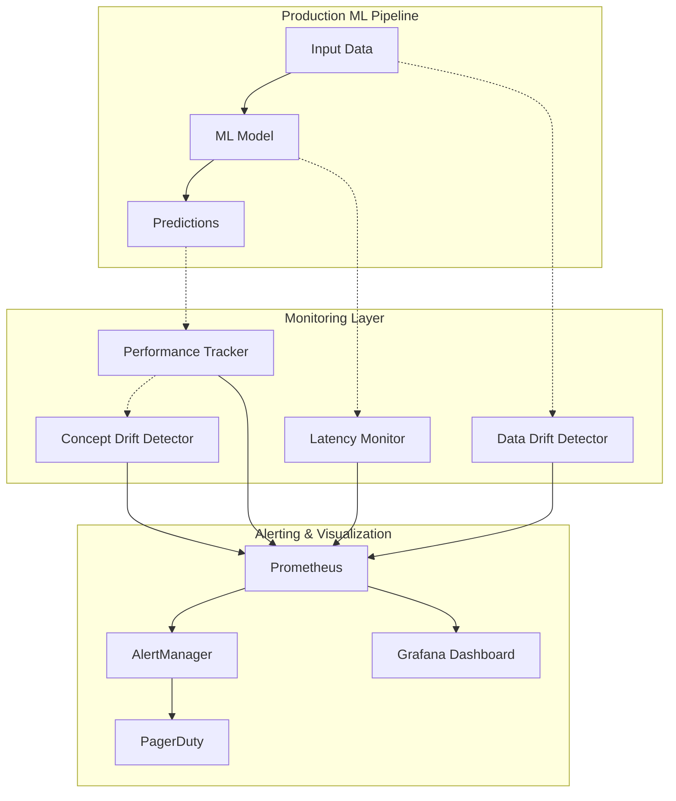

# AI-Web-Test v1 - ML Model Monitoring & Observability Architecture

## Document Information
- **Version**: 1.0
- **Last Updated**: 2025-01-31
- **Status**: Architecture Specification
- **Related Documents**: 
  - [PRD](../AI-Web-Test-v1-PRD.md)
  - [SRS](../AI-Web-Test-v1-SRS.md)
  - [MLOps Architecture](./AI-Web-Test-v1-MLOps-Architecture.md)
  - [Data Governance](./AI-Web-Test-v1-Data-Governance.md)

---

## Executive Summary

This document defines the **comprehensive ML model monitoring and observability architecture** for the AI-Web-Test v1 platform, implementing production model performance tracking, latency monitoring, drift detection, and automated alerting.

### Key ML Monitoring Capabilities

| Component | Technology | Purpose |
|-----------|-----------|---------|
| **Model Performance Tracking** | Prometheus + Custom metrics | Track accuracy, precision, recall, F1 over time |
| **Latency Monitoring** | Prometheus Histogram | Track p50, p95, p99 latency percentiles |
| **Data Drift Detection** | Evidently AI | Monitor input feature distribution changes |
| **Concept Drift Detection** | Custom implementation | Detect model accuracy degradation |
| **Automated Alerting** | Prometheus AlertManager | Alert on >5% accuracy drop, >2x latency |
| **Model Dashboard** | Grafana | Real-time model performance visualization |
| **Prediction Logging** | PostgreSQL + S3 | Store predictions for analysis |

### Implementation Timeline
- **Total Effort**: 7 days
- **Phase 1** (Days 1-3): Performance Tracking + Latency Monitoring
- **Phase 2** (Days 4-5): Drift Detection (Data + Concept)
- **Phase 3** (Days 6-7): Alerting + Dashboard

---

## Table of Contents
1. [ML Monitoring Architecture](#ml-monitoring-architecture)
2. [Model Performance Tracking](#model-performance-tracking)
3. [Latency Monitoring](#latency-monitoring)
4. [Data Drift Detection](#data-drift-detection)
5. [Concept Drift Detection](#concept-drift-detection)
6. [Automated Alerting](#automated-alerting)
7. [Model Monitoring Dashboard](#model-monitoring-dashboard)
8. [Prediction Logging & Analysis](#prediction-logging--analysis)
9. [Implementation Roadmap](#implementation-roadmap)
10. [Summary & Integration](#summary--integration)

---

## ML Monitoring Architecture

### Overview
Production ML model monitoring ensures models perform reliably and alerts on degradation.



### Monitoring Principles

| Principle | Description | Implementation |
|-----------|-------------|----------------|
| **Real-Time Monitoring** | Track metrics as predictions happen | Prometheus metrics |
| **Drift Detection** | Detect data and concept drift early | Evidently AI + custom |
| **Automated Alerting** | Alert on degradation without manual checks | AlertManager + PagerDuty |
| **Historical Analysis** | Analyze trends over time | Grafana dashboards |
| **Prediction Logging** | Store predictions for debugging | PostgreSQL + S3 |

---

## Model Performance Tracking

### 1.1 Performance Metrics

**Track classification metrics over time**:
- **Accuracy**: Overall correctness
- **Precision**: True positives / (True positives + False positives)
- **Recall**: True positives / (True positives + False negatives)
- **F1 Score**: Harmonic mean of precision and recall

### 1.2 Implementation

```python
# app/ml_monitoring/performance_tracker.py
from prometheus_client import Gauge, Counter
from datetime import datetime
from typing import List, Dict
import numpy as np

class ModelPerformanceTracker:
    """Track ML model performance metrics"""
    
    def __init__(self):
        # Prometheus metrics
        self.accuracy_gauge = Gauge(
            'model_accuracy',
            'Model accuracy over sliding window',
            ['model_name', 'model_version']
        )
        
        self.precision_gauge = Gauge(
            'model_precision',
            'Model precision over sliding window',
            ['model_name', 'model_version']
        )
        
        self.recall_gauge = Gauge(
            'model_recall',
            'Model recall over sliding window',
            ['model_name', 'model_version']
        )
        
        self.f1_gauge = Gauge(
            'model_f1_score',
            'Model F1 score over sliding window',
            ['model_name', 'model_version']
        )
        
        self.prediction_counter = Counter(
            'model_predictions_total',
            'Total number of predictions',
            ['model_name', 'model_version', 'predicted_class']
        )
        
        self.error_counter = Counter(
            'model_prediction_errors_total',
            'Total prediction errors',
            ['model_name', 'model_version', 'error_type']
        )
        
        # Sliding window for recent predictions (last 1000)
        self.recent_predictions = {}  # model_name -> deque of (y_true, y_pred)
    
    def log_prediction(
        self,
        model_name: str,
        model_version: str,
        y_true: int,
        y_pred: int,
        confidence: float
    ):
        """Log a single prediction with ground truth"""
        from collections import deque
        
        # Initialize sliding window if needed
        key = f"{model_name}:{model_version}"
        if key not in self.recent_predictions:
            self.recent_predictions[key] = deque(maxlen=1000)
        
        # Add to sliding window
        self.recent_predictions[key].append((y_true, y_pred))
        
        # Increment prediction counter
        self.prediction_counter.labels(
            model_name=model_name,
            model_version=model_version,
            predicted_class=str(y_pred)
        ).inc()
        
        # Update metrics if we have enough samples
        if len(self.recent_predictions[key]) >= 100:
            self._update_metrics(model_name, model_version, key)
    
    def _update_metrics(self, model_name: str, model_version: str, key: str):
        """Calculate and update performance metrics"""
        predictions = list(self.recent_predictions[key])
        y_true = np.array([p[0] for p in predictions])
        y_pred = np.array([p[1] for p in predictions])
        
        # Calculate metrics
        from sklearn.metrics import accuracy_score, precision_score, recall_score, f1_score
        
        accuracy = accuracy_score(y_true, y_pred)
        precision = precision_score(y_true, y_pred, average='weighted', zero_division=0)
        recall = recall_score(y_true, y_pred, average='weighted', zero_division=0)
        f1 = f1_score(y_true, y_pred, average='weighted', zero_division=0)
        
        # Update Prometheus gauges
        self.accuracy_gauge.labels(
            model_name=model_name,
            model_version=model_version
        ).set(accuracy)
        
        self.precision_gauge.labels(
            model_name=model_name,
            model_version=model_version
        ).set(precision)
        
        self.recall_gauge.labels(
            model_name=model_name,
            model_version=model_version
        ).set(recall)
        
        self.f1_gauge.labels(
            model_name=model_name,
            model_version=model_version
        ).set(f1)
    
    def log_error(self, model_name: str, model_version: str, error_type: str):
        """Log a model prediction error"""
        self.error_counter.labels(
            model_name=model_name,
            model_version=model_version,
            error_type=error_type
        ).inc()

# Global tracker instance
performance_tracker = ModelPerformanceTracker()

# Usage in ML service
@app.post("/api/ml/predict")
async def predict(request: PredictionRequest):
    """Make prediction with performance tracking"""
    try:
        # Make prediction
        prediction = model.predict(request.features)
        confidence = model.predict_proba(request.features).max()
        
        # Log prediction
        performance_tracker.prediction_counter.labels(
            model_name=model.name,
            model_version=model.version,
            predicted_class=str(prediction)
        ).inc()
        
        # Store prediction for later performance tracking
        await store_prediction_for_tracking(
            model_name=model.name,
            model_version=model.version,
            features=request.features,
            prediction=prediction,
            confidence=confidence
        )
        
        return {
            "prediction": prediction,
            "confidence": confidence,
            "model_version": model.version
        }
    
    except Exception as e:
        performance_tracker.log_error(
            model_name=model.name,
            model_version=model.version,
            error_type=type(e).__name__
        )
        raise

# Async job to fetch ground truth and update metrics
from apscheduler.schedulers.background import BackgroundScheduler

scheduler = BackgroundScheduler()

def update_performance_metrics():
    """Fetch ground truth and update performance metrics"""
    # Get recent predictions without ground truth
    pending_predictions = db.query(Prediction).filter(
        Prediction.ground_truth.is_(None),
        Prediction.created_at > datetime.utcnow() - timedelta(hours=24)
    ).all()
    
    for pred in pending_predictions:
        # Fetch ground truth (e.g., from user feedback, test results)
        ground_truth = fetch_ground_truth(pred.id)
        
        if ground_truth is not None:
            # Update database
            pred.ground_truth = ground_truth
            db.commit()
            
            # Log to performance tracker
            performance_tracker.log_prediction(
                model_name=pred.model_name,
                model_version=pred.model_version,
                y_true=ground_truth,
                y_pred=pred.prediction,
                confidence=pred.confidence
            )

# Run every 15 minutes
scheduler.add_job(update_performance_metrics, 'interval', minutes=15)
scheduler.start()
```

### 1.3 Performance Thresholds

**Define acceptable performance ranges**:

| Metric | Threshold | Alert Trigger |
|--------|-----------|---------------|
| Accuracy | ≥ 85% | < 80% (5% drop) |
| Precision | ≥ 80% | < 75% (5% drop) |
| Recall | ≥ 80% | < 75% (5% drop) |
| F1 Score | ≥ 80% | < 75% (5% drop) |
| Error Rate | < 1% | > 2% (2x increase) |

---

## Latency Monitoring

### 2.1 Latency Percentiles

**Track latency at different percentiles**:
- **p50 (Median)**: 50% of requests complete within this time
- **p95**: 95% of requests complete within this time
- **p99**: 99% of requests complete within this time

### 2.2 Implementation

```python
# app/ml_monitoring/latency_monitor.py
from prometheus_client import Histogram
import time

class LatencyMonitor:
    """Monitor ML model inference latency"""
    
    def __init__(self):
        self.inference_latency = Histogram(
            'model_inference_duration_seconds',
            'Model inference latency in seconds',
            ['model_name', 'model_version'],
            buckets=(0.01, 0.025, 0.05, 0.075, 0.1, 0.25, 0.5, 0.75, 1.0, 2.5, 5.0, 7.5, 10.0)
        )
        
        self.preprocessing_latency = Histogram(
            'model_preprocessing_duration_seconds',
            'Data preprocessing latency in seconds',
            ['model_name', 'model_version'],
            buckets=(0.001, 0.005, 0.01, 0.025, 0.05, 0.1, 0.25, 0.5, 1.0)
        )
        
        self.postprocessing_latency = Histogram(
            'model_postprocessing_duration_seconds',
            'Prediction postprocessing latency in seconds',
            ['model_name', 'model_version'],
            buckets=(0.001, 0.005, 0.01, 0.025, 0.05, 0.1, 0.25, 0.5, 1.0)
        )
    
    def track_inference(self, model_name: str, model_version: str):
        """Context manager to track inference latency"""
        return self.inference_latency.labels(
            model_name=model_name,
            model_version=model_version
        ).time()
    
    def track_preprocessing(self, model_name: str, model_version: str):
        """Context manager to track preprocessing latency"""
        return self.preprocessing_latency.labels(
            model_name=model_name,
            model_version=model_version
        ).time()
    
    def track_postprocessing(self, model_name: str, model_version: str):
        """Context manager to track postprocessing latency"""
        return self.postprocessing_latency.labels(
            model_name=model_name,
            model_version=model_version
        ).time()

# Global monitor instance
latency_monitor = LatencyMonitor()

# Usage in ML service
@app.post("/api/ml/predict")
async def predict(request: PredictionRequest):
    """Make prediction with latency tracking"""
    model_name = "test_generator"
    model_version = "v1.2.3"
    
    # Track preprocessing latency
    with latency_monitor.track_preprocessing(model_name, model_version):
        features = preprocess_features(request.features)
    
    # Track inference latency
    with latency_monitor.track_inference(model_name, model_version):
        prediction = model.predict(features)
    
    # Track postprocessing latency
    with latency_monitor.track_postprocessing(model_name, model_version):
        result = postprocess_prediction(prediction)
    
    return result
```

### 2.3 Latency Thresholds

**Define acceptable latency ranges**:

| Percentile | Threshold | Alert Trigger |
|------------|-----------|---------------|
| p50 | < 100ms | > 200ms (2x increase) |
| p95 | < 500ms | > 1000ms (2x increase) |
| p99 | < 2000ms | > 5000ms (2.5x increase) |

---

## Data Drift Detection

### 3.1 Data Drift Overview

**Purpose**: Detect when input feature distributions change significantly from training data.

**Causes**:
- Changes in data collection process
- Seasonal variations
- User behavior changes
- External factors (e.g., new telecom plans)

### 3.2 Implementation with Evidently AI

```python
# app/ml_monitoring/data_drift_detector.py
from evidently.report import Report
from evidently.metric_preset import DataDriftPreset
from evidently.test_suite import TestSuite
from evidently.tests import TestNumberOfDriftedColumns
import pandas as pd
from datetime import datetime, timedelta

class DataDriftDetector:
    """Detect data drift in production"""
    
    def __init__(self, reference_data: pd.DataFrame):
        """
        Initialize with reference data (training data)
        
        Args:
            reference_data: DataFrame with training features
        """
        self.reference_data = reference_data
    
    def detect_drift(self, current_data: pd.DataFrame) -> dict:
        """
        Detect drift between reference and current data
        
        Returns:
            dict with drift metrics and report
        """
        # Create drift report
        report = Report(metrics=[
            DataDriftPreset(),
        ])
        
        report.run(
            reference_data=self.reference_data,
            current_data=current_data
        )
        
        # Extract drift metrics
        report_dict = report.as_dict()
        
        # Get summary metrics
        dataset_drift = report_dict['metrics'][0]['result']['dataset_drift']
        share_drifted_columns = report_dict['metrics'][0]['result']['share_of_drifted_columns']
        number_drifted_columns = report_dict['metrics'][0]['result']['number_of_drifted_columns']
        
        # Save report HTML
        report_path = f"reports/data_drift_{datetime.utcnow().strftime('%Y%m%d_%H%M%S')}.html"
        report.save_html(report_path)
        
        return {
            'dataset_drift': dataset_drift,
            'share_drifted_columns': share_drifted_columns,
            'number_drifted_columns': number_drifted_columns,
            'report_path': report_path,
            'timestamp': datetime.utcnow().isoformat()
        }
    
    def run_drift_tests(self, current_data: pd.DataFrame) -> bool:
        """
        Run drift tests and return pass/fail
        
        Returns:
            bool: True if tests pass, False if drift detected
        """
        test_suite = TestSuite(tests=[
            TestNumberOfDriftedColumns(lt=5)  # Alert if > 5 columns drifted
        ])
        
        test_suite.run(
            reference_data=self.reference_data,
            current_data=current_data
        )
        
        results = test_suite.as_dict()
        all_passed = all(test['status'] == 'SUCCESS' for test in results['tests'])
        
        return all_passed

# Load reference data (training data)
training_data = pd.read_csv('data/training_features.csv')
drift_detector = DataDriftDetector(reference_data=training_data)

# Scheduled drift detection
from apscheduler.schedulers.background import BackgroundScheduler

scheduler = BackgroundScheduler()

def check_data_drift():
    """Check for data drift in recent production data"""
    # Get recent production data (last 7 days)
    cutoff = datetime.utcnow() - timedelta(days=7)
    recent_predictions = db.query(Prediction).filter(
        Prediction.created_at > cutoff
    ).all()
    
    # Convert to DataFrame
    current_data = pd.DataFrame([
        pred.features for pred in recent_predictions
    ])
    
    if len(current_data) < 100:
        print("Not enough data for drift detection")
        return
    
    # Detect drift
    drift_results = drift_detector.detect_drift(current_data)
    
    # Log to Prometheus
    data_drift_detected.labels(
        model_name='test_generator'
    ).set(1 if drift_results['dataset_drift'] else 0)
    
    drifted_columns_ratio.labels(
        model_name='test_generator'
    ).set(drift_results['share_drifted_columns'])
    
    # Alert if drift detected
    if drift_results['dataset_drift']:
        print(f"⚠️ Data drift detected! {drift_results['number_drifted_columns']} columns drifted")
        print(f"Report: {drift_results['report_path']}")
        
        # Send alert
        alerter.send_alert(
            severity='warning',
            title='Data Drift Detected',
            description=f"{drift_results['number_drifted_columns']} features have drifted from training distribution"
        )

# Run weekly (every Monday at 2 AM)
scheduler.add_job(check_data_drift, 'cron', day_of_week='mon', hour=2, minute=0)
scheduler.start()

# Prometheus metrics
from prometheus_client import Gauge

data_drift_detected = Gauge(
    'model_data_drift_detected',
    'Whether data drift is detected (0 or 1)',
    ['model_name']
)

drifted_columns_ratio = Gauge(
    'model_drifted_columns_ratio',
    'Ratio of drifted columns (0.0 to 1.0)',
    ['model_name']
)
```

### 3.3 Data Drift Thresholds

| Metric | Threshold | Alert Trigger |
|--------|-----------|---------------|
| Dataset Drift | No drift | Drift detected |
| Drifted Columns | < 10% | > 20% (significant drift) |
| PSI (Population Stability Index) | < 0.1 | > 0.2 (high drift) |

---

## Concept Drift Detection

### 4.1 Concept Drift Overview

**Purpose**: Detect when the relationship between features and target changes (model accuracy degrades).

**Causes**:
- Changes in user behavior
- New test patterns not seen in training
- Adversarial patterns
- Model staleness

### 4.2 Implementation

```python
# app/ml_monitoring/concept_drift_detector.py
from datetime import datetime, timedelta
from typing import List, Tuple
import numpy as np

class ConceptDriftDetector:
    """Detect concept drift via accuracy degradation"""
    
    def __init__(self, baseline_accuracy: float = 0.85):
        """
        Initialize with baseline accuracy
        
        Args:
            baseline_accuracy: Expected model accuracy on training data
        """
        self.baseline_accuracy = baseline_accuracy
        self.accuracy_threshold = baseline_accuracy - 0.05  # 5% drop
        
        # Historical accuracy tracking
        self.accuracy_history = []  # (timestamp, accuracy) tuples
    
    def check_concept_drift(
        self,
        current_accuracy: float,
        window_days: int = 7
    ) -> Tuple[bool, dict]:
        """
        Check for concept drift based on accuracy degradation
        
        Args:
            current_accuracy: Current model accuracy
            window_days: Number of days to compare
        
        Returns:
            Tuple of (drift_detected, drift_metrics)
        """
        # Add to history
        self.accuracy_history.append((datetime.utcnow(), current_accuracy))
        
        # Keep only recent history (last 90 days)
        cutoff = datetime.utcnow() - timedelta(days=90)
        self.accuracy_history = [
            (ts, acc) for ts, acc in self.accuracy_history
            if ts > cutoff
        ]
        
        # Calculate accuracy drop
        accuracy_drop = self.baseline_accuracy - current_accuracy
        accuracy_drop_pct = (accuracy_drop / self.baseline_accuracy) * 100
        
        # Check for drift
        drift_detected = current_accuracy < self.accuracy_threshold
        
        # Calculate trend (last 7 days vs previous 7 days)
        recent_cutoff = datetime.utcnow() - timedelta(days=window_days)
        previous_cutoff = datetime.utcnow() - timedelta(days=window_days * 2)
        
        recent_accuracy = [
            acc for ts, acc in self.accuracy_history
            if ts > recent_cutoff
        ]
        
        previous_accuracy = [
            acc for ts, acc in self.accuracy_history
            if previous_cutoff < ts <= recent_cutoff
        ]
        
        trend = None
        if len(recent_accuracy) > 0 and len(previous_accuracy) > 0:
            recent_avg = np.mean(recent_accuracy)
            previous_avg = np.mean(previous_accuracy)
            trend = recent_avg - previous_avg
        
        drift_metrics = {
            'current_accuracy': current_accuracy,
            'baseline_accuracy': self.baseline_accuracy,
            'accuracy_drop': accuracy_drop,
            'accuracy_drop_pct': accuracy_drop_pct,
            'drift_detected': drift_detected,
            'trend': trend,
            'timestamp': datetime.utcnow().isoformat()
        }
        
        return drift_detected, drift_metrics
    
    def get_accuracy_trend(self, days: int = 30) -> List[Tuple[datetime, float]]:
        """Get accuracy trend over last N days"""
        cutoff = datetime.utcnow() - timedelta(days=days)
        return [
            (ts, acc) for ts, acc in self.accuracy_history
            if ts > cutoff
        ]

# Global detector instance
concept_drift_detector = ConceptDriftDetector(baseline_accuracy=0.87)

# Scheduled concept drift detection
from apscheduler.schedulers.background import BackgroundScheduler

scheduler = BackgroundScheduler()

def check_concept_drift():
    """Check for concept drift via accuracy monitoring"""
    # Calculate current accuracy from recent predictions with ground truth
    cutoff = datetime.utcnow() - timedelta(days=7)
    recent_predictions = db.query(Prediction).filter(
        Prediction.created_at > cutoff,
        Prediction.ground_truth.isnot(None)
    ).all()
    
    if len(recent_predictions) < 100:
        print("Not enough labeled data for concept drift detection")
        return
    
    # Calculate accuracy
    y_true = np.array([p.ground_truth for p in recent_predictions])
    y_pred = np.array([p.prediction for p in recent_predictions])
    current_accuracy = (y_true == y_pred).mean()
    
    # Check for drift
    drift_detected, drift_metrics = concept_drift_detector.check_concept_drift(current_accuracy)
    
    # Log to Prometheus
    model_concept_drift_detected.labels(
        model_name='test_generator'
    ).set(1 if drift_detected else 0)
    
    model_accuracy_drop.labels(
        model_name='test_generator'
    ).set(drift_metrics['accuracy_drop_pct'])
    
    # Alert if drift detected
    if drift_detected:
        print(f"⚠️ Concept drift detected! Accuracy dropped by {drift_metrics['accuracy_drop_pct']:.2f}%")
        print(f"Current accuracy: {current_accuracy:.4f}, Baseline: {drift_metrics['baseline_accuracy']:.4f}")
        
        # Send alert
        alerter.send_alert(
            severity='high',
            title='Concept Drift Detected',
            description=f"Model accuracy dropped by {drift_metrics['accuracy_drop_pct']:.2f}% (current: {current_accuracy:.4f})"
        )

# Run daily at 3 AM
scheduler.add_job(check_concept_drift, 'cron', hour=3, minute=0)
scheduler.start()

# Prometheus metrics
from prometheus_client import Gauge

model_concept_drift_detected = Gauge(
    'model_concept_drift_detected',
    'Whether concept drift is detected (0 or 1)',
    ['model_name']
)

model_accuracy_drop = Gauge(
    'model_accuracy_drop_percent',
    'Percentage drop in model accuracy',
    ['model_name']
)
```

### 4.3 Concept Drift Thresholds

| Metric | Threshold | Alert Trigger |
|--------|-----------|---------------|
| Accuracy Drop | < 5% | > 5% (significant drop) |
| Trend (7-day) | Stable or improving | Declining for 3+ days |
| Absolute Accuracy | ≥ 85% | < 80% (critical) |

---

## Automated Alerting

### 5.1 Prometheus Alert Rules

```yaml
# prometheus/alerts/ml_model_alerts.yml
groups:
  - name: ml_model_alerts
    interval: 30s
    rules:
      # Model Accuracy Alerts
      - alert: ModelAccuracyDrop
        expr: model_accuracy < 0.80
        for: 10m
        labels:
          severity: critical
          component: ml_model
        annotations:
          summary: "Model accuracy dropped below 80%"
          description: "Model {{ $labels.model_name }} v{{ $labels.model_version }} accuracy is {{ $value }}, below critical threshold of 0.80"
      
      - alert: ModelAccuracyWarning
        expr: model_accuracy < 0.85
        for: 30m
        labels:
          severity: warning
          component: ml_model
        annotations:
          summary: "Model accuracy dropped below 85%"
          description: "Model {{ $labels.model_name }} v{{ $labels.model_version }} accuracy is {{ $value }}, below warning threshold of 0.85"
      
      # Latency Alerts
      - alert: HighInferenceLatencyP99
        expr: histogram_quantile(0.99, model_inference_duration_seconds_bucket) > 5.0
        for: 5m
        labels:
          severity: high
          component: ml_model
        annotations:
          summary: "P99 inference latency exceeds 5 seconds"
          description: "Model {{ $labels.model_name }} p99 latency is {{ $value }}s, exceeding threshold of 5s"
      
      - alert: HighInferenceLatencyP95
        expr: histogram_quantile(0.95, model_inference_duration_seconds_bucket) > 1.0
        for: 10m
        labels:
          severity: warning
          component: ml_model
        annotations:
          summary: "P95 inference latency exceeds 1 second"
          description: "Model {{ $labels.model_name }} p95 latency is {{ $value }}s, exceeding threshold of 1s"
      
      # Data Drift Alerts
      - alert: DataDriftDetected
        expr: model_data_drift_detected == 1
        for: 1h
        labels:
          severity: warning
          component: ml_model
        annotations:
          summary: "Data drift detected in production"
          description: "Model {{ $labels.model_name }} is experiencing data drift. Input feature distributions have changed."
      
      - alert: HighDriftedColumnsRatio
        expr: model_drifted_columns_ratio > 0.20
        for: 1h
        labels:
          severity: high
          component: ml_model
        annotations:
          summary: "High ratio of drifted columns"
          description: "Model {{ $labels.model_name }} has {{ $value }} ratio of drifted columns (>20%)"
      
      # Concept Drift Alerts
      - alert: ConceptDriftDetected
        expr: model_concept_drift_detected == 1
        for: 30m
        labels:
          severity: critical
          component: ml_model
        annotations:
          summary: "Concept drift detected - model accuracy degraded"
          description: "Model {{ $labels.model_name }} accuracy has degraded >5% from baseline. Retraining may be required."
      
      # Prediction Volume Alerts
      - alert: LowPredictionVolume
        expr: rate(model_predictions_total[5m]) < 0.1
        for: 15m
        labels:
          severity: warning
          component: ml_model
        annotations:
          summary: "Low prediction volume"
          description: "Model {{ $labels.model_name }} prediction rate is {{ $value }} predictions/sec, below expected minimum of 0.1/sec"
      
      # Error Rate Alerts
      - alert: HighModelErrorRate
        expr: rate(model_prediction_errors_total[5m]) / rate(model_predictions_total[5m]) > 0.02
        for: 10m
        labels:
          severity: critical
          component: ml_model
        annotations:
          summary: "High model error rate"
          description: "Model {{ $labels.model_name }} error rate is {{ $value }}, exceeding threshold of 2%"
```

### 5.2 AlertManager Configuration

```yaml
# alertmanager/config.yml
global:
  resolve_timeout: 5m
  slack_api_url: 'https://hooks.slack.com/services/YOUR/SLACK/WEBHOOK'
  pagerduty_url: 'https://events.pagerduty.com/v2/enqueue'

route:
  group_by: ['alertname', 'model_name']
  group_wait: 10s
  group_interval: 10s
  repeat_interval: 12h
  receiver: 'ml-team'
  
  routes:
    # Critical alerts go to PagerDuty
    - match:
        severity: critical
      receiver: 'pagerduty'
      continue: true
    
    # High severity to Slack + Email
    - match:
        severity: high
      receiver: 'ml-team-urgent'
    
    # Warnings to Slack only
    - match:
        severity: warning
      receiver: 'ml-team'

receivers:
  - name: 'ml-team'
    slack_configs:
      - channel: '#ml-monitoring'
        title: '{{ .CommonAnnotations.summary }}'
        text: '{{ .CommonAnnotations.description }}'
  
  - name: 'ml-team-urgent'
    slack_configs:
      - channel: '#ml-alerts-urgent'
        title: '🚨 {{ .CommonAnnotations.summary }}'
        text: '{{ .CommonAnnotations.description }}'
    email_configs:
      - to: 'ml-team@company.com'
        from: 'alertmanager@company.com'
        smarthost: 'smtp.company.com:587'
        auth_username: 'alertmanager'
        auth_password: '$SMTP_PASSWORD'
  
  - name: 'pagerduty'
    pagerduty_configs:
      - service_key: '$PAGERDUTY_SERVICE_KEY'
        severity: '{{ .CommonLabels.severity }}'
        description: '{{ .CommonAnnotations.description }}'
```

---

## Model Monitoring Dashboard

### 6.1 Grafana Dashboard Configuration

```json
{
  "dashboard": {
    "title": "ML Model Monitoring",
    "panels": [
      {
        "title": "Model Accuracy (7-day rolling)",
        "targets": [
          {
            "expr": "model_accuracy",
            "legendFormat": "{{ model_name }} v{{ model_version }}"
          }
        ],
        "type": "graph",
        "yaxis": {
          "min": 0,
          "max": 1
        },
        "thresholds": [
          {"value": 0.85, "color": "yellow"},
          {"value": 0.80, "color": "red"}
        ]
      },
      {
        "title": "Model Performance Metrics",
        "targets": [
          {"expr": "model_accuracy", "legendFormat": "Accuracy"},
          {"expr": "model_precision", "legendFormat": "Precision"},
          {"expr": "model_recall", "legendFormat": "Recall"},
          {"expr": "model_f1_score", "legendFormat": "F1 Score"}
        ],
        "type": "graph"
      },
      {
        "title": "Inference Latency Percentiles",
        "targets": [
          {"expr": "histogram_quantile(0.50, model_inference_duration_seconds_bucket)", "legendFormat": "p50"},
          {"expr": "histogram_quantile(0.95, model_inference_duration_seconds_bucket)", "legendFormat": "p95"},
          {"expr": "histogram_quantile(0.99, model_inference_duration_seconds_bucket)", "legendFormat": "p99"}
        ],
        "type": "graph",
        "yaxis": {
          "format": "s"
        }
      },
      {
        "title": "Data Drift Status",
        "targets": [
          {"expr": "model_data_drift_detected", "legendFormat": "Drift Detected (0/1)"},
          {"expr": "model_drifted_columns_ratio", "legendFormat": "Drifted Columns Ratio"}
        ],
        "type": "graph"
      },
      {
        "title": "Concept Drift (Accuracy Drop %)",
        "targets": [
          {"expr": "model_accuracy_drop_percent", "legendFormat": "Accuracy Drop %"}
        ],
        "type": "graph",
        "thresholds": [
          {"value": 5, "color": "yellow"},
          {"value": 10, "color": "red"}
        ]
      },
      {
        "title": "Prediction Volume",
        "targets": [
          {"expr": "rate(model_predictions_total[5m])", "legendFormat": "Predictions/sec"}
        ],
        "type": "graph"
      },
      {
        "title": "Error Rate",
        "targets": [
          {"expr": "rate(model_prediction_errors_total[5m]) / rate(model_predictions_total[5m])", "legendFormat": "Error Rate"}
        ],
        "type": "graph",
        "thresholds": [
          {"value": 0.01, "color": "yellow"},
          {"value": 0.02, "color": "red"}
        ]
      },
      {
        "title": "Prediction Class Distribution",
        "targets": [
          {"expr": "sum by (predicted_class) (model_predictions_total)", "legendFormat": "Class {{ predicted_class }}"}
        ],
        "type": "pie"
      }
    ]
  }
}
```

---

## Prediction Logging & Analysis

### 7.1 Prediction Storage

```python
# app/models/prediction.py
from sqlalchemy import Column, Integer, String, Float, DateTime, JSON
from datetime import datetime

class Prediction(Base):
    __tablename__ = 'predictions'
    
    id = Column(Integer, primary_key=True)
    model_name = Column(String(100), nullable=False, index=True)
    model_version = Column(String(20), nullable=False, index=True)
    features = Column(JSON, nullable=False)
    prediction = Column(Integer, nullable=False)
    confidence = Column(Float, nullable=False)
    ground_truth = Column(Integer, nullable=True)  # Filled later
    latency_ms = Column(Float, nullable=False)
    created_at = Column(DateTime, default=datetime.utcnow, index=True)

async def store_prediction(
    model_name: str,
    model_version: str,
    features: dict,
    prediction: int,
    confidence: float,
    latency_ms: float
):
    """Store prediction for monitoring and analysis"""
    pred = Prediction(
        model_name=model_name,
        model_version=model_version,
        features=features,
        prediction=prediction,
        confidence=confidence,
        latency_ms=latency_ms
    )
    db.add(pred)
    db.commit()
    return pred.id
```

### 7.2 Prediction Analysis

```python
# app/ml_monitoring/prediction_analysis.py
import pandas as pd
from datetime import datetime, timedelta

class PredictionAnalyzer:
    """Analyze stored predictions for insights"""
    
    def __init__(self, db_session):
        self.db = db_session
    
    def get_prediction_statistics(self, days: int = 7) -> dict:
        """Get prediction statistics for last N days"""
        cutoff = datetime.utcnow() - timedelta(days=days)
        
        predictions = self.db.query(Prediction).filter(
            Prediction.created_at > cutoff
        ).all()
        
        if len(predictions) == 0:
            return {}
        
        df = pd.DataFrame([
            {
                'prediction': p.prediction,
                'confidence': p.confidence,
                'latency_ms': p.latency_ms,
                'has_ground_truth': p.ground_truth is not None
            }
            for p in predictions
        ])
        
        stats = {
            'total_predictions': len(predictions),
            'predictions_per_day': len(predictions) / days,
            'avg_confidence': df['confidence'].mean(),
            'avg_latency_ms': df['latency_ms'].mean(),
            'p95_latency_ms': df['latency_ms'].quantile(0.95),
            'p99_latency_ms': df['latency_ms'].quantile(0.99),
            'ground_truth_coverage': df['has_ground_truth'].mean(),
            'prediction_distribution': df['prediction'].value_counts().to_dict()
        }
        
        return stats
    
    def get_low_confidence_predictions(self, threshold: float = 0.7, days: int = 7) -> List[Prediction]:
        """Get predictions with low confidence for manual review"""
        cutoff = datetime.utcnow() - timedelta(days=days)
        
        low_confidence = self.db.query(Prediction).filter(
            Prediction.created_at > cutoff,
            Prediction.confidence < threshold
        ).order_by(Prediction.confidence.asc()).limit(100).all()
        
        return low_confidence

# API endpoint for prediction analysis
@app.get("/api/ml/predictions/stats")
async def get_prediction_stats(days: int = 7):
    """Get prediction statistics"""
    analyzer = PredictionAnalyzer(db_session)
    stats = analyzer.get_prediction_statistics(days=days)
    return stats

@app.get("/api/ml/predictions/low-confidence")
async def get_low_confidence_predictions(threshold: float = 0.7, days: int = 7):
    """Get low confidence predictions for review"""
    analyzer = PredictionAnalyzer(db_session)
    predictions = analyzer.get_low_confidence_predictions(threshold=threshold, days=days)
    
    return [
        {
            'id': p.id,
            'model_name': p.model_name,
            'model_version': p.model_version,
            'prediction': p.prediction,
            'confidence': p.confidence,
            'features': p.features,
            'created_at': p.created_at.isoformat()
        }
        for p in predictions
    ]
```

---

## Implementation Roadmap

### Phase 1: Performance Tracking + Latency Monitoring (Days 1-3)

#### Day 1: Performance Tracking
- [ ] Implement ModelPerformanceTracker class
- [ ] Add Prometheus metrics (accuracy, precision, recall, F1)
- [ ] Create sliding window for recent predictions
- [ ] Implement ground truth feedback loop

**Deliverables**: `app/ml_monitoring/performance_tracker.py` (300 lines)

#### Day 2: Latency Monitoring
- [ ] Implement LatencyMonitor class
- [ ] Add latency histograms (preprocessing, inference, postprocessing)
- [ ] Track percentiles (p50, p95, p99)
- [ ] Test with sample predictions

**Deliverables**: `app/ml_monitoring/latency_monitor.py` (150 lines)

#### Day 3: Prediction Logging
- [ ] Create Prediction database model
- [ ] Implement prediction storage
- [ ] Create PredictionAnalyzer class
- [ ] Add API endpoints for stats

**Deliverables**: `app/models/prediction.py` (100 lines), `app/ml_monitoring/prediction_analysis.py` (200 lines)

### Phase 2: Drift Detection (Days 4-5)

#### Day 4: Data Drift Detection
- [ ] Implement DataDriftDetector with Evidently AI
- [ ] Set up scheduled drift checks (weekly)
- [ ] Add Prometheus metrics for drift
- [ ] Test with sample data

**Deliverables**: `app/ml_monitoring/data_drift_detector.py` (300 lines)

#### Day 5: Concept Drift Detection
- [ ] Implement ConceptDriftDetector class
- [ ] Set up scheduled accuracy monitoring (daily)
- [ ] Add Prometheus metrics for concept drift
- [ ] Test with accuracy degradation scenarios

**Deliverables**: `app/ml_monitoring/concept_drift_detector.py` (250 lines)

### Phase 3: Alerting + Dashboard (Days 6-7)

#### Day 6: Alerting Configuration
- [ ] Create Prometheus alert rules
- [ ] Configure AlertManager
- [ ] Set up Slack integration
- [ ] Set up PagerDuty integration (optional)
- [ ] Test alert notifications

**Deliverables**: `prometheus/alerts/ml_model_alerts.yml` (150 lines), `alertmanager/config.yml` (100 lines)

#### Day 7: Grafana Dashboard
- [ ] Create ML Model Monitoring dashboard
- [ ] Add panels for all metrics
- [ ] Configure thresholds and colors
- [ ] Test dashboard with live data
- [ ] Document dashboard usage

**Deliverables**: `grafana/dashboards/ml_model_monitoring.json` (800 lines), `documentation/ML-MONITORING-DASHBOARD.md` (500 lines)

---

## Cost Analysis

### Open-Source Tools (Free)
- **Evidently AI**: $0
- **Prometheus**: $0
- **AlertManager**: $0
- **Grafana**: $0

### Infrastructure Costs (Monthly)
| Component | Cost | Notes |
|-----------|------|-------|
| PostgreSQL (predictions) | $10-20 | Additional 10-20 GB for predictions |
| S3 (prediction logs) | $5-10 | Archive old predictions |
| Prometheus (time-series data) | $10-20 | Additional storage for ML metrics |
| PagerDuty (optional) | $0-25 | Free tier or paid plan |
| **Total** | **$25-75/month** | Scales with prediction volume |

### ROI Analysis
- **Cost of undetected model degradation**: $50,000 - $500,000+ (bad decisions, customer churn)
- **Cost of ML monitoring**: $25-75/month
- **Break-even**: Catching 1 significant model issue = 667-20,000 months of monitoring

**Conclusion**: ML monitoring prevents costly production model failures.

---

## Summary & Integration

### Key Achievements

✅ **Model Performance Tracking**: Accuracy, precision, recall, F1 over time  
✅ **Latency Monitoring**: p50, p95, p99 percentiles with alerting  
✅ **Data Drift Detection**: Evidently AI for feature distribution changes  
✅ **Concept Drift Detection**: Accuracy degradation monitoring  
✅ **Automated Alerting**: Prometheus + AlertManager + PagerDuty  
✅ **Model Dashboard**: Grafana for real-time visualization  
✅ **Prediction Logging**: PostgreSQL + analysis tools  

### Integration with Other Components

| Component | Integration Point |
|-----------|------------------|
| **MLOps** | Model registry versions, A/B testing metrics, retraining triggers |
| **Data Governance** | Prediction data retention, GDPR compliance, data quality |
| **Security** | RBAC for monitoring dashboards, audit logs for model changes |
| **Deployment** | Health checks for model performance, rollback on drift detection |

### Next Steps

1. **Review** this ML Monitoring architecture document
2. **Update PRD** with ML monitoring functional requirements
3. **Update SRS** with ML monitoring technology stack
4. **Begin Phase 1** implementation (Days 1-3)

---

**End of ML Model Monitoring & Observability Architecture Document**

This architecture provides **production-grade ML monitoring** for the AI-Web-Test v1 platform, ensuring models perform reliably and alerting on degradation before it impacts users.

